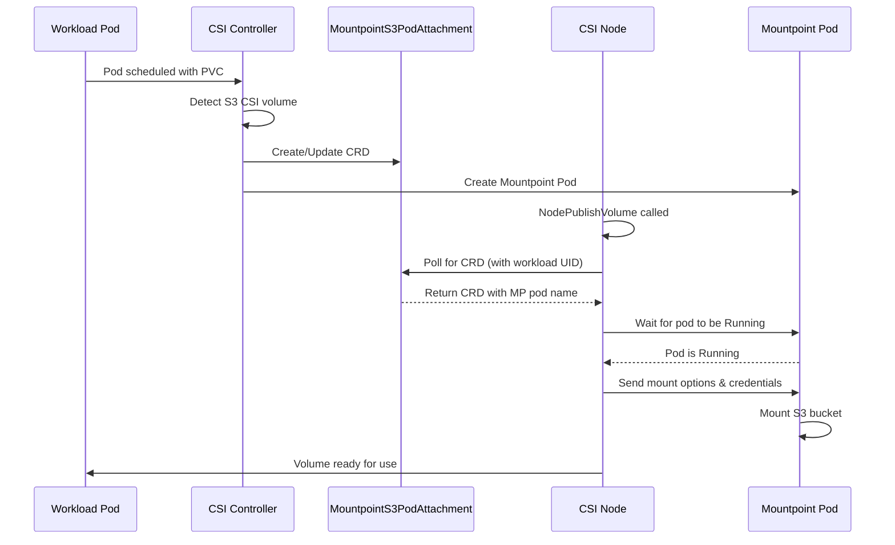

# CRD-Based Pod Creation Architecture

## Overview

The Scality CSI Driver v2 uses a Custom Resource Definition (CRD) based architecture for managing Mountpoint Pods. This architecture aligns with the AWS upstream implementation and provides better separation of concerns between the controller and node components.

## Architecture Components

### MountpointS3PodAttachment CRD

The `MountpointS3PodAttachment` is a cluster-scoped Custom Resource that represents the relationship between workload pods and Mountpoint pods. It serves as the coordination point between the CSI controller and node components.

Key characteristics:

- **Cluster-scoped**: No namespace restriction, allowing cross-namespace coordination
- **Indexed fields**: Optimized for efficient lookups by node, volume, and workload attributes
- **Attachment tracking**: Maintains the mapping between workload pods and Mountpoint pods

### Controller-Side: Pod Reconciler

The controller watches workload pods and manages the lifecycle of MountpointS3PodAttachment CRDs and Mountpoint Pods.

**Location**: `cmd/scality-csi-controller/csicontroller/reconciler.go`

**Responsibilities**:

1. Watch workload pods that use S3 CSI volumes
2. Create MountpointS3PodAttachment CRDs when workloads need S3 volumes
3. Spawn Mountpoint Pods based on the CRD specifications
4. Manage pod sharing - multiple workloads can share a single Mountpoint Pod
5. Clean up CRDs and pods when workloads are deleted

### Node-Side: Pod Mounter

The node component waits for the controller to create the necessary resources before proceeding with the mount operation.

**Location**: `pkg/driver/node/mounter/pod_mounter.go`

**Responsibilities**:

1. Wait for MountpointS3PodAttachment CRD to be created by the controller
2. Wait for the associated Mountpoint Pod to be running
3. Provide credentials to the Mountpoint Pod
4. Execute the FUSE mount operation using source/bind mount pattern
5. Send mount options to the Mountpoint Pod

The Pod Mounter implements a [source/bind mount pattern](./source-bind-mount-pattern.md) for efficient pod sharing.

## Workflow Sequence



## Pod Naming Convention

Mountpoint Pods use deterministic naming to ensure consistency across components:

```go
func MountpointPodNameFor(podUID string, volumeName string) string {
    return fmt.Sprintf("mp-%x", sha256.Sum224(fmt.Appendf(nil, "%s%s", podUID, volumeName)))
}
```

**Pattern**: `mp-<sha224_hash>`

**Inputs**:

- `podUID`: Unique identifier of the workload pod
- `volumeName`: Name of the PersistentVolume

**Example**: `mp-a7f3b2c9d8e5f1a2b3c4d5e6f7a8b9c0d1e2f3a4b5c6d7e8f9a0b1c2`

This deterministic naming ensures:

- Same pod+volume combination always generates the same Mountpoint Pod name
- Controller and node can independently calculate the expected pod name
- No need for explicit communication of pod names between components

## Field Indexing

The controller sets up field indices for efficient CRD lookups:

```go
// Fields used for indexing MountpointS3PodAttachments
const (
    FieldNodeName                    = "spec.nodeName"
    FieldPersistentVolumeName        = "spec.persistentVolumeName"
    FieldVolumeID                    = "spec.volumeID"
    FieldMountOptions                = "spec.mountOptions"
    FieldWorkloadFSGroup             = "spec.workloadFSGroup"
    FieldAuthenticationSource        = "spec.authenticationSource"
    FieldWorkloadNamespace           = "spec.workloadNamespace"
    FieldWorkloadServiceAccountName  = "spec.workloadServiceAccountName"
)
```

These indices enable the node to quickly find the relevant CRD for a given workload.

## Pod Sharing

Multiple workload pods can share a single Mountpoint Pod when they:

- Are on the same node
- Use the same PersistentVolume
- Have compatible mount options
- Use the same authentication source

The controller manages this by:

1. Checking if an existing Mountpoint Pod can serve the new workload
2. Adding the workload UID to the existing pod's attachment list
3. Creating a new Mountpoint Pod only if no suitable one exists

## Cleanup Process

When a workload pod is deleted:

1. Controller removes the workload UID from the MountpointS3PodAttachment
2. If no workloads remain attached to a Mountpoint Pod:
   - Add `needs-unmount` annotation to the pod
   - Remove the pod from the CRD
   - Delete the CRD if no Mountpoint Pods remain
3. CSI Node detects the annotation and performs clean unmount
4. Mountpoint Pod transitions to `Succeeded` state
5. Controller deletes completed pods

## Benefits of CRD-Based Architecture

1. **Separation of Concerns**: Clear division between controller (orchestration) and node (mounting) responsibilities

2. **No Race Conditions**: Controller atomically creates both CRD and pod, eliminating timing issues

3. **Better Observability**: CRDs provide a queryable API for understanding mount relationships

4. **Pod Sharing Support**: Efficient resource utilization through shared Mountpoint Pods

5. **Failure Recovery**: CRDs persist state, enabling recovery after component restarts

6. **AWS Upstream Alignment**: Consistent with AWS implementation, simplifying maintenance and updates

## Configuration

### Controller Configuration

The controller requires RBAC permissions for:

- Watching Pods
- Creating/updating/deleting MountpointS3PodAttachments
- Creating/deleting Mountpoint Pods

### Node Configuration

The node requires:

- Access to list MountpointS3PodAttachments
- Access to get Mountpoint Pods
- Local filesystem access for FUSE operations

## Troubleshooting

### Common Issues

1. **"Timed out waiting for MountpointS3PodAttachment"**
   - Check controller logs: `kubectl logs -n kube-system -lapp=s3-csi-controller`
   - Verify controller is running and has proper RBAC permissions

2. **"Failed to list MountpointS3PodAttachments"**
   - Ensure CRD is installed: `kubectl get crd mountpoints3podattachments.s3.csi.scality.com`
   - Check field indices are properly configured

3. **Multiple Mountpoint Pods for same workload**
   - This indicates the deterministic naming function has changed
   - Requires clean reinstall of the CSI driver

### Debugging Commands

```bash
# View all MountpointS3PodAttachments
kubectl get mountpoints3podattachments -A

# Describe a specific attachment
kubectl describe mountpoints3podattachment <name>

# Check controller logs
kubectl logs -n kube-system -lapp=s3-csi-controller

# Check Mountpoint Pod logs
kubectl logs -n kube-system mp-<hash>
```

## Migration from v1

The v2 architecture is backward compatible with v1 systemd-based mounts:

- Existing mounts continue to work
- New mounts use the CRD-based approach
- Gradual migration as workloads are redeployed

## Future Enhancements

1. **Headroom Pods**: Pre-provisioning pods for faster mount times
2. **Priority Classes**: Different priority levels for critical workloads
3. **Advanced Scheduling**: Node affinity and topology constraints
4. **Metrics and Monitoring**: Prometheus metrics for mount operations
