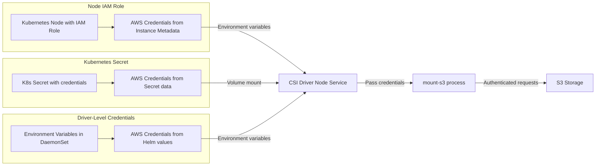

# Authentication and Credentials

The Scality S3 CSI Driver supports three authentication methods for accessing S3-compatible storage.

## Authentication Methods Overview

<div align="center">



</div>

## Prerequisites: S3 Endpoint Configuration

The S3 endpoint URL is **mandatory** and must be configured during installation:

```yaml
node:
  s3EndpointUrl: "https://s3.example.com:8000"  # REQUIRED
  s3Region: "us-east-1"
```

## Method 1: Node-Level Authentication

Uses IAM roles attached to Kubernetes nodes. All volumes on the node share the same credentials.

```yaml
apiVersion: v1
kind: PersistentVolume
metadata:
  name: s3-volume-iam
spec:
  capacity:
    storage: 1200Gi
  accessModes:
    - ReadWriteMany
  csi:
    driver: s3.csi.scality.com
    volumeHandle: my-bucket-iam
    volumeAttributes:
      bucketName: my-bucket
      region: us-east-1
      # No nodePublishSecretRef - uses node IAM role
```

## Method 2: Volume-Level Authentication (Kubernetes Secrets)

Each volume can use different credentials stored in Kubernetes Secrets.

**Create Secret**:
```yaml
apiVersion: v1
kind: Secret
metadata:
  name: s3-credentials
type: Opaque
data:
  access_key_id: <base64-encoded-access-key>      # Note: snake_case
  secret_access_key: <base64-encoded-secret-key>  # Note: snake_case
  session_token: <base64-encoded-session-token>   # Optional
```

**PersistentVolume**:
```yaml
apiVersion: v1
kind: PersistentVolume
metadata:
  name: s3-volume-secret
spec:
  capacity:
    storage: 1200Gi
  accessModes:
    - ReadWriteMany
  csi:
    driver: s3.csi.scality.com
    volumeHandle: my-bucket-secret
    volumeAttributes:
      bucketName: my-bucket
      region: us-east-1
      authenticationSource: secret  # Required
    nodePublishSecretRef:
      name: s3-credentials
      namespace: default
```

## Method 3: Driver-Level Authentication

Credentials configured globally during driver installation. All volumes use these credentials unless overridden.

**Helm Installation**:
```bash
helm install scality-s3-csi-driver charts/scality-mountpoint-s3-csi-driver \
  --set node.s3EndpointUrl="https://s3.example.com:8000" \
  --set s3CredentialSecret.name=s3-secret \
  --set s3CredentialSecret.accessKeyId=access_key_id \
  --set s3CredentialSecret.secretAccessKey=secret_access_key
```

**PersistentVolume** (no authentication attributes needed):
```yaml
apiVersion: v1
kind: PersistentVolume
metadata:
  name: s3-volume-driver-auth
spec:
  capacity:
    storage: 1200Gi
  accessModes:
    - ReadWriteMany
  csi:
    driver: s3.csi.scality.com
    volumeHandle: my-bucket-driver
    volumeAttributes:
      bucketName: my-bucket
      region: us-east-1
```

## Security Considerations

- **Kubernetes RBAC**: Controls access to secrets and PVs
- **Process Isolation**: Each mount runs in isolated systemd service
- **Credential Isolation**: Each mount process has separate credentials
- **Network Security**: TLS encryption for all S3 communication

## Troubleshooting

### Common Authentication Errors

- **"AWS_ENDPOINT_URL environment variable must be set"** - Missing S3 endpoint configuration
- **"The AWS access key Id you provided does not exist"** - Invalid access key
- **"Access Denied Error: Failed to create mount process"** - Valid credentials but no bucket permissions
- **"secret not found"** - Verify secret exists and `authenticationSource: secret` is set

### Debug Commands

```bash
# Check driver logs
kubectl logs -n mount-s3 daemonset/scality-s3-csi-driver-node

# Verify secret
kubectl get secret s3-credentials -o yaml

# Check mount status
systemctl status scality-s3-mount-*
```
