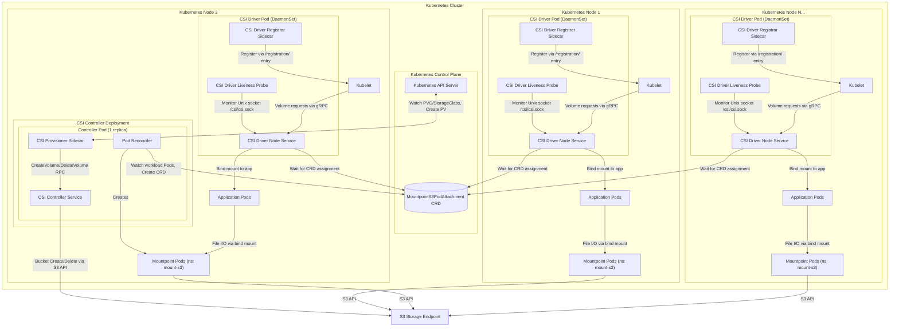

# Deployment Architecture

This document illustrates the deployment topology of the Scality CSI Driver for S3, showing how components are distributed across a Kubernetes cluster.
The architecture differs between static and dynamic provisioning modes.

## Deployment Components

### Controller Components

| Component | Type | Purpose | Details |
|-----------|------|---------|---------|
| **CSI Controller Service** | Main Container | Volume lifecycle management | Binary: `scality-s3-csi-driver` with `CSI_CONTROLLER_ONLY=true`. Handles CreateVolume/DeleteVolume RPCs for dynamic provisioning. Creates and deletes S3 buckets based on StorageClass parameters. Manages provisioner and node-publish secrets from StorageClass. Single replica Deployment (not DaemonSet). |
| **Pod Reconciler** | Main Container | Mountpoint Pod lifecycle | Binary: `scality-csi-controller`. Watches workload Pods (not CRDs). When a workload needs an S3 volume, creates Mountpoint Pod first, then creates MountpointS3PodAttachment CRD with assignment. Manages pod placement, resource allocation, and cleanup. Handles volume sharing by reusing Mountpoint Pods for matching workloads. |
| **CSI Provisioner Sidecar** | Sidecar Container | Kubernetes integration | Standard `csi-provisioner` from Kubernetes. Watches for PVCs that need dynamic provisioning. Reads StorageClass parameters and templates. Resolves template variables (`${pvc.name}`, `${pvc.namespace}`, `${pv.name}`, etc.). Calls CSI Controller's CreateVolume/DeleteVolume. Creates PV objects after successful bucket creation. |

### Node Components

| Component | Type | Purpose | Details |
|-----------|------|---------|---------|
| **CSI Driver Node Service** | Main Container | Core CSI functionality | Binary: `scality-s3-csi-driver`. Creates gRPC server on `/csi/csi.sock` Unix socket file. Exposes HTTP `/healthz` endpoint for Kubernetes liveness probe. Handles volume mount requests by waiting for MountpointS3PodAttachment CRD (created by Pod Reconciler). Sends mount options to Mountpoint Pod via Unix socket. Creates bind mounts from source directory to container target paths. Handles unmount by removing bind mounts. |
| **CSI Driver Registrar** | Sidecar | Kubelet registration | Creates registration entry in `/registration/` directory watched by kubelet. Registration entry announces CSI driver name `s3.csi.scality.com` and Unix socket location. Maintains registration while driver is deployed on node. Uses standard Kubernetes CSI node-driver-registrar sidecar. |
| **CSI Driver Liveness Probe** | Sidecar | CSI socket health logging | Checks CSI Driver Node Service via `/csi/csi.sock` Unix socket file. Logs health status to container logs for troubleshooting. Does NOT trigger pod restarts (logging only). |

### Mountpoint Pods

| Scope | Component | Purpose | Details |
|-------|-----------|---------|---------|
| **Per Volume (shared)** | Mountpoint Pod | S3 filesystem mounting | Dedicated pod running `mount-s3` FUSE process. Created by Pod Reconciler in the `mount-s3` namespace (configurable via `mountpointPod.namespace` Helm value). Mounts S3 bucket to source directory at `/var/lib/kubelet/plugins/s3.csi.scality.com/mnt/<pod-name>`. Can serve multiple workload pods with matching configurations. Provides POSIX-compliant filesystem interface through FUSE. Handles S3 API communication, caching, and file system semantics. |

### Custom Resource Definition

| Resource | Scope | Purpose | Details |
|----------|-------|---------|---------|
| **MountpointS3PodAttachment** | Cluster-scoped | Volume attachment tracking | Tracks which workload pods are attached to which Mountpoint Pods. Contains node name, PV name, volume ID, mount options, and fsGroup. Enables volume sharing across workloads with matching configurations. Short name: `s3pa`. Created by Pod Reconciler, Node Service waits for assignment. |

## Key Deployment Characteristics

### Resource Distribution

| Resource Scope | What Gets Deployed | Deployment Method | When Required |
|----------------|-------------------|-------------------|---------------|
| **Cluster-wide** | One CSI Controller pod | Deployment (1 replica) | Always (contains Pod Reconciler) |
| **Cluster-wide** | MountpointS3PodAttachment CRD | CustomResourceDefinition | Always |
| **Per Kubernetes Node** | One CSI Driver pod | DaemonSet | Always |
| **Per Volume (shared)** | One Mountpoint Pod | Created by Pod Reconciler | Per unique volume/node/options combination |

### Communication Paths

| Path | From | To | Protocol | Purpose | Provisioning Mode |
|------|------|----|----------|---------|-------------------|
| **PVC Monitoring** | CSI Provisioner Sidecar | Kubernetes API | HTTPS | Watch PVC/StorageClass events | Dynamic only |
| **Volume Provisioning** | CSI Provisioner Sidecar | CSI Controller Service | gRPC on Unix socket `/csi/csi.sock` | CreateVolume/DeleteVolume | Dynamic only |
| **Bucket Operations** | CSI Controller Service | S3 endpoint | HTTPS | Create/delete S3 buckets | Dynamic only |
| **Pod Watch** | Pod Reconciler | Kubernetes API | HTTPS | Watch workload Pods with S3 volumes | Both |
| **Mountpoint Pod Management** | Pod Reconciler | Kubernetes API | HTTPS | Create/delete Mountpoint Pods | Both |
| **CSI Driver Registration** | CSI Driver Registrar | Kubelet | Unix socket `/registration/` | Register driver per Kubernetes node | Both |
| **Volume Operations** | Kubelet | CSI Driver Node Service | gRPC on Unix socket | Mount/unmount requests | Both |
| **CRD Wait** | CSI Driver Node Service | Kubernetes API | HTTPS | Wait for MountpointS3PodAttachment assignment | Both |
| **Health Monitoring** | CSI Driver Liveness Probe | CSI Driver Node Service | gRPC on Unix socket `/csi/csi.sock` | Health status checks | Both |
| **File I/O** | Application pods | Mountpoint Pods | Bind mount + FUSE | File system operations | Both |
| **Storage Access** | Mountpoint Pods | S3 endpoint | HTTPS | S3 API calls | Both |

### Host Mounts Required

| Host Path | Purpose | Used By |
|-----------|---------|---------|
| `/var/lib/kubelet/plugins/s3.csi.scality.com/` | CSI driver socket and mount source directories | CSI Driver Node Service (creates gRPC socket and source mounts), kubelet (volume operations), CSI Driver Registrar (driver registration), CSI Driver Liveness Probe (health checks) |
| `/var/lib/kubelet/plugins/s3.csi.scality.com/mnt/<mp-pod-name>/` | Source mount directory for S3 bucket | Mountpoint Pod (FUSE mount point), CSI Driver Node Service (creates bind mounts from here) |
| `/var/lib/kubelet/pods/<pod-id>/volumes/kubernetes.io~csi/<volume-id>/mount/` | Target mount point for application access | kubelet (creates mount point directory), CSI Driver Node Service (creates bind mount to here), Application pods (file I/O) |

### Scaling Behavior

| Resource | Scaling Behavior | Mechanism | Notes |
|----------|------------------|-----------|-------|
| **CSI Controller** | Single instance | Deployment with 1 replica | One controller needed cluster-wide |
| **Kubernetes Nodes** | Automatic deployment to new nodes | DaemonSet controller | One CSI node pod per Kubernetes node |
| **Mountpoint Pods** | One per unique volume/node/options | Created by Pod Reconciler | Multiple workloads can share one Mountpoint Pod |

## Static vs Dynamic Provisioning

### Static Provisioning

- Controller deployment still required (for Pod Reconciler)
- DaemonSet for node pods
- Administrator pre-creates S3 buckets
- PersistentVolumes reference existing buckets

### Dynamic Provisioning

- Controller deployment required (CSI Controller Service + Pod Reconciler)
- Controller creates/deletes S3 buckets automatically
- StorageClass defines bucket creation parameters
- Supports credential templating for multi-tenancy

### Credential Flow Differences

| Aspect | Static Provisioning | Dynamic Provisioning |
|--------|--------------------|-----------------------|
| **Bucket Creation** | Manual by admin | Automatic by CSI Controller |
| **Credential Sources** | Driver-level (global), PV-level (nodePublishSecretRef) | Driver-level (global), StorageClass provisioner secrets, StorageClass node-publish secrets, Template-based secrets |
| **Secret Resolution** | At mount time by CSI Node | Provisioner secrets at CreateVolume, Node-publish secrets at mount time |
| **Multi-tenancy** | Per-PV secrets | Per-StorageClass or per-PVC templated secrets |
