# Deployment Architecture

This document illustrates the deployment topology of the Scality CSI Driver for S3, showing how components are distributed across a Kubernetes cluster.
The architecture differs between static and dynamic provisioning modes.

```mermaid
graph TB
    subgraph cluster["Kubernetes Cluster"]

        subgraph controlplane["Kubernetes Control Plane"]
            APIServer["Kubernetes API Server"]
        end

        subgraph node1["Kubernetes Node 1"]
            K1[Kubelet]
            subgraph ds1["CSI Driver Pod (DaemonSet)"]
                N1[CSI Driver Node Service]
                R1[CSI Driver Registrar Sidecar]
                L1[CSI Driver Liveness Probe]
            end
            subgraph init1["CSI Driver Init Container"]
                I1[mount-s3 Installer: Copies binary to host]
            end
            S1[Host systemd]
            M1[mount-s3 FUSE processes: One per mounted volume]
            A1[Application Pods]
        end

        subgraph node2["Kubernetes Node 2"]
            subgraph controller["CSI Controller Deployment"]
                subgraph controllerPod["Controller Pod (1 replica)"]
                    CSIController["CSI Controller Service"]
                    CSIProvisioner["CSI Provisioner Sidecar(Watch PVC)"]
                end
            end
            K2[Kubelet]
            subgraph ds2["CSI Driver Pod (DaemonSet)"]
                N2[CSI Driver Node Service]
                R2[CSI Driver Registrar Sidecar]
                L2[CSI Driver Liveness Probe]
            end
            subgraph init2["CSI Driver Init Container"]
                I2[mount-s3 Installer: Copies binary to host]
            end
            S2[Host systemd]
            M2[mount-s3 FUSE processes: One per mounted volume]
            A2[Application Pods]
        end

        subgraph node3["Kubernetes Node N..."]
            K3[Kubelet]
            subgraph ds3["CSI Driver Pod (DaemonSet)"]
                N3[CSI Driver Node Service]
                R3[CSI Driver Registrar Sidecar]
                L3[CSI Driver Liveness Probe]
            end
            subgraph init3["CSI Driver Init Container"]
                I3[mount-s3 Installer: Copies binary to host]
            end
            S3[Host systemd]
            M3[mount-s3 FUSE processes: One per mounted volume]
            A3[Application Pods]
        end


    end

    S3Storage[S3 Storage Endpoint]

    %% Controller operations (Dynamic Provisioning)
    APIServer <-->|"Watch PVC/StorageClass, Resolve PV/PVC Templates, Create PV, Update PVC Status"| CSIProvisioner
    CSIProvisioner -->|"CreateVolume/DeleteVolume RPC | Unix socket /csi/csi.sock"| CSIController
    CSIController -->|"Bucket Create/Delete via S3 API"| S3Storage

    %% Init container flow
    I1 -.->|Install binary to /opt/mountpoint-s3-csi/bin/| S1
    I2 -.->|Install binary to /opt/mountpoint-s3-csi/bin/| S2
    I3 -.->|Install binary to /opt/mountpoint-s3-csi/bin/| S3

    %% CSI Driver Registration
    R1 -->|Register via /registration/ entry| K1
    R2 -->|Register via /registration/ entry| K2
    R3 -->|Register via /registration/ entry| K3

    %% Health monitoring
    L1 -->|Monitor Unix socket /csi/csi.sock| N1
    L2 -->|Monitor Unix socket /csi/csi.sock| N2
    L3 -->|Monitor Unix socket /csi/csi.sock| N3

    %% Node operations
    K1 -->|Volume requests via gRPC on host Unix socket| N1
    K2 -->|Volume requests via gRPC on host Unix socket| N2
    K3 -->|Volume requests via gRPC on host Unix socket| N3

    N1 -->|Create/stop services via D-Bus| S1
    N2 -->|Create/stop services via D-Bus| S2
    N3 -->|Create/stop services via D-Bus| S3

    S1 -->|Start/stop/monitor processes| M1
    S2 -->|Start/stop/monitor processes| M2
    S3 -->|Start/stop/monitor processes| M3

    %% Application access
    A1 -->|File I/O| M1
    A2 -->|File I/O| M2
    A3 -->|File I/O| M3

    %% S3 connections
    M1 -->|S3 API| S3Storage
    M2 -->|S3 API| S3Storage
    M3 -->|S3 API| S3Storage

    %% Styling for clarity without colors
    classDef optional stroke-dasharray: 5 5
```

## Deployment Components

### Controller Components (Dynamic Provisioning Only)

| Component | Type | Purpose | Details |
|-----------|------|---------|---------|
| **CSI Controller Service** | Main Container | Volume lifecycle management | • Binary: `scality-s3-csi-driver` with `CSI_CONTROLLER_ONLY=true` • Handles CreateVolume/DeleteVolume RPCs for dynamic provisioning • Creates and deletes S3 buckets based on StorageClass parameters • Manages provisioner and node-publish secrets from StorageClass • Single replica Deployment (not DaemonSet) • Runs on exactly one Kubernetes node in the cluster at any time |
| **CSI Provisioner Sidecar** | Sidecar Container | Kubernetes integration | • Standard `csi-provisioner` from Kubernetes • Watches for PVCs that need dynamic provisioning • Reads StorageClass parameters and templates • Resolves template variables in StorageClass parameters (`${pvc.name}`, `${pvc.namespace}`, `${pv.name}`, etc.) • Calls CSI Controller's CreateVolume/DeleteVolume • Creates PV objects after successful bucket creation |

### Node Components

| Component | Type | Purpose | Details |
|-----------|------|---------|---------|
| **mount-s3 Installer** | Init Container | Binary deployment | • Copies `mount-s3` binary from container to host at `/opt/mountpoint-s3-csi/bin/` • Runs first and must complete successfully before main containers start • Required because systemd executes processes on host filesystem • Sets appropriate file permissions for systemd execution |
| **CSI Driver Node Service** | Main Container | Core CSI functionality | • Binary: `scality-s3-csi-driver` • Creates gRPC server on `/csi/csi.sock` Unix socket file • Exposes HTTP `/healthz` endpoint for Kubernetes liveness probe • Pod restart triggered if HTTP health check fails • Handles volume mount/unmount operations by launching `mount-s3` binary installed by init container • Manages systemd services via D-Bus that execute the `mount-s3` binary installed by init container |
| **CSI Driver Registrar** | Sidecar | Kubelet registration | • Creates registration entry in `/registration/` directory watched by kubelet • Registration entry announces CSI driver name `s3.csi.scality.com` and Unix socket location `/var/lib/kubelet/plugins/s3.csi.scality.com/csi.sock` • Maintains registration while driver is deployed on node • Has own liveness probe for registration health • Uses standard Kubernetes CSI node-driver-registrar sidecar |
| **CSI Driver Liveness Probe** | Sidecar | CSI socket health logging | • Checks CSI Driver Node Service via `/csi/csi.sock` Unix socket file • Logs health status to container logs for troubleshooting • Does NOT trigger pod restarts (logging only) |

### Host-Level Components

| Scope | Component | Purpose | Details |
|-------|-----------|---------|---------|
| **Per Kubernetes Node** | Host systemd | Service management | • Host's service manager receiving D-Bus commands from CSI Driver Node Service • Creates transient systemd services that execute `mount-s3` binary installed by init container • Manages service lifecycle: start, stop, monitor mount processes • Provides process supervision and cleanup on service failures • Runs on host filesystem context, not in container |
| **Per Volume** | mount-s3 FUSE processes | S3 filesystem mounting | • One process per mounted volume using `mount-s3` binary installed by init container • Executed by systemd services created via D-Bus by CSI Driver Node Service • Creates FUSE mount presenting S3 bucket as POSIX filesystem • Handles S3 API communication, caching, and file system semantics |

## Key Deployment Characteristics

### Resource Distribution

| Resource Scope | What Gets Deployed | Deployment Method | When Required |
|----------------|-------------------|-------------------|---------------|
| **Cluster-wide** | One CSI Controller pod | Deployment (1 replica) | Dynamic provisioning only |
| **Per Kubernetes Node** | One CSI Driver pod | DaemonSet | Always |
| **Per Volume** | One mount-s3 process | systemd service | Always |

### Communication Paths

| Path | From | To | Protocol | Purpose | Provisioning Mode |
|------|------|----|----------|---------|-------------------|
| **PVC Monitoring** | CSI Provisioner Sidecar | Kubernetes API | HTTPS | Watch PVC/StorageClass events | Dynamic only |
| **Volume Provisioning** | CSI Provisioner Sidecar | CSI Controller Service | gRPC on Unix socket `/csi/csi.sock` | CreateVolume/DeleteVolume | Dynamic only |
| **Bucket Operations** | CSI Controller Service | S3 endpoint | HTTPS | Create/delete S3 buckets | Dynamic only |
| **CSI Driver Registration** | CSI Driver Registrar | Kubelet | Unix socket `/registration/` | Register driver per Kubernetes node | Both |
| **Volume Operations** | Kubelet | CSI Driver Node Service | gRPC on Unix socket `/var/lib/kubelet/plugins/s3.csi.scality.com/csi.sock` | Mount/unmount requests | Both |
| **Health Monitoring** | CSI Driver Liveness Probe | CSI Driver Node Service | gRPC on Unix socket `/csi/csi.sock` | Health status checks | Both |
| **Service Management** | CSI Driver Node Service | systemd | D-Bus on `/run/systemd/` | Create/stop services | Both |
| **File I/O** | Application pods | mount-s3 processes | FUSE | File system operations | Both |
| **Storage Access** | mount-s3 processes | S3 endpoint | HTTPS | S3 API calls | Both |

### Host Mounts Required

| Host Path | Purpose | Used By |
|-----------|---------|---------|
| `/var/lib/kubelet/plugins/s3.csi.scality.com/` | CSI driver Unix socket creation and registration info storage | CSI Driver Node Service (creates gRPC socket), kubelet (volume operations), CSI Driver Registrar (driver registration), CSI Driver Liveness Probe (health checks) |
| `/var/lib/kubelet/pods/<pod-id>/volumes/kubernetes.io~csi/<volume-id>/mount/` | S3 bucket content mount point for application access | kubelet (creates mount point directory), mount-s3 processes (FUSE filesystem), Application pods (file I/O) |
| `/run/systemd/` | D-Bus socket for systemd service lifecycle management | systemd (owns D-Bus sockets), CSI Driver Node Service (D-Bus client for service management) |
| `/opt/mountpoint-s3-csi/bin/mount-s3` | FUSE mount binary executable storage | mount-s3 Installer (creates binary file), systemd transient services (execute FUSE mounts) |

### Scaling Behavior

| Resource | Scaling Behavior | Mechanism | Notes |
|----------|------------------|-----------|-------|
| **CSI Controller** | Single instance | Deployment with 1 replica | Only one controller needed cluster-wide (dynamic provisioning) |
| **Kubernetes Nodes** | Automatic deployment to new nodes | DaemonSet controller | One CSI node pod per Kubernetes node |
| **Volumes** | One process per volume | systemd service creation | Each mounted volume gets its own mount-s3 process |

## Static vs Dynamic Provisioning

### Static Provisioning

- No controller deployment needed
- Only DaemonSet for node pods
- Administrator pre-creates S3 buckets
- PersistentVolumes reference existing buckets

### Dynamic Provisioning

- Requires controller deployment (`controller.enable: true` in Helm values)
- Controller creates/deletes S3 buckets automatically
- StorageClass defines bucket creation parameters
- Supports credential templating for multi-tenancy

### Credential Flow Differences

| Aspect | Static Provisioning | Dynamic Provisioning |
|--------|--------------------|-----------------------|
| **Bucket Creation** | Manual by admin | Automatic by CSI Controller |
| **Credential Sources** | • Driver-level (global) • PV-level (nodePublishSecretRef) | • Driver-level (global) • StorageClass provisioner secrets • StorageClass node-publish secrets • Template-based secrets |
| **Secret Resolution** | At mount time by CSI Node | • Provisioner secrets at CreateVolume • Node-publish secrets at mount time |
| **Multi-tenancy** | Per-PV secrets | Per-StorageClass or per-PVC templated secrets |
