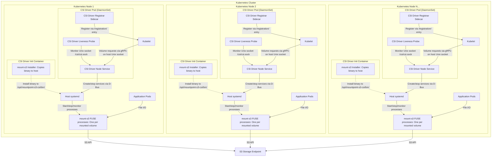

# Deployment Architecture

This document illustrates the deployment topology of the Scality CSI Driver for S3, showing how components are distributed across a Kubernetes cluster.

## Deployment Components

### Pod Components

| Component | Type | Purpose | Details |
|-----------|------|---------|---------|
| **mount-s3 Installer** | Init Container | Binary deployment | • Copies `mount-s3` binary from container to host at `/opt/mountpoint-s3-csi/bin/` • Runs first and must complete successfully before main containers start • Required because systemd executes processes on host filesystem • Sets appropriate file permissions for systemd execution |
| **CSI Driver Node Service** | Main Container | Core CSI functionality | • Binary: `scality-s3-csi-driver` • Creates gRPC server on `/csi/csi.sock` Unix socket file • Exposes HTTP `/healthz` endpoint for Kubernetes liveness probe • Pod restart triggered if HTTP health check fails • Handles volume mount/unmount operations by launching `mount-s3` binary installed by init container • Manages systemd services via D-Bus that execute the `mount-s3` binary installed by init container |
| **CSI Driver Registrar** | Sidecar | Kubelet registration | • Creates registration entry in `/registration/` directory watched by kubelet • Registration entry announces CSI driver name `s3.csi.scality.com` and Unix socket location `/var/lib/kubelet/plugins/s3.csi.scality.com/csi.sock` • Maintains registration while driver is deployed on node • Has own liveness probe for registration health • Uses standard Kubernetes CSI node-driver-registrar sidecar |
| **CSI Driver Liveness Probe** | Sidecar | CSI socket health logging | • Checks CSI Driver Node Service via `/csi/csi.sock` Unix socket file • Logs health status to container logs for troubleshooting • Does NOT trigger pod restarts (logging only) |

### Host-Level Components

| Scope | Component | Purpose | Details |
|-------|-----------|---------|---------|
| **Per Kubernetes Node** | Host systemd | Service management | • Host's service manager receiving D-Bus commands from CSI Driver Node Service • Creates transient systemd services that execute `mount-s3` binary installed by init container • Manages service lifecycle: start, stop, monitor mount processes • Provides process supervision and cleanup on service failures • Runs on host filesystem context, not in container |
| **Per Volume** | mount-s3 FUSE processes | S3 filesystem mounting | • One process per mounted volume using `mount-s3` binary installed by init container • Executed by systemd services created via D-Bus by CSI Driver Node Service • Creates FUSE mount presenting S3 bucket as POSIX filesystem • Handles S3 API communication, caching, and file system semantics |

## Key Deployment Characteristics

### Resource Distribution

| Resource Scope | What Gets Deployed | Deployment Method |
|----------------|-------------------|-------------------|
| **Per Kubernetes Node** | One CSI Driver pod | DaemonSet |
| **Per Volume** | One mount-s3 process | systemd service |

### Communication Paths

| Path | From | To | Protocol | Purpose |
|------|------|----|----------|---------|
| **CSI Driver Registration** | CSI Driver Registrar | Kubelet | Unix socket `/registration/` | Register driver per Kubernetes node |
| **Volume Operations** | Kubelet | CSI Driver Node Service | gRPC on Unix socket `/var/lib/kubelet/plugins/s3.csi.scality.com/csi.sock` | Mount/unmount requests |
| **Health Monitoring** | CSI Driver Liveness Probe | CSI Driver Node Service | gRPC on Unix socket `/csi/csi.sock` | Health status checks |
| **Service Management** | CSI Driver Node Service | systemd | D-Bus on `/run/systemd/` | Create/stop services |
| **File I/O** | Application pods | mount-s3 processes | FUSE | File system operations |
| **Storage Access** | mount-s3 processes | S3 endpoint | HTTPS | S3 API calls |

### Host Mounts Required

| Host Path | Purpose | Used By |
|-----------|---------|---------|
| `/var/lib/kubelet/plugins/s3.csi.scality.com/` | CSI driver Unix socket creation and registration info storage | CSI Driver Node Service (creates gRPC socket), kubelet (volume operations), CSI Driver Registrar (driver registration), CSI Driver Liveness Probe (health checks) |
| `/var/lib/kubelet/pods/<pod-id>/volumes/kubernetes.io~csi/<volume-id>/mount/` | S3 bucket content mount point for application access | kubelet (creates mount point directory), mount-s3 processes (FUSE filesystem), Application pods (file I/O) |
| `/run/systemd/` | D-Bus socket for systemd service lifecycle management | systemd (owns D-Bus sockets), CSI Driver Node Service (D-Bus client for service management) |
| `/opt/mountpoint-s3-csi/bin/mount-s3` | FUSE mount binary executable storage | mount-s3 Installer (creates binary file), systemd transient services (execute FUSE mounts) |

### Scaling Behavior

| Resource | Scaling Behavior | Mechanism |
|----------|------------------|-----------|
| **Kubernetes Nodes** | Automatic deployment to new nodes | DaemonSet controller |
| **Volumes** | One process per volume | systemd service creation |
