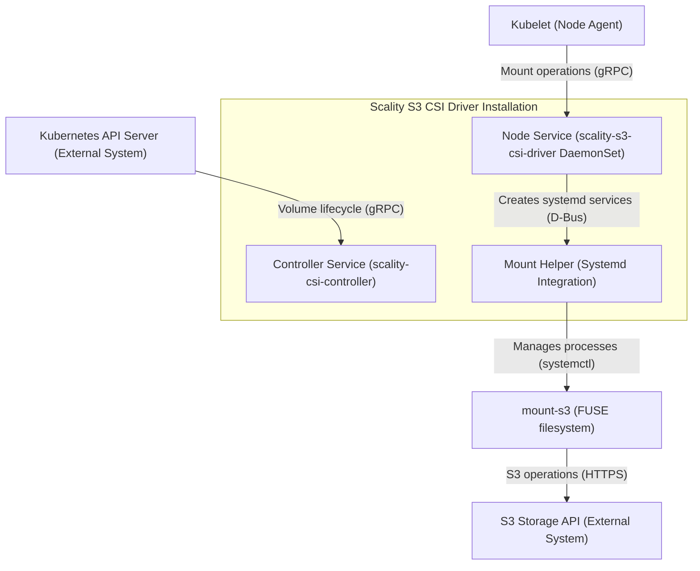

# Deployment Architecture

This document describes what gets deployed when you install the Scality S3 CSI Driver.

## Components Diagram

```mermaid
graph TB
    K8sAPI["Kubernetes API Server (External System)"]
    Kubelet["Kubelet (Node Agent)"]
    S3API["S3 Storage API (External System)"]

    subgraph driver["Scality S3 CSI Driver Installation"]
        Controller["Controller Service (scality-csi-controller)"]
        Node["Node Service (scality-s3-csi-driver DaemonSet)"]
        Mounter["Mount Helper (Systemd Integration)"]
    end

    MP["mount-s3 (FUSE filesystem)"]

    K8sAPI -->|"Volume lifecycle (gRPC)"| Controller
    Kubelet -->|"Mount operations (gRPC)"| Node
    Node -->|"Creates systemd services (D-Bus)"| Mounter
    Mounter -->|"Manages processes (systemctl)"| MP
    MP -->|"S3 operations (HTTPS)"| S3API
```

## What Gets Installed

### Controller Service (Experimental Only)

**Kubernetes Resource**: `scality-csi-controller` Deployment  
**Deployment Condition**: Only deployed when `experimental.podMounter: true`  
**Replicas**: 1 (can be scaled for HA)  
**Node Placement**: Any node (uses node selector/tolerations if configured)

> **Note**: The controller is currently only used for the experimental pod-based mounting feature. In standard systemd-based deployments (default), only the Node Service DaemonSet is deployed.

**Container Details**:

- **Image**: `scality/scality-s3-csi-driver:latest`
- **Technology**: Go application with gRPC server
- **Purpose**: Cluster-wide volume lifecycle management
- **Network**: Communicates with Kubernetes API Server only

**What it does**:

- Handles volume creation/deletion requests
- Validates volume parameters and requirements
- Manages volume attachments (in static provisioning: validation only)
- Future: Will handle dynamic bucket creation and deletion

### Node Service

**Kubernetes Resource**: `scality-s3-csi-driver` DaemonSet  
**Replicas**: One pod per node  
**Node Placement**: All nodes (or subset based on node selectors)

**Container Details**:

- **Image**: `scality/scality-s3-csi-driver:latest`
- **Technology**: Go application with gRPC server
- **Purpose**: Per-node volume mounting and management
- **Network**: Local communication with kubelet and systemd

**What it does**:

- Receives mount/unmount requests from kubelet
- Manages S3 credentials securely
- Creates and manages systemd service units
- Monitors volume health and handles mount failures

### Init Container

**Purpose**: Install the mount-s3 binary on each node  
**Container**: `install-mountpoint` (runs before the main containers)

**What it does**:

- Copies the mount-s3 binary to a host path
- Ensures the binary is available for systemd to execute
- Only runs once during pod initialization

**Installation Path**: `/opt/mountpoint-s3-csi/bin/mount-s3` (configurable)

### Supporting Kubernetes Resources

#### ServiceAccounts

- **Controller ServiceAccount**: `s3-csi-driver-controller-sa` (only with experimental.podMounter)
- **Node ServiceAccount**: `s3-csi-driver-sa` (always created)

#### RBAC (ClusterRole/ClusterRoleBinding)

- **Node Service Permissions**:
  - `serviceaccounts`: get (to verify its own service account)
  - No other cluster-wide permissions required
- **Controller Permissions** (experimental only):
  - Pod management in mountpoint namespace
  - CSI volume attachment handling

#### ConfigMaps (Optional)

- Driver configuration parameters
- Logging and debugging settings
- Regional endpoint configurations

#### Secrets (User-provided)

- S3 credentials when not using node-level authentication
- Per-volume authentication credentials

### Runtime Components

#### mount-s3 Processes

**Deployment Model**: Managed by systemd (one per mounted volume)  
**Technology**: Rust application (AWS Mountpoint for S3)  
**Lifecycle**: Created/destroyed per volume mount/unmount

**Process Details**:

- **Binary**: `mount-s3` (included in node service container or installed separately)
- **Purpose**: Provides FUSE filesystem interface to S3
- **Management**: Supervised by systemd for reliability
- **Isolation**: Each volume gets its own process with isolated credentials

## Communication Patterns

### gRPC Interfaces

- **Kubernetes API → Controller**: Volume lifecycle management via CSI specification
- **Kubelet → Node Service**: Mount/unmount operations using Unix domain sockets (`/var/lib/kubelet/plugins/`)
- **Security**: All gRPC communication uses secure Unix domain sockets

### Systemd Integration

- **Node Service → Systemd**: D-Bus API for service management
- **Service Creation**: Creates transient systemd service units for each mount
- **Process Supervision**: Systemd automatically restarts failed mount processes
- **Resource Management**: Integration with cgroups for resource limits

### External APIs

- **mount-s3 → S3 Storage**: RESTful HTTPS API for object operations
- **Authentication**: Supports AWS profiles, Kubernetes secrets, and instance roles
- **Connection Management**: Connection pooling and retry logic built-in
- **Security**: TLS encryption for all data transfers

## Resource Requirements

### Controller Service

- **Memory**: ~50MB baseline, scales with number of volumes
- **CPU**: Minimal, mostly event-driven
- **Storage**: No persistent storage required
- **Network**: Low bandwidth, API calls only

### Node Service (per node)

- **Memory**: ~100MB baseline per node
- **CPU**: Minimal, scales with mount operations
- **Storage**: No persistent storage required
- **Network**: Local communication only

### mount-s3 Processes (per volume)

- **Memory**: Variable based on cache configuration (50MB-2GB+)
- **CPU**: Scales with I/O load and concurrent operations
- **Storage**: Optional local cache (configurable size)
- **Network**: Direct S3 API bandwidth usage

## Scaling Characteristics

### Horizontal Scaling

- **Controller**: Can run multiple replicas for high availability
- **Node Service**: Automatically scales with cluster size (DaemonSet)
- **Mount Processes**: One per active volume, managed automatically

### Resource Scaling

- **Linear with Volumes**: Memory and CPU usage scales linearly with active volumes
- **I/O Dependent**: Mount process resources depend on application access patterns
- **Cache Configurable**: Local cache size directly impacts memory usage

### High Availability

- **Controller**: Supports multiple replicas with leader election
- **Node Service**: Node failure only affects volumes on that node
- **Mount Processes**: Systemd automatically restarts failed processes

## Security Architecture

### Process Isolation

- **Separate Processes**: Each mount runs in isolated systemd service
- **Credential Isolation**: Each mount process has its own credential context
- **Resource Limits**: Systemd enforces memory and CPU limits per service

### Network Security

- **TLS Everywhere**: All external communication encrypted
- **Local Sockets**: gRPC uses secure Unix domain sockets
- **No Exposed Ports**: No additional network ports opened in cluster

### Kubernetes Security

- **RBAC**: Minimal required permissions for each component
- **ServiceAccount Isolation**: Separate service accounts for controller and node
- **Secret Management**: Secure handling of S3 credentials through Kubernetes secrets

## Troubleshooting Resources

### Logs

- **Controller Logs**: `kubectl logs deployment/scality-csi-controller`
- **Node Logs**: `kubectl logs daemonset/scality-s3-csi-driver`
- **Mount Process Logs**: `journalctl -u scality-s3-mount-*`

### Status Monitoring

- **Volume Status**: Check PV and PVC status in Kubernetes
- **Mount Status**: `systemctl status scality-s3-mount-*`
- **Process Health**: Standard Kubernetes readiness/liveness probes

### Common Issues

- **Mount Failures**: Check systemd service status and logs
- **Credential Errors**: Verify S3 credentials and permissions
- **Performance Issues**: Review cache configuration and resource limits
