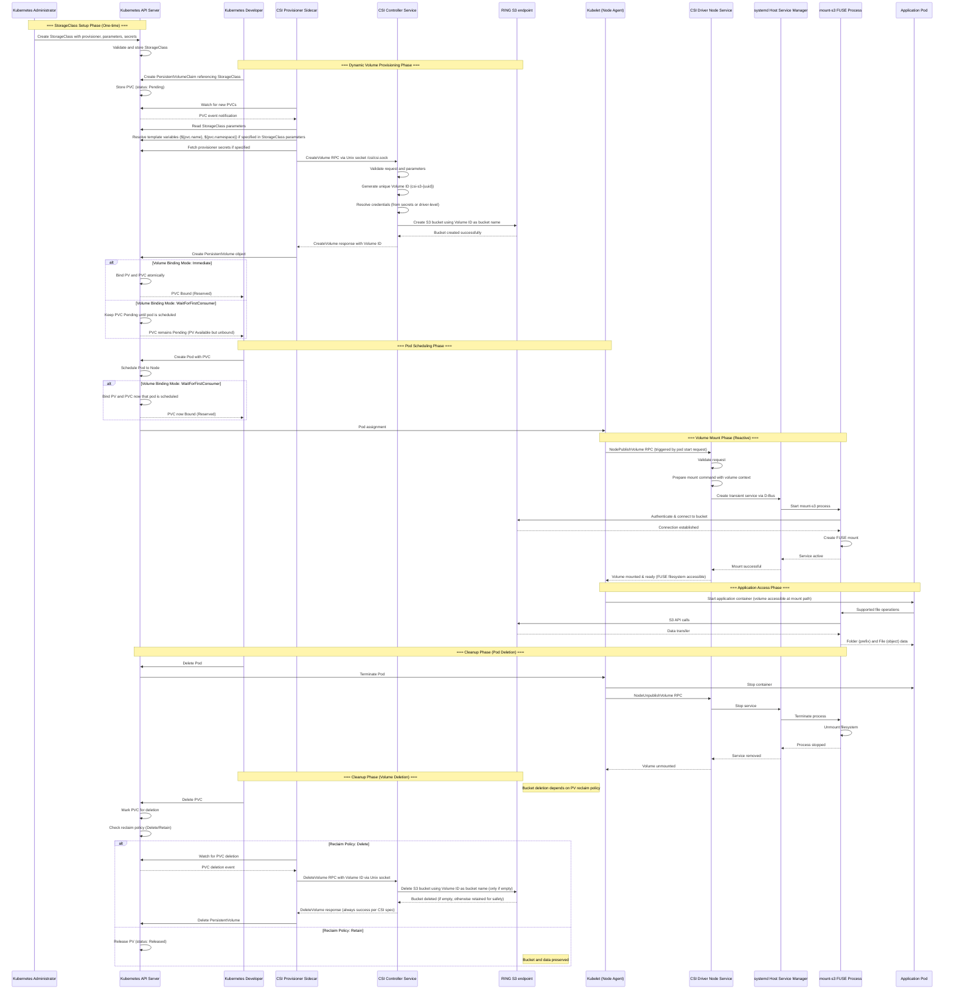

# Dynamic Provisioning Architecture

This document details the complete lifecycle of dynamically provisioned volumes in the Scality CSI Driver for S3, from StorageClass creation to application file access and eventual cleanup.

## Phase Flow Summary

| Phase/Step | Description | Key Outcome |
|------------|-------------|-------------|
| **Phase 1: StorageClass Setup** | **Administrator defines provisioning parameters (one-time setup)** | **Template for dynamic volumes** |
| 1.1 | Create StorageClass with provisioner `s3.csi.scality.com`, parameters (mount options), and secret references | StorageClass stored |
| 1.2 | Define provisioner-secret and node-publish-secret names with template variables (${pvc.name}, ${pvc.namespace}) | Credential templates ready |
| **Phase 2: Volume Provisioning** | **Automatic S3 bucket creation on PVC request** | **S3 bucket and PV created** |
| 2.1 | Developer creates PVC referencing StorageClass, specifying capacity and access modes | PVC created (status: Pending) |
| 2.2 | CSI Provisioner Sidecar watches API Server, detects new PVC, resolves templates | Provisioning triggered |
| 2.3 | Provisioner calls CreateVolume RPC to CSI Controller Service with resolved parameters | Controller invoked |
| 2.4 | CSI Controller generates unique Volume ID (csi-s3-{uuid}) and creates S3 bucket with this ID as bucket name | S3 bucket created with consistent naming |
| 2.5a | Provisioner creates PV object. If volumeBindingMode: Immediate, PVC binds immediately | PV created, binding depends on mode |
| 2.5b | If volumeBindingMode: WaitForFirstConsumer, PVC remains Pending until pod scheduled | PV available, PVC waits for consumer |
| | | |
| **Phase 3: Pod Scheduling** | **Kubernetes finds where to run the pod** | **Pod assigned to node** |
| 3.1 | Create Pod with volumeMounts section referencing PVC and specifying container mount path | Pod object created |
| 3.2 | Scheduler evaluates nodes based on resources, topology constraints, and CSI driver availability | Pod scheduled to node |
| 3.3 | If volumeBindingMode: WaitForFirstConsumer, PVC and PV bind now that pod is scheduled | PVC finally bound (all modes) |
| | | |
| **Phase 4: Volume Mount (CSI)** | **Node makes dynamically created S3 bucket accessible as filesystem** | **S3 mounted locally** |
| 4.1 | Kubelet triggers NodePublishVolume RPC when pod starts on the scheduled node | CSI mount request initiated |
| 4.2 | CSI Node Service extracts volume context including authenticationSource from PV | Mount configuration prepared |
| 4.3 | CSI driver creates systemd transient service, starts mount-s3 with appropriate credentials | mount-s3 process running |
| 4.4 | mount-s3 authenticates to S3 endpoint, creates FUSE mount at CSI target path | FUSE filesystem ready |
| | | |
| **Phase 5: Application Access** | **Pod performs file operations on dynamically provisioned storage** | **S3 data accessible** |
| 5.1 | Kubelet bind-mounts CSI target path into container at specified mountPath | Container has S3 access |
| 5.2 | Application performs file operations, mount-s3 translates to S3 API calls | Data read/write operations |
| | | |
| **Phase 6: Cleanup (Pod)** | **Unmount volume when pod terminates** | **Mount cleaned up** |
| 6.1 | Pod deletion initiated, kubelet stops container gracefully | Container terminated |
| 6.2 | Kubelet calls NodeUnpublishVolume RPC, CSI driver stops mount-s3 process | Volume unmounted |
| | | |
| **Phase 7: Cleanup (Volume)** | **Handle bucket lifecycle based on reclaim policy** | **Storage fate determined** |
| 7.1 | Developer deletes PVC, triggering cleanup based on StorageClass reclaim policy | PVC marked for deletion |
| 7.2a | If Delete: Provisioner calls DeleteVolume RPC with Volume ID, Controller attempts to delete S3 bucket (only if empty) | Storage removed if empty, otherwise retained |
| 7.2b | If Retain: PV released but bucket preserved, admin must manually clean up | Data preserved for recovery |

## Volume ID System Architecture

The CSI driver implements a unified identification system that ensures perfect consistency between Kubernetes resources and S3 storage:

### Volume ID Generation and Usage

### Key Characteristics

- **Unique Generation**: Each volume gets a UUID-based identifier: `csi-s3-12345678-abcd-1234-abcd-123456789012`
- **Dual Purpose**: The same ID serves as both the CSI Volume ID (stored in PersistentVolume) and the S3 bucket name
- **Lifecycle Consistency**: Creation and deletion operations use identical identifiers, eliminating bucket/volume mapping ambiguity
- **Resource Mapping**:
  - Kubernetes PV Name: `pvc-{pvc-uuid}` (generated by external-provisioner)
  - CSI Volume ID: `csi-s3-{driver-uuid}` (generated by CSI driver)
  - S3 Bucket Name: `csi-s3-{driver-uuid}` (same as Volume ID)

This architecture ensures that:

1. There's never confusion about which S3 bucket corresponds to which Kubernetes volume
2. Deletion operations are reliable and precise
3. Manual debugging is simplified (Volume ID directly maps to bucket name)

## Key Differences from Static Provisioning

| Aspect | Dynamic Provisioning | Static Provisioning |
|--------|---------------------|-------------------|
| **Bucket Creation** | Automatic via CSI Controller | Manual by administrator |
| **PV Creation** | Automatic by CSI Provisioner Sidecar | Manual by administrator |
| **Credential Flow** | Template-based, resolved at provision time | Fixed at PV creation |
| **Bucket Deletion** | Automatic if reclaim policy is Delete | Never deleted by CSI |
| **Multi-tenancy** | Supported via credential templates | Limited to per-PV secrets |
| **Complexity** | More moving parts, but automated | Simpler architecture, manual setup |

## Credential Resolution Details

For detailed information about how credentials are resolved during dynamic provisioning, including:

- Provisioner secret resolution for bucket operations
- Node-publish secret resolution for mount operations  
- Template variable substitution
- Credential precedence and fallback

See [Dynamic Provisioning Credentials Management](./ring-s3-credentials-management/dynamic-provisioning-credentials-management.md)
