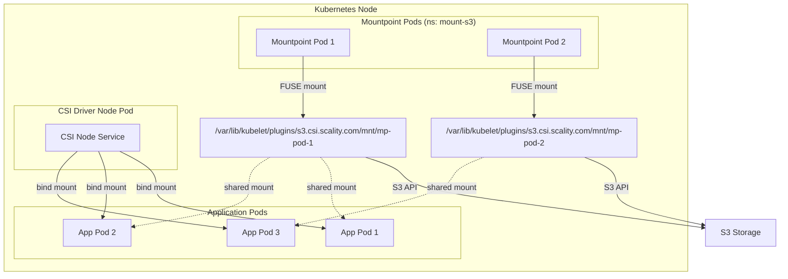
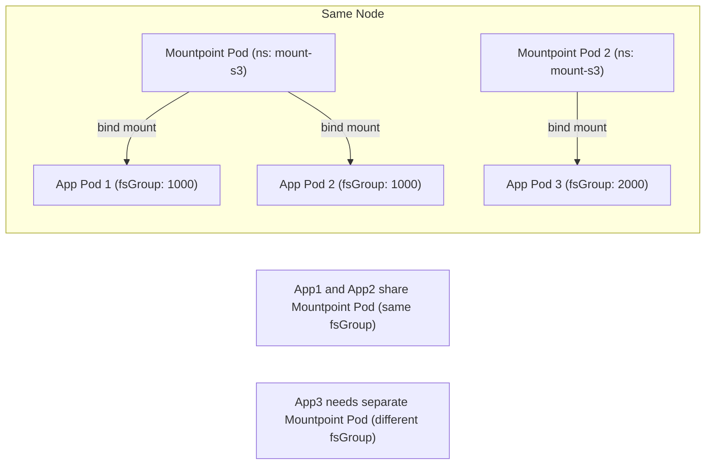
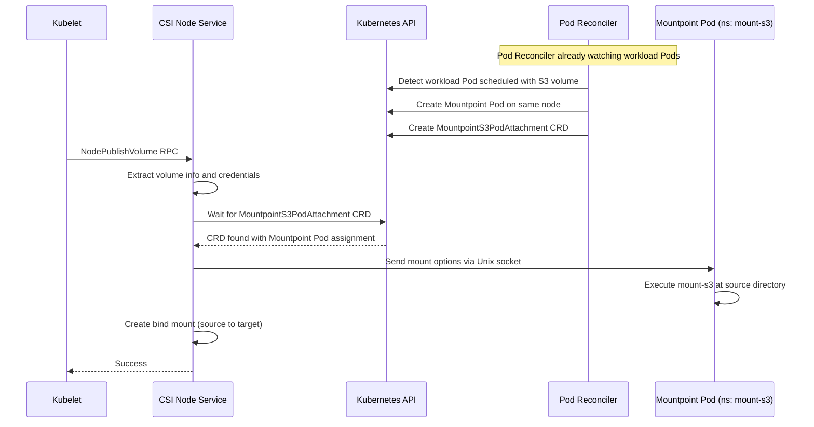
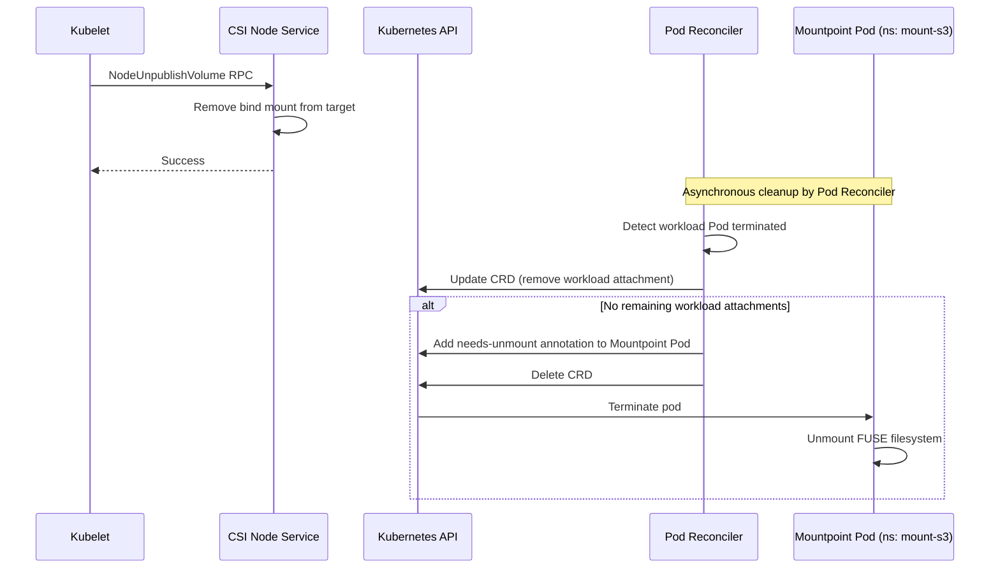

# Pod Mounter Architecture

This document explains the Pod Mounter architecture, the core mounting mechanism in version 2 of the Scality CSI Driver for S3.

## Overview

The Pod Mounter architecture replaces the systemd-based mounting approach used in v1.x with a
Kubernetes-native solution using dedicated Mountpoint Pods. This approach provides better isolation,
resource management, and volume sharing capabilities.

<div align="center">



</div>

## Source/Bind Mount Architecture

The Pod Mounter implements a two-tier mounting strategy:

### 1. Source Mount

The Mountpoint Pod creates a FUSE mount at a source directory:

```text
/var/lib/kubelet/plugins/s3.csi.scality.com/mnt/<mountpoint-pod-name>/
```

This source mount:

- Is created once per unique volume/node/options combination
- Runs the mount-s3 FUSE process inside the Mountpoint Pod
- Handles all S3 API communication
- Can serve multiple workload pods simultaneously

### 2. Bind Mount

For each workload pod, the CSI Node Service creates a bind mount from the source to the container's target path:

```text
Source: /var/lib/kubelet/plugins/s3.csi.scality.com/mnt/<mp-pod-name>/
Target: /var/lib/kubelet/pods/<pod-uid>/volumes/kubernetes.io~csi/<pv-name>/mount/
```

This bind mount:

- Is lightweight (no additional FUSE processes)
- Provides isolation for each workload's mount path
- Can be created/removed independently of the source mount

## Mountpoint Pod Namespace

Mountpoint Pods are created in a dedicated namespace, separate from workload pods:

| Configuration | Default | Description |
|---------------|---------|-------------|
| **Helm value** | `mountpointPod.namespace` | Namespace for Mountpoint Pods |
| **Environment variable** | `MOUNTPOINT_NAMESPACE` | Set on controller and node pods |
| **Default namespace** | `mount-s3` | Created automatically by the Helm chart |

This separation provides:

- **Isolation**: Mountpoint Pods run separately from application workloads
- **RBAC control**: Fine-grained permissions for the CSI driver in this namespace
- **Resource management**: Easier monitoring and resource quotas for mount operations
- **Security**: Network policies can be applied specifically to mount operations

To view Mountpoint Pods:

```bash
kubectl get pods -n mount-s3
```

## Volume Sharing

Multiple workload pods can share a single Mountpoint Pod when they match on these criteria:

| Field | Description |
|-------|-------------|
| `nodeName` | Workloads must be on the same node |
| `persistentVolumeName` | Workloads must use the same PV |
| `volumeID` | Underlying volume identifier must match |
| `mountOptions` | Mount options from PV/StorageClass must match |
| `workloadFSGroup` | Pod security context fsGroup must match |

### Sharing Example



## Mount Flow

### NodePublishVolume (Mount Request)



### NodeUnpublishVolume (Unmount Request)



## Key Components

### Pod Reconciler

The Pod Reconciler is responsible for:

1. **Watching workload Pods** - Uses controller-runtime to watch all Pods in the cluster (`For(&corev1.Pod{})`)
2. **Detecting S3 volume needs** - Identifies Pods using CSI volumes from `s3.csi.scality.com`
3. **Creating Mountpoint Pods** - Spawns dedicated pods to run mount-s3 on the same node as workloads
4. **Managing CRDs** - Creates and updates MountpointS3PodAttachment resources
5. **Cleanup** - Removes Mountpoint Pods and CRDs when no workloads need them

### CSI Node Service

The CSI Node Service is responsible for:

1. **Waiting for CRD** - Polls for MountpointS3PodAttachment CRD to find assigned Mountpoint Pod
2. **Sending mount options** - Communicates credentials and options to Mountpoint Pod via Unix socket
3. **Creating bind mounts** - Establishes bind mounts from source to container target paths
4. **Removing bind mounts** - Cleans up bind mounts during NodeUnpublishVolume

## Benefits Over Systemd Approach

| Aspect | Pod Mounter (v2) | Systemd Mounter (v1.x) |
|--------|------------------|------------------------|
| **Isolation** | Each mount runs in dedicated pod with resource limits | Processes share host resources |
| **Resource Management** | Kubernetes-native resource requests/limits | Limited to systemd cgroups |
| **Volume Sharing** | Multiple workloads share one FUSE process | Each mount gets separate process |
| **Observability** | Standard kubectl logs/describe | Requires host access for journalctl |
| **Upgrades** | Graceful pod replacement | Requires careful service management |
| **Security** | Pod security context, network policies | Host-level security only |

## Mountpoint Pod Lifecycle

### Creation

1. Pod Reconciler detects workload Pod scheduled with S3 volume
2. Pod Reconciler creates Mountpoint Pod on same node as workload
3. Pod Reconciler creates MountpointS3PodAttachment CRD with assignment
4. Mountpoint Pod starts and waits for mount options via Unix socket
5. CSI Node Service (during NodePublishVolume) sends credentials and mount options
6. Mountpoint Pod executes mount-s3 at source directory

### Termination

1. All workloads using the volume terminate
2. CSI Node Service removes bind mounts during NodeUnpublishVolume
3. Pod Reconciler detects no remaining attachments in CRD
4. Pod Reconciler adds `needs-unmount` annotation to Mountpoint Pod
5. Pod Reconciler deletes CRD and Mountpoint Pod
6. Mountpoint Pod terminates, FUSE filesystem unmounts

## Stale Attachment Cleanup

The Pod Reconciler runs a background cleanup process to handle edge cases where normal cleanup didn't occur.

### Timing Parameters

| Parameter | Value | Description |
|-----------|-------|-------------|
| Cleanup interval | 2 minutes | How often the cleanup process runs |
| Stale threshold | 2 minutes | Minimum age before an attachment is considered stale |

### What Gets Cleaned

- Workload pods that terminated without proper unmount
- Orphaned CRDs from crashed Node Service
- Mountpoint Pods without valid attachments

### Implications for Operations

- After workload termination, expect up to **4 minutes** before full cleanup (2 min threshold + 2 min interval)
- During this window, `kubectl get s3pa` may show entries for terminated workloads
- This is normal behavior, not an error condition
- The cleanup process is leader-elected, so only one controller instance performs cleanup

### Troubleshooting Stale Resources

If resources persist longer than expected:

```bash
# Check for stale CRDs
kubectl get s3pa -o wide

# Check controller logs for cleanup activity
kubectl logs -n kube-system deploy/s3-csi-controller -c s3-csi-controller | grep -i cleanup
```

This ensures the cluster doesn't accumulate stale resources over time.

## Seamless Upgrade from v1.x

The driver supports seamless upgrades from v1.x (systemd mounter) to v2 (pod mounter):

1. Existing systemd mounts continue working after upgrade
2. New mount requests use pod mounter
3. When workload with systemd mount restarts, it transitions to pod mounter
4. Credential refresh works for both mount types during transition period

This allows gradual migration without disrupting running workloads.
