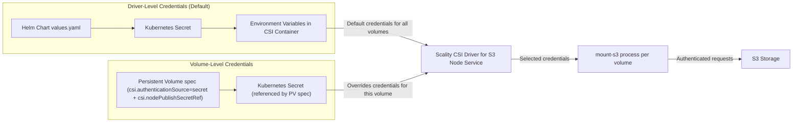

# Credentials Architecture

This document details how credentials flow through the Scality CSI Driver for S3, supporting both driver-level (global) and volume-level (per-volume) authentication methods.

<div align="center">



</div>

## Credentials Management

There are 2 ways to manage credentials:

1. **Driver-Level Authentication** - Global credentials for all volumes
2. **Persistent Volume-Level Authentication** - Per-volume credentials (set via Persistent Volume specifications)

For Kubernetes secrets used in both driver-level and volume-level authentication,
the credentials should be stored using the same key names as specified in the
[values.yaml](https://github.com/scality/mountpoint-s3-csi-driver/blob/main/charts/scality-mountpoint-s3-csi-driver/values.yaml#L104) file.
Default key names are:

- `access_key_id` for Access Key ID
- `secret_access_key` for Secret Access Key
- `session_token` (optional) for Session Token

!!! Note
    Use `stringData` (not `data`) because the Scality CSI driver for S3 expects plain text credentials, not base64 encoded values.
    This does not reduce security - base64 is encoding (not encryption), and both methods store credentials identically in Kubernetes. Secret security is controlled by Kubernetes RBAC permissions.

```yaml
apiVersion: v1
kind: Secret
metadata:
  name: s3-credentials # use a different name/namespace for volume specific credentials
type: Opaque
stringData:  # Use stringData for plain text values
  access_key_id: "AKIAXXXXXXXXXXXXXXXXX"
  secret_access_key: "SECRETXXXXXXXXXXXXXXXXXXXXXXXXX"
  session_token: "SESSION_TOKEN_IF_NEEDED"  # Optional
```

### Method 1: Driver-Level Authentication

Credentials configured globally during driver installation. All volumes use these credentials unless overridden.

Step 1: Install with Helm (referencing secret)

```bash
helm install scality-s3-csi-driver charts/scality-mountpoint-s3-csi-driver \
  --set node.s3EndpointUrl="https://s3.example.com:8000" \
  --set s3CredentialSecret.name=s3-credentials
```

Step 2: Create PersistentVolume (no credentials needed)

```yaml
apiVersion: v1
kind: PersistentVolume
metadata:
  name: s3-volume-driver-auth
spec:
  capacity:
    storage: 1200Gi
  accessModes:
    - ReadWriteMany
  csi:
    driver: s3.csi.scality.com
    volumeHandle: my-bucket-driver
    volumeAttributes:
      bucketName: my-bucket
      region: us-east-1
      # No authenticationSource - uses driver-level credentials
```

### Method 2: Volume-Level Authentication

Each persistent volume can use different credentials stored in Kubernetes Secrets. The secret definition is similar to the driver-level authentication secret.
For volume-level authentication, the secret is referenced in the PersistentVolume spec via the `nodePublishSecretRef` field and the `authenticationSource` field is set to `secret`.
This overrides the driver-level credentials for this volume.

**PersistentVolume**:

```yaml
apiVersion: v1
kind: PersistentVolume
metadata:
  name: s3-volume-secret
spec:
  capacity:
    storage: 1200Gi
  accessModes:
    - ReadWriteMany
  csi:
    driver: s3.csi.scality.com
    volumeHandle: my-bucket-secret
    volumeAttributes:
      bucketName: my-bucket
      region: us-east-1
      authenticationSource: secret  # Required
    nodePublishSecretRef:
      name: s3-credentials # Required
      namespace: default # Required
```

## Credential Priority Chain

The Scality CSI driver for S3 evaluates credentials in the following order, using the first valid credentials found:

### Persistent Volume-Level Credentials (Priority 1 - Highest)

- Specified in PersistentVolume spec via `csi.authenticationSource: secret` and `csi.nodePublishSecretRef`
- Allows different credentials per persistent volume
- Overrides driver-level settings
- Use case: Multi-tenant environments
- Example: [Secret Authentication](../volume-provisioning/static-provisioning/examples/secret-authentication.md)

### Driver-Level Secret (Priority 2)

- Configured in Helm chart values.yaml file
- Applies to all volumes unless overridden
- Stored in driver namespace
- Use case: Single-tenant clusters

## Common Patterns for multi-tenant environments

### Single-Tenant Pattern (Driver-Level)

One set of shared credentials for all volumes. This is the default pattern for single-tenant environments.

```text
Persistent Volume 1: No secret in PV spec → Driver-level credentials
Persistent Volume 2: No secret in PV spec → Driver-level credentials
PersistentVolume 3: No secret in PV spec → Driver-level credentials
```

### Multi-Tenant Pattern (Volume-Level)

Different credentials per tenant/application. This is the default pattern for multi-tenant environments.

```text
Persistent Volume 1: Tenant A secret in PV spec → Tenant A's S3 bucket
Persistent Volume 2: Tenant B secret in PV spec → Tenant B's S3 bucket
Persistent Volume 3: No secret in PV spec → Driver-level credentials
```
