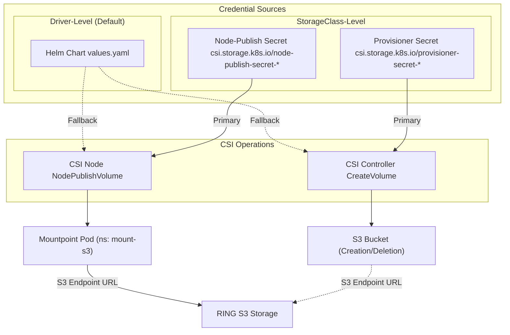

# Dynamic Provisioning Credentials Management

This document details how credentials flow through the Scality CSI Driver for S3 for dynamic provisioning,
supporting driver-level (global), storage-class-level (per-StorageClass), and template-based (per-PVC)
authentication methods.

<div align="center">



</div>

There are 3 ways to manage credentials:

1. **Driver-Level Authentication** - Global kubernetes secret containing credentials configured during driver installation
2. **StorageClass Fixed Authentication** - Fixed kubernetes secret names containing credentials specified in StorageClass parameters
3. **StorageClass Template Authentication** - Dynamic kubernetes secret names containing credentials using templating in StorageClass parameters

For Kubernetes secrets used in driver-level, StorageClass-level, and template-based authentication,
the credentials should be stored using the same key names as specified in the
[values.yaml](https://github.com/scality/mountpoint-s3-csi-driver/blob/main/charts/scality-mountpoint-s3-csi-driver/values.yaml) file.
Default key names are:

- `access_key_id` for Access Key ID
- `secret_access_key` for Secret Access Key
- `session_token` (optional) for Session Token

!!! Note
    Use `stringData` (not `data`) because the Scality CSI driver for S3 expects plain text credential. Secret security is controlled by Kubernetes RBAC permissions.

```yaml title="Kubernetes Secret with RING S3 credentials"
apiVersion: v1
kind: Secret
metadata:
  name: s3-credentials # use different names for specific use cases
type: Opaque
stringData:  # Use stringData for plain text values
  access_key_id: "AKIAXXXXXXXXXXXXXXXXX"
  secret_access_key: "SECRETXXXXXXXXXXXXXXXXXXXXXXXXX"
  session_token: "SESSION_TOKEN_IF_NEEDED"  # Optional
```

## Method 1: Driver-Level Authentication

Global secret configured during driver installation. All dynamically provisioned volumes use this secret unless overridden by StorageClass parameters.

```bash title="Step 1: Install with Helm (referencing secret)"
helm install scality-s3-csi-driver charts/scality-mountpoint-s3-csi-driver \
  --set node.s3EndpointUrl="https://s3.example.com:8000" \
  --set s3CredentialSecret.name=s3-credentials
```

```yaml title="Step 2: Create StorageClass (no credentials needed)"
apiVersion: storage.k8s.io/v1
kind: StorageClass
metadata:
  name: s3-driver-auth
provisioner: s3.csi.scality.com
parameters:
  # No credential parameters - uses driver-level credentials
  bucketNamePrefix: "dynamic-buckets-"
  region: "us-east-1"
```

```yaml title="Step 3: Create PVC (bucket will be created automatically)"
apiVersion: v1
kind: PersistentVolumeClaim
metadata:
  name: my-dynamic-volume
  namespace: default
spec:
  storageClassName: s3-driver-auth
  accessModes:
    - ReadWriteMany
  resources:
    requests:
      storage: 100Gi
```

## Method 2: StorageClass Fixed Authentication

Each StorageClass can specify fixed secret names for bucket creation and mounting operations. This allows different
StorageClasses to use different S3 accounts or permission sets.

### Understanding Provisioner vs Node-Publish Secrets

For dynamic provisioning, credentials are used at two different stages:

- **Provisioner Secrets** (`csi.storage.k8s.io/provisioner-secret-*`) - Used by CSI Controller during bucket creation (CreateVolume RPC). Requires administrative permissions to create/delete S3 buckets.
- **Node-Publish Secrets** (`csi.storage.k8s.io/node-publish-secret-*`) - Used by CSI Node during volume mounting (NodePublishVolume RPC). Requires read/write access to bucket contents.

!!! tip "Security Best Practice"
    Use different credentials for provisioner (admin) and node-publish (user) operations to implement principle of least privilege.

!!! important "Secret Configuration Requirement"
    **Both `provisioner-secret` and `node-publish-secret` must be configured together** when using secret-based authentication for dynamic provisioning.
    The controller uses `provisioner-secret` presence to determine if secret-based authentication is enabled
    (it cannot directly detect `node-publish-secret` due to CSI specification limitations).

**Technical Background:**

The CSI external-provisioner strips all `csi.storage.k8s.io/*` prefixed parameters from `CreateVolumeRequest`:

- `provisioner-secret-*` parameters → Resolved and VALUES passed in `req.GetSecrets()`
- `node-publish-secret-*` parameters → Stored in `PV.Spec.CSI.NodePublishSecretRef` (not visible during CreateVolume)

The controller cannot directly detect if only `node-publish-secret` is configured, so it uses `provisioner-secret` presence as a proxy indicator for secret-based authentication.

**Workaround for Node-Only Use Case:**

If you only need credentials for mounting (not bucket creation), configure both secrets pointing to the same Secret.
Example: set both `provisioner-secret-name` and `node-publish-secret-name` to "shared-credentials" in the same namespace.

### Example 1: Same Credentials for Both Operations

```yaml title="StorageClass with fixed secret names for both provisioner and node-publish"
apiVersion: storage.k8s.io/v1
kind: StorageClass
metadata:
  name: s3-fixed-auth
provisioner: s3.csi.scality.com
parameters:
  # Same secret for both bucket creation and mounting
  csi.storage.k8s.io/provisioner-secret-name: "team-a-credentials"
  csi.storage.k8s.io/provisioner-secret-namespace: "default"
  csi.storage.k8s.io/node-publish-secret-name: "team-a-credentials"
  csi.storage.k8s.io/node-publish-secret-namespace: "default"
  # StorageClass specific parameters
  bucketNamePrefix: "team-a-buckets-"
  region: "us-west-2"
```

### Example 2: Separate Admin and User Credentials (Recommended)

This is the **recommended approach** for production environments, implementing the principle of least privilege with different credentials for controller and node operations.

```yaml title="StorageClass with separate admin (provisioner) and user (node-publish) secret names"
apiVersion: storage.k8s.io/v1
kind: StorageClass
metadata:
  name: s3-separated-auth
provisioner: s3.csi.scality.com
parameters:
  # Admin credentials for bucket creation/deletion
  csi.storage.k8s.io/provisioner-secret-name: "s3-admin-credentials"
  csi.storage.k8s.io/provisioner-secret-namespace: "kube-system"
  # User credentials for mounting S3 bucket (read/write access only)
  csi.storage.k8s.io/node-publish-secret-name: "s3-user-credentials"
  csi.storage.k8s.io/node-publish-secret-namespace: "default"
  bucketNamePrefix: "secure-buckets-"
  region: "us-east-1"
```

```yaml title="Admin secret (for bucket operations)"
apiVersion: v1
kind: Secret
metadata:
  name: s3-admin-credentials
  namespace: kube-system
type: Opaque
stringData:
  access_key_id: "ADMIN_ACCESS_KEY_ID"
  secret_access_key: "ADMIN_SECRET_ACCESS_KEY"
```

```yaml title="User secret (for mounting S3 bucket)"
apiVersion: v1
kind: Secret
metadata:
  name: s3-user-credentials
  namespace: default
type: Opaque
stringData:
  access_key_id: "USER_ACCESS_KEY_ID"
  secret_access_key: "USER_SECRET_ACCESS_KEY"
```

## Method 3: StorageClass Template Authentication

Template-based authentication allows dynamic secret selection per PVC using template variables.
The external-provisioner resolves these templates before calling the CSI driver.

!!! warning "Template Resolution Timing"
    Templates are resolved by Kubernetes external-provisioner, **not** by the CSI driver. Secrets must exist when templates are evaluated during provisioning.
    The only exception is `${pv.name}` template, as for dynamic provisioning, the PV name is supplied by the CSI driver. In such case, the secret must be created after the PV is created.

### Supported Template Variables

| Template Variable | What It Becomes | Supported In | Example Usage |
|-------------------|-----------------|--------------|---------------|
| `${pv.name}` | `pvc-a1b2c3d4-e5f6-7890` if PVC UID is `a1b2c3d4-e5f6-7890` | All parameters | `"${pv.name}-secret"` |
| `${pvc.name}` | `my-app-data` if PVC name is `my-app-data` | All parameters | `"${pvc.name}-credentials"` |
| `${pvc.namespace}` | `production` if PVC is in `production` namespace | All parameters | `"${pvc.namespace}"` |
| `${pvc.annotations['key']}` | `team-alpha` if PVC has annotation `key: team-alpha` | **node-publish-secret-name ONLY** | `"${pvc.annotations['team.io/name']}"` |

### StorageClass Parameters

| Parameter | Purpose | Template Variables Supported |
|-----------|---------|------------------------------|
| `csi.storage.k8s.io/provisioner-secret-name` | Secret name for bucket creation | `${pv.name}`, `${pvc.name}`, `${pvc.namespace}` |
| `csi.storage.k8s.io/provisioner-secret-namespace` | Secret namespace for bucket creation | `${pv.name}`, `${pvc.namespace}` |
| `csi.storage.k8s.io/node-publish-secret-name` | Secret name for mounting S3 bucket | `${pv.name}`, `${pvc.name}`, `${pvc.namespace}`, `${pvc.annotations['key']}` |
| `csi.storage.k8s.io/node-publish-secret-namespace` | Secret namespace for mounting S3 bucket | `${pv.name}`, `${pvc.namespace}` |

!!! note "Key Limitations & Best Practices per [CSI specification](https://kubernetes-csi.github.io/docs/secrets-and-credentials-storage-class.html)"
    - **Annotations** (`${pvc.annotations['key']}`) are **ONLY** supported for `node-publish-secret-name`, **NOT** for provisioner secrets
    - PV names follow predictable pattern: `pvc-<PVC-UID>`
    - Templates can be mixed with static text (e.g., `${pvc.name}-admin`)
    - For `${pv.name}` templates: Consider using `volumeBindingMode: WaitForFirstConsumer` to allow time for secret creation after PVC UID is known

### Example 1: Per-PVC Credentials using PVC Name

```yaml title="StorageClass using PVC name for credential selection"
apiVersion: storage.k8s.io/v1
kind: StorageClass
metadata:
  name: s3-per-pvc-auth
provisioner: s3.csi.scality.com
parameters:
  # Use PVC name to select credentials
  csi.storage.k8s.io/provisioner-secret-name: "${pvc.name}-credentials"
  csi.storage.k8s.io/provisioner-secret-namespace: "${pvc.namespace}"
  csi.storage.k8s.io/node-publish-secret-name: "${pvc.name}-credentials"
  csi.storage.k8s.io/node-publish-secret-namespace: "${pvc.namespace}"
  bucketNamePrefix: "pvc-buckets-"
  region: "us-east-1"
```

```yaml title="Create secret matching PVC name"
apiVersion: v1
kind: Secret
metadata:
  name: my-app-data-credentials  # Matches PVC name + "-credentials"
  namespace: production
type: Opaque
stringData:
  access_key_id: "APP_SPECIFIC_ACCESS_KEY"
  secret_access_key: "APP_SPECIFIC_SECRET_KEY"
---
apiVersion: v1
kind: PersistentVolumeClaim
metadata:
  name: my-app-data  # Secret name will be "my-app-data-credentials"
  namespace: production
spec:
  storageClassName: s3-per-pvc-auth
  accessModes: [ReadWriteMany]
  resources:
    requests:
      storage: 50Gi
```

### Example 2: Team-Based Credentials using Annotations

!!! warning "Annotation Limitation"
    Annotations (`${pvc.annotations['key']}`) are **ONLY** supported in `node-publish-secret-name`. For provisioner secrets, use fixed names or other template variables.

```yaml title="StorageClass using PVC annotations for node-publish secrets only"
apiVersion: storage.k8s.io/v1
kind: StorageClass
metadata:
  name: s3-team-based-auth
provisioner: s3.csi.scality.com
parameters:
  # Fixed provisioner secret (annotations NOT supported here)
  csi.storage.k8s.io/provisioner-secret-name: "team-admin-secret"
  csi.storage.k8s.io/provisioner-secret-namespace: "team-secrets"
  # Annotation-based node-publish secret (supported here)
  csi.storage.k8s.io/node-publish-secret-name: "${pvc.annotations['team.example.com/credentials']}"
  csi.storage.k8s.io/node-publish-secret-namespace: "team-secrets"
  bucketNamePrefix: "team-buckets-"
```

```yaml title="Team secrets in dedicated namespace"
apiVersion: v1
kind: Secret
metadata:
  name: team-alpha-s3-creds
  namespace: team-secrets
type: Opaque
stringData:
  access_key_id: "TEAM_ALPHA_ACCESS_KEY"
  secret_access_key: "TEAM_ALPHA_SECRET_KEY"
---
apiVersion: v1
kind: Secret
metadata:
  name: team-beta-s3-creds
  namespace: team-secrets
type: Opaque
stringData:
  access_key_id: "TEAM_BETA_ACCESS_KEY"
  secret_access_key: "TEAM_BETA_SECRET_KEY"
---
# PVC for Team Alpha
apiVersion: v1
kind: PersistentVolumeClaim
metadata:
  name: alpha-project-storage
  namespace: alpha-namespace
  annotations:
    team.example.com/credentials: "team-alpha-s3-creds"
spec:
  storageClassName: s3-team-based-auth
  accessModes: [ReadWriteMany]
  resources:
    requests:
      storage: 100Gi
```

### Example 3: Using ${pv.name} Template with WaitForFirstConsumer

```yaml title="StorageClass using PV name (requires WaitForFirstConsumer)"
apiVersion: storage.k8s.io/v1
kind: StorageClass
metadata:
  name: s3-pv-name-auth
provisioner: s3.csi.scality.com
volumeBindingMode: WaitForFirstConsumer  # Required for ${pv.name} templates
parameters:
  csi.storage.k8s.io/provisioner-secret-name: "${pv.name}-secret"
  csi.storage.k8s.io/provisioner-secret-namespace: "${pvc.namespace}"
  csi.storage.k8s.io/node-publish-secret-name: "${pv.name}-secret"  
  csi.storage.k8s.io/node-publish-secret-namespace: "${pvc.namespace}"
```
