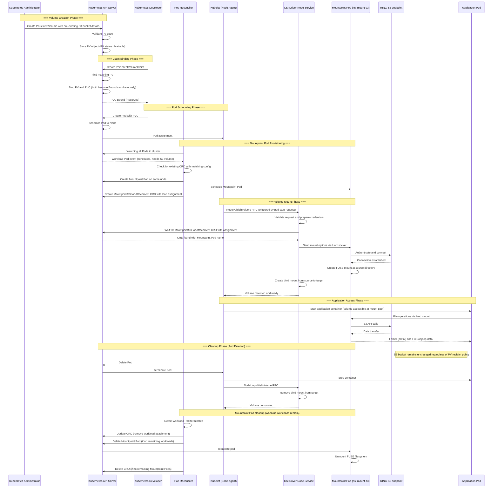

# Static Provisioning Architecture

This document details the complete lifecycle of statically provisioned volumes in the Scality CSI Driver for S3, from PersistentVolume creation to application file access.

## Phase Flow Summary

| Phase/Step | Description | Key Outcome |
|------------|-------------|-------------|
| **Phase 1: Volume Creation** | **Kubernetes administrator sets up S3 storage reference** | **PV ready for use** |
| 1.1 | Create PV with S3 bucket name (bucket must pre-exist), mount options, access modes (ReadWriteMany), and optional credentials secret (see [credentials docs](./ring-s3-credentials-management/static-provisioning-credentials-management.md)) | PV object created |
| 1.2 | Kubernetes API validates CSI driver name, volumeAttributes, and stores PV in etcd | PV status: Available, waiting for PVC |
| **Phase 2: Claim Binding** | **Kubernetes developer requests and reserves storage (control plane operation)** | **PV-PVC bound together** |
| 2.1 | Create PVC with matching storage class (""), access modes, and capacity - must reference specific PV by name | PVC object created (status: Pending) |
| 2.2 | Kubernetes controller finds matching PV and atomically binds: sets PV.claimRef and PVC.volumeName | Both PV and PVC status: Bound simultaneously - volume reserved but NOT accessible yet |
| **Phase 3: Pod Scheduling** | **Kubernetes finds where to run the pod** | **Pod assigned to node** |
| 3.1 | Create Pod with volumeMounts section referencing PVC and specifying container mount path (e.g., /data) | Pod object created (status: Pending) |
| 3.2 | Scheduler evaluates nodes based on resources, PV node affinity constraints, and CSI driver availability | Pod scheduled to specific node |
| | | |
| **Phase 4: Mountpoint Pod Provisioning** | **Pod Reconciler creates Mountpoint Pod and CRD** | **Mountpoint Pod ready** |
| 4.1 | Pod Reconciler (watching all Pods) detects workload Pod scheduled and needs S3 volume | Reconciliation triggered |
| 4.2 | Pod Reconciler checks for existing MountpointS3PodAttachment CRD with matching config | Reuse or create decision |
| 4.3 | Pod Reconciler creates Mountpoint Pod on the same node as workload | Mountpoint Pod scheduled |
| 4.4 | Pod Reconciler creates MountpointS3PodAttachment CRD with workload and Mountpoint Pod assignment | CRD created with assignment |
| | | |
| **Phase 5: Volume Mount (CSI)** | **Node Service coordinates mount operation** | **S3 mounted locally** |
| 5.1 | Kubelet triggers NodePublishVolume RPC when pod starts on the scheduled node | CSI mount request initiated |
| 5.2 | CSI Node Service waits for MountpointS3PodAttachment CRD to contain its Mountpoint Pod assignment | Assignment found |
| 5.3 | CSI Node Service sends mount options to Mountpoint Pod via Unix socket | Mountpoint Pod receives S3 config |
| 5.4 | Mountpoint Pod authenticates to S3 endpoint, creates FUSE mount at source directory | Source mount ready |
| 5.5 | CSI Node Service creates bind mount from source to container target path | Volume NOW accessible via bind mount |
| | | |
| **Phase 6: Application Access** | **Pod performs file-like operations with S3 limitations** | **S3 data accessible** |
| 6.1 | Kubelet starts container with volume accessible at specified mountPath | Container running with S3 accessible at /data |
| 6.2 | Application performs supported file operations (read, sequential write, list), mount-s3 translates to S3 API | S3 bucket access with filesystem semantics |
| | | |
| **Phase 7: Cleanup (Pod Deletion)** | **Unmount volume and clean up resources** | **S3 data preserved** |
| 7.1 | Pod deletion initiated, kubelet stops container with grace period (default 30s), sends SIGTERM then SIGKILL | Container terminated gracefully |
| 7.2 | Kubelet calls NodeUnpublishVolume RPC, CSI driver removes bind mount from target path | Bind mount removed |
| 7.3 | Pod Reconciler detects workload Pod terminated, removes attachment from CRD | CRD updated |
| 7.4 | If no remaining workloads, Pod Reconciler deletes Mountpoint Pod and CRD | Mountpoint Pod terminated, FUSE unmounted |
| 7.5 | S3 bucket and all data remain unchanged - static provisioning never deletes buckets regardless of reclaim policy | Original S3 storage completely preserved |

## Volume Sharing

When multiple workload pods on the same node use the same PersistentVolume with matching mount options and fsGroup:

- Pod Reconciler adds the new workload to the existing MountpointS3PodAttachment CRD
- The same Mountpoint Pod serves all workloads
- Each workload gets its own bind mount to the shared source mount
- Resource efficiency is optimized by avoiding duplicate FUSE processes
- When any workload terminates, only its bind mount is removed
- The Mountpoint Pod remains until all workloads using it terminate
