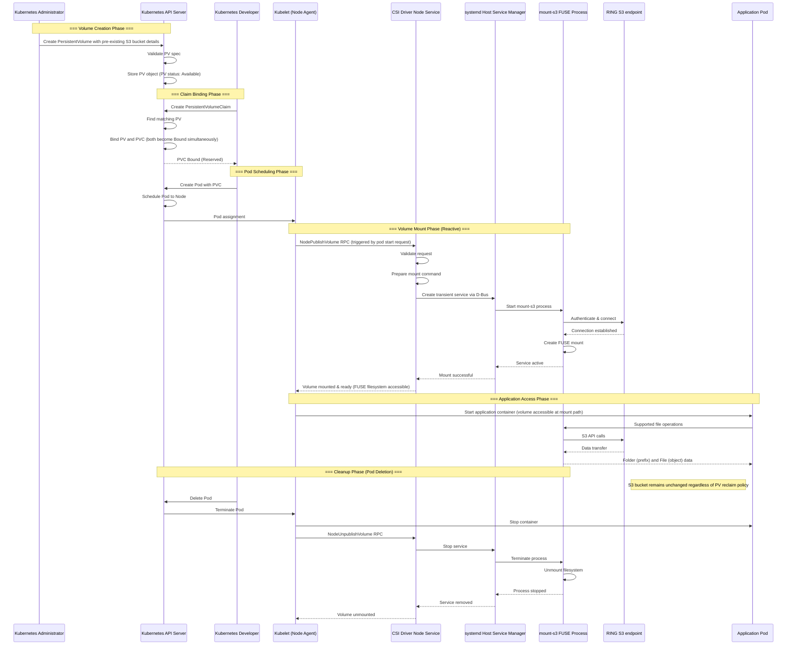

# Static Provisioning Architecture

This document details the complete lifecycle of statically provisioned volumes in the Scality CSI Driver for S3, from PersistentVolume creation to application file access.

## Phase Flow Summary

| Phase/Step | Description | Key Outcome |
|------------|-------------|-------------|
| **Phase 1: Volume Creation** | **Kubernetes administrator sets up S3 storage reference** | **PV ready for use** |
| 1.1 | Create PV with S3 bucket name (bucket must pre-exist), mount options, access modes (ReadWriteMany), and optional credentials secret (see [credentials docs](ring-s3-credentials-management.md)) | PV object created |
| 1.2 | Kubernetes API validates CSI driver name, volumeAttributes, and stores PV in etcd | PV status: Available, waiting for PVC |
| **Phase 2: Claim Binding** | **Kubernetes developer requests and reserves storage (control plane operation)** | **PV-PVC bound together** |
| 2.1 | Create PVC with matching storage class (""), access modes, and capacity - must reference specific PV by name | PVC object created (status: Pending) |
| 2.2 | Kubernetes controller finds matching PV and atomically binds: sets PV.claimRef and PVC.volumeName | Both PV and PVC status: Bound simultaneously - volume reserved but NOT accessible yet |
| **Phase 3: Pod Scheduling** | **Kubernetes finds where to run the pod** | **Pod assigned to node** |
| 3.1 | Create Pod with volumeMounts section referencing PVC and specifying container mount path (e.g., /data) | Pod object created (status: Pending) |
| 3.2 | Scheduler evaluates nodes based on resources, PV node affinity constraints, and CSI driver availability | Pod scheduled to specific node |
| | | |
| **Phase 4: Volume Mount (CSI)** | **Node makes S3 bucket accessible as filesystem (physical node operation)** | **S3 mounted locally** |
| 4.1 | Kubelet triggers NodePublishVolume RPC only when pod starts - reactive process, can happen hours after binding | CSI mount request initiated |
| 4.2 | CSI driver validates request, extracts S3 credentials, and creates systemd transient service via D-Bus | mount-s3 process started with S3 config |
| 4.3 | mount-s3 authenticates to S3 endpoint, creates FUSE mount at CSI target path on host node | Volume NOW accessible - FUSE filesystem ready |
| | | |
| **Phase 5: Application Access** | **Pod performs file-like operations with S3 limitations** | **S3 data accessible** |
| 5.1 | Kubelet bind-mounts CSI target path into container at specified mountPath, then starts container | Container running with S3 accessible at /data |
| 5.2 | Application performs supported file operations (read, sequential write, list), mount-s3 translates to S3 API | S3 bucket access with filesystem semantics |
| | | |
| **Phase 6: Cleanup (Pod Deletion)** | **Unmount volume and clean up resources** | **S3 data preserved** |
| 6.1 | Pod deletion initiated, kubelet stops container with grace period (default 30s), sends SIGTERM then SIGKILL | Container terminated gracefully |
| 6.2 | Kubelet calls NodeUnpublishVolume RPC, CSI driver stops systemd service and unmounts FUSE filesystem | Volume unmounted, mount-s3 process ended |
| 6.3 | S3 bucket and all data remain unchanged - static provisioning never deletes buckets regardless of reclaim policy | Original S3 storage completely preserved |
