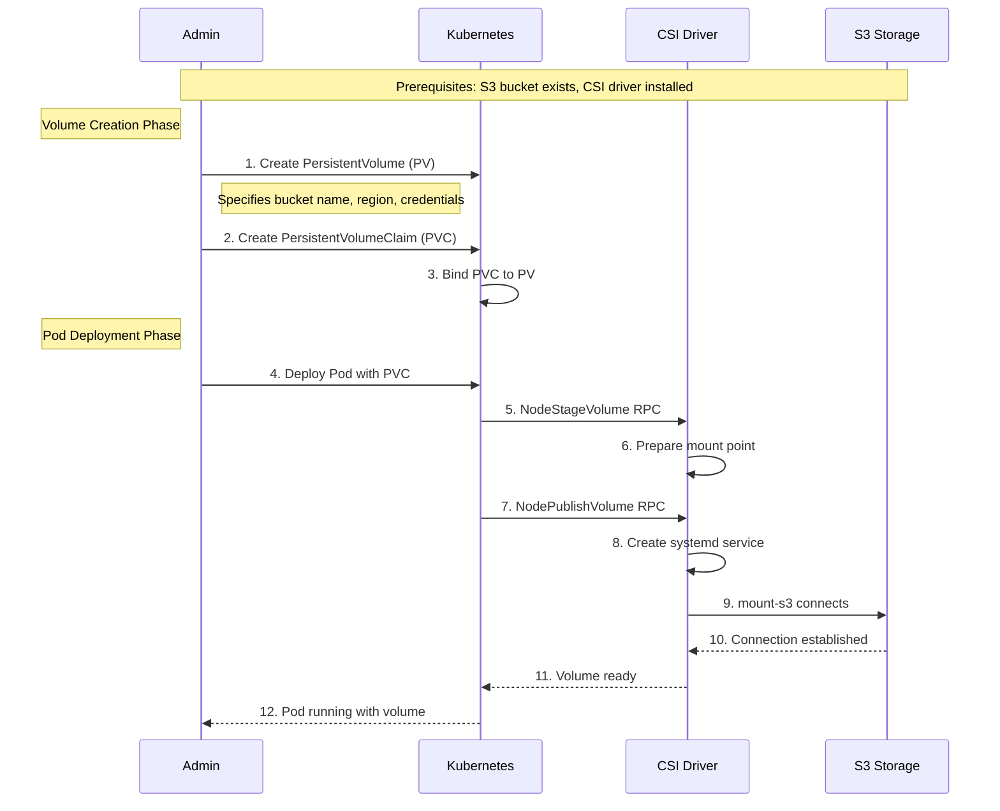

# Static Provisioning Workflow

Static provisioning allows you to mount existing S3 buckets as Kubernetes volumes. This workflow shows the complete process from volume definition to application access.

## High-Level Data Flow

Static provisioning follows this high-level flow from installation to application access:

1. **Installation & Configuration**: Administrator installs the CSI driver and configures authentication
2. **Volume Definition**: Administrator creates PersistentVolumes pointing to existing S3 buckets  
3. **Application Deployment**: Users deploy applications that request storage through PersistentVolumeClaims
4. **Mount Operation**: CSI driver coordinates with host systemd to create mount-s3 service units
5. **Service Management**: Host systemd starts and supervises mount-s3 processes for reliable operation
6. **File Access**: Applications read/write files through FUSE filesystem interface
7. **S3 Operations**: mount-s3 processes translate filesystem operations to S3 API calls transparently

## Detailed Workflow

<div align="center">



</div>

## Detailed Process Steps

### Phase 1: Volume Creation

#### Step 1: Create PersistentVolume (PV)

The administrator creates a PV definition that specifies the S3 bucket details:

```yaml
apiVersion: v1
kind: PersistentVolume
metadata:
  name: s3-volume
spec:
  capacity:
    storage: 1200Gi
  accessModes:
    - ReadWriteMany
  csi:
    driver: s3.csi.scality.com
    volumeHandle: my-bucket
    volumeAttributes:
      bucketName: my-bucket
      region: us-east-1
```

#### Step 2: Create PersistentVolumeClaim (PVC)

Users request storage through a PVC:

```yaml
apiVersion: v1
kind: PersistentVolumeClaim
metadata:
  name: s3-claim
spec:
  accessModes:
    - ReadWriteMany
  resources:
    requests:
      storage: 1200Gi
```

#### Step 3: Volume Binding

Kubernetes automatically binds the PVC to the matching PV based on:

- Storage capacity requirements
- Access mode compatibility
- Label selectors (if specified)

### Phase 2: Pod Deployment

#### Step 4: Deploy Application Pod

Application deployment references the PVC:

```yaml
apiVersion: v1
kind: Pod
metadata:
  name: app-pod
spec:
  containers:
  - name: app
    image: nginx
    volumeMounts:
    - name: s3-storage
      mountPath: /data
  volumes:
  - name: s3-storage
    persistentVolumeClaim:
      claimName: s3-claim
```

#### Step 5-6: Volume Staging

- Kubelet calls `NodeStageVolume` RPC
- CSI driver prepares the staging area
- Validates volume parameters and credentials

#### Step 7-8: Volume Publishing

- Kubelet calls `NodePublishVolume` RPC
- CSI driver creates a systemd service unit
- Service unit includes mount-s3 command with proper parameters

#### Step 9-11: S3 Connection

- Systemd starts the mount-s3 process
- mount-s3 establishes connection to S3 bucket
- FUSE filesystem becomes available at mount point
- CSI driver reports success to Kubelet

#### Step 12: Application Access

- Pod starts successfully with mounted volume
- Application can read/write files through FUSE interface
- File operations are translated to S3 API calls

## Key Concepts

### Static vs Dynamic Provisioning

**Static Provisioning** (Current):

- Pre-existing S3 buckets are mounted
- Administrator manually creates PV definitions
- Bucket lifecycle managed outside Kubernetes
- Suitable for shared storage and existing data

**Dynamic Provisioning** (Future):

- Buckets created automatically on-demand
- StorageClass defines provisioning parameters
- Bucket lifecycle tied to PVC lifecycle
- Suitable for application-specific storage

### Volume Lifecycle States

1. **Available**: PV created but not bound to PVC
2. **Bound**: PV bound to PVC
3. **Used**: Pod actively using the volume
4. **Released**: PVC deleted but PV still exists
5. **Failed**: Volume encountered an error

### Mount Point Management

Each mounted volume gets:

- Unique systemd service name
- Isolated mount point directory
- Separate mount-s3 process
- Independent credential context

## Common Use Cases

### Shared Data Access

Multiple pods can mount the same S3 bucket with `ReadWriteMany` access mode:

- Content management systems
- Shared file repositories
- Data processing pipelines

### Legacy Data Migration

Mount existing S3 data in Kubernetes:

- Gradual migration from object storage to containers
- Hybrid applications using both APIs
- Development and testing with production data

### Backup and Archive Access

Mount backup buckets for restoration:

- Database backup access
- Log archive processing
- Disaster recovery scenarios

## Best Practices

### Performance Optimization

- Use appropriate mount-s3 cache settings
- Consider local caching for frequently accessed data
- Monitor transfer costs for cross-region access

### Security Considerations

- Use least-privilege IAM policies
- Rotate credentials regularly
- Enable S3 encryption at rest
- Monitor access patterns and audit logs

### Operational Guidelines

- Use descriptive PV names and labels
- Document bucket ownership and lifecycle
- Implement proper monitoring and alerting
- Plan for backup and disaster recovery
