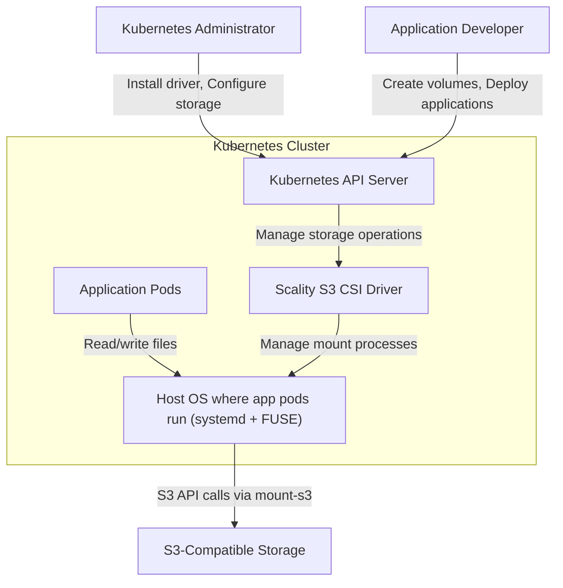

# System Architecture

The Scality S3 CSI Driver enables Kubernetes applications to use S3-compatible storage as persistent volumes.

The diagram shows how administrators install the driver, developers create volumes and deploy applications, and how the CSI driver manages mount processes through the node's operating system to access S3 storage.

## Core Components

### Controller Service
- Validates volume configurations and handles volume lifecycle requests
- Single replica deployment (only with experimental pod mounter enabled)

### Node Service  
- DaemonSet that runs on every node
- Mounts S3 buckets as filesystems when pods request volumes
- Manages credentials and creates systemd services for each mount

### Mount Process (mount-s3)
- Provides POSIX filesystem interface to S3 using FUSE
- One process per mounted volume, managed by systemd
- Handles all S3 API communication

## Static Provisioning

The driver currently supports static provisioning only - mounting existing S3 buckets as Kubernetes volumes.

1. Administrator creates PersistentVolume pointing to an existing S3 bucket
2. Developer creates PersistentVolumeClaim to request the storage
3. Kubernetes binds the PVC to the PV
4. Applications access S3 data through standard filesystem operations

[→ Detailed Static Provisioning Workflow](static-provisioning-workflow.md)

## Key Architectural Concepts

### FUSE Filesystem Interface

The driver uses FUSE (Filesystem in Userspace) to present S3 storage as a standard filesystem:

- **Benefit:** Applications access S3 data using standard file operations (read, write, open, close)
- **Transparency:** No application code changes needed to use S3 storage
- **Performance:** Optimized for common access patterns with intelligent caching

### Systemd Process Management
- Each mounted volume runs as a systemd service with automatic restart on failures
- Process isolation and resource limits per volume
- Integration with system logging (journalctl)

### Credential Management
- Supports Kubernetes Secrets, node-level credentials, and driver-level static credentials
- Per-volume authentication possible
- See [Credential Management](credential-management.md) for details

## Integration Points

- **Kubernetes CSI**: Standard CSI specification compliance
- **S3 API**: Compatible with Scality RING, Artesca, AWS S3, and other S3-compatible storage
- **Systemd**: Uses node's systemd for reliable mount process management
- **FUSE**: Leverages kernel FUSE module for filesystem operations
