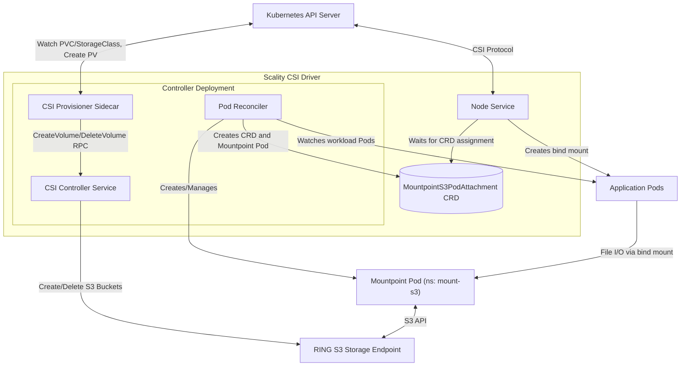

# System Overview

The Scality CSI Driver for S3 enables Kubernetes applications to use Scality RING S3 buckets as persistent volumes through the [Container Storage Interface (CSI) specification](https://github.com/container-storage-interface/spec/blob/master/spec.md).

## Core Components

| Component | Responsibility | Details |
|-----------|----------------|---------|
| **CSI Driver Controller Service** | Dynamic Volume Provisioning | Handles CreateVolume/DeleteVolume RPCs for dynamic provisioning. Creates and deletes S3 buckets automatically based on StorageClass parameters. Manages credential templating and secret resolution for multi-tenancy. Enabled by default in Helm deployment. |
| **Pod Reconciler** | Mountpoint Pod Lifecycle | Watches workload Pods (not CRDs) to detect when S3 volumes are needed. Creates MountpointS3PodAttachment CRDs and Mountpoint Pods. Determines optimal pod placement based on node affinity, resource constraints, and volume sharing opportunities. Cleans up stale attachments and orphaned pods. |
| **MountpointS3PodAttachment CRD** | Volume Attachment Tracking | Cluster-scoped custom resource that tracks which workload pods are attached to which Mountpoint Pods. Created by Pod Reconciler when workloads need S3 volumes. Enables volume sharing across workloads with matching configurations. Stores node name, PV name, volume ID, mount options, and fsGroup. |
| **CSI Driver Node Service** | Volume Mount Coordination | Receives mount requests from kubelet via gRPC. Waits for Pod Reconciler to create the MountpointS3PodAttachment CRD with Mountpoint Pod assignment. Sends mount options to the assigned Mountpoint Pod. Establishes bind mounts from source mount to container target paths. Handles unmount operations by removing bind mounts. |
| **Mountpoint Pods** | S3 FUSE Operations | Dedicated pods running mount-s3 (FUSE filesystem). Mounts S3 bucket to a shared source directory. Can serve multiple workload pods simultaneously. Provides POSIX-compliant filesystem interface through FUSE. Translates file operations to S3 API calls with optional caching. |

## S3 Volume Setup Flow

### Dynamic Provisioning

| Step | Action | Description |
|------|--------|-------------|
| 1 | **StorageClass Creation** | Administrator creates StorageClass referencing CSI provisioner, parameters, and secret configurations |
| 2 | **PVC Creation** | User creates PersistentVolumeClaim referencing the StorageClass |
| 3 | **Volume Provisioning** | CSI Provisioner watches PVC, resolves template variables, and calls CreateVolume RPC |
| 4 | **Bucket Creation** | CSI Controller Service creates S3 bucket based on StorageClass parameters |
| 5 | **PV Creation** | CSI Provisioner Sidecar creates PersistentVolume object after successful bucket creation |
| 6 | **Pod Scheduling** | Kubernetes schedules workload pod to a node |
| 7 | **CRD and Mountpoint Pod Creation** | Pod Reconciler detects scheduled workload pod, creates Mountpoint Pod, then creates MountpointS3PodAttachment CRD |
| 8 | **Volume Mounting Request** | Kubelet calls NodePublishVolume via CSI protocol |
| 9 | **Wait for Assignment** | CSI Node Service waits for CRD to contain its Mountpoint Pod assignment |
| 10 | **S3 Mount** | CSI Node Service sends mount options to Mountpoint Pod, which mounts S3 bucket to source directory |
| 11 | **Bind Mount** | CSI Node Service creates bind mount from source to container's target path |
| 12 | **File Access** | Applications read/write files normally, which are translated to S3 API operations |

### Static Provisioning

| Step | Action | Description |
|------|--------|-------------|
| 1 | **Manual Bucket Setup** | Administrator pre-creates S3 bucket and PersistentVolume object |
| 2 | **PVC Binding** | User creates PVC that binds to existing PV |
| 3 | **Pod Scheduling** | Kubernetes schedules workload pod to a node |
| 4 | **CRD and Mountpoint Pod Creation** | Pod Reconciler detects scheduled workload pod, creates Mountpoint Pod, then creates MountpointS3PodAttachment CRD |
| 5 | **Volume Mounting Request** | Kubelet calls NodePublishVolume via CSI protocol |
| 6 | **Wait for Assignment** | CSI Node Service waits for CRD to contain its Mountpoint Pod assignment |
| 7 | **S3 Mount** | CSI Node Service sends mount options to Mountpoint Pod, which mounts S3 bucket to source directory |
| 8 | **Bind Mount** | CSI Node Service creates bind mount from source to container's target path |
| 9 | **File Access** | Applications read/write files normally, which are translated to S3 API operations |

## Volume Sharing

Multiple workload pods can share a single Mountpoint Pod when they have matching configurations:

| Criteria | Description |
|----------|-------------|
| **Node Name** | Workloads must be scheduled on the same node |
| **PersistentVolume** | Workloads must use the same PersistentVolume |
| **Mount Options** | Mount options specified in the PV or StorageClass must match |
| **FSGroup** | Security context fsGroup must match (or both be unset) |

When workloads share a Mountpoint Pod:

- The S3 bucket is mounted once to a source directory
- Each workload gets its own bind mount from the source to its target path
- Resource utilization is optimized by avoiding duplicate FUSE processes
- The Mountpoint Pod remains active until all workloads using it terminate
