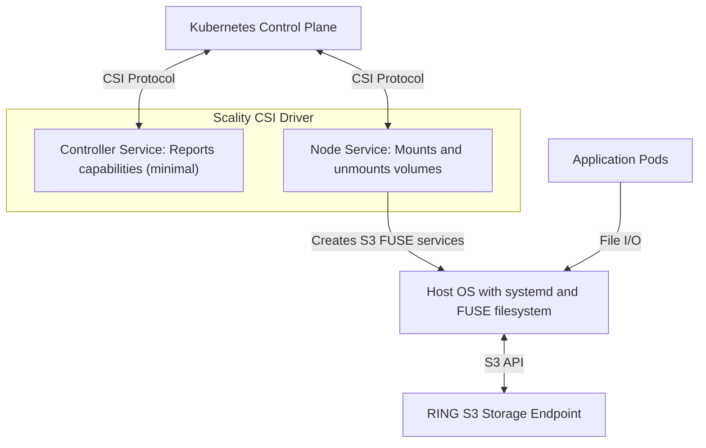

# System Overview

The Scality CSI Driver for S3 enables Kubernetes applications to use Scality RING S3 buckets as persistent volumes through the [Container Storage Interface (CSI) specification](https://github.com/container-storage-interface/spec/blob/master/spec.md).

## Core Components

| Component | Responsibility | Details |
|-----------|----------------|---------|
| **CSI Driver Controller Service** | Volume Management | • Reports supported capabilities to Kubernetes (minimal functionality) • Implements CSI controller interface for compatibility  |
| **CSI Driver Node Service** | RING S3 FUSE Operations | • Receives mount requests from kubelet via gRPC • Creates systemd transient services for each volume mount • Configures mount-s3 with appropriate credentials and cache settings • Verifies mount point existence • Handles unmount operations during pod termination |
| **Host Integration** | RING S3 Access Layer | • Runs mount-s3 processes as systemd transient services • Provides POSIX-compliant filesystem interface through FUSE kernel module • Maintains per-volume isolation with separate processes and credentials • Translates file operations to S3 API calls with optional caching |

## S3 Volume Setup Flow

| Step | Action | Description |
|------|--------|-------------|
| 1 | **Volume Request** | Kubernetes requests a volume mount through the CSI protocol |
| 2 | **Mount Creation** | The CSI Driver Node Service creates a systemd service to run mount-s3 process |
| 3 | **S3 Connection** | mount-s3 process authenticates and establishes connection to S3 endpoint |
| 4 | **File Access** | Applications read/write files normally, which are translated to S3 operations |
