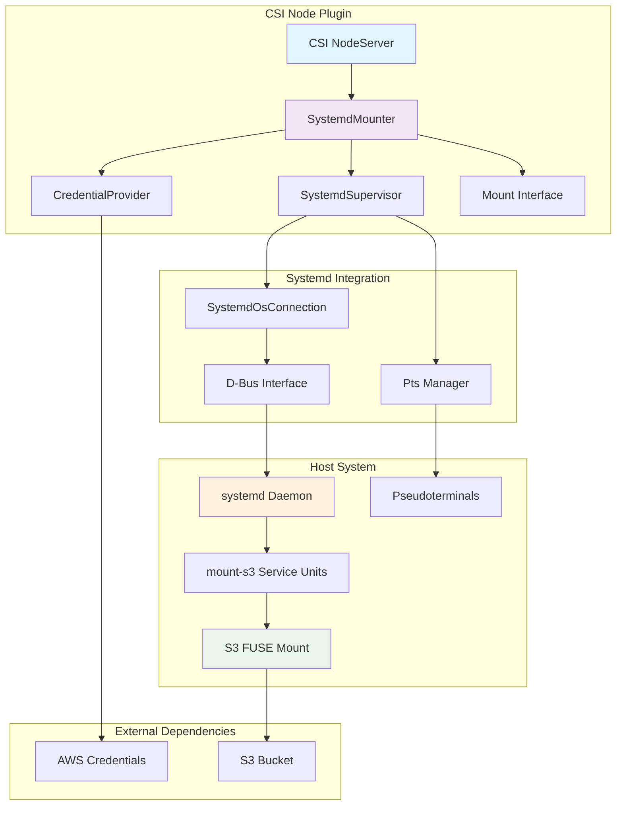
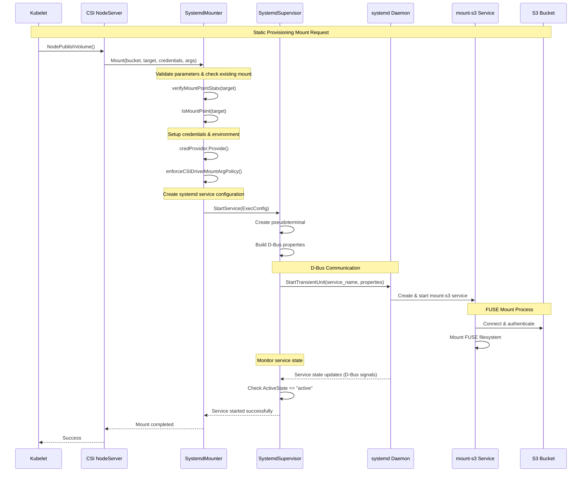
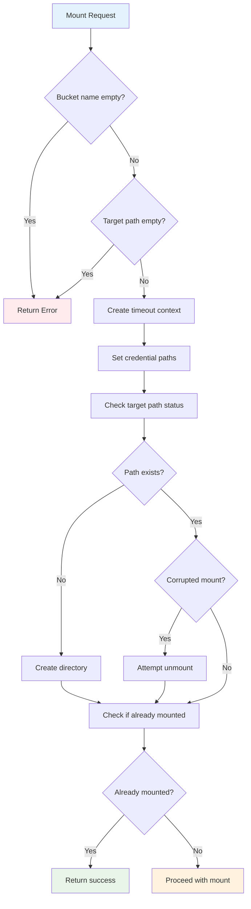
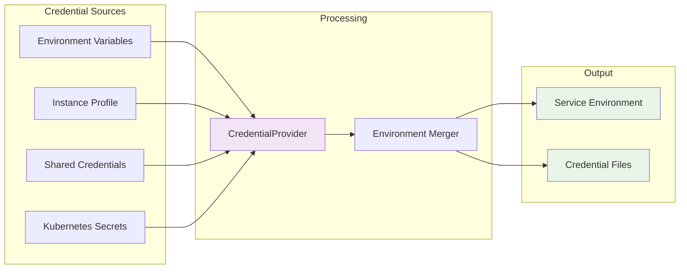
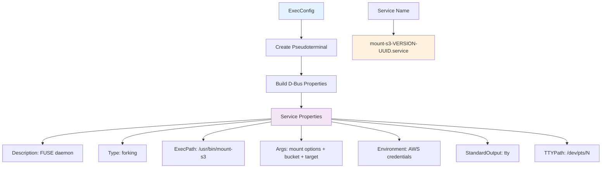
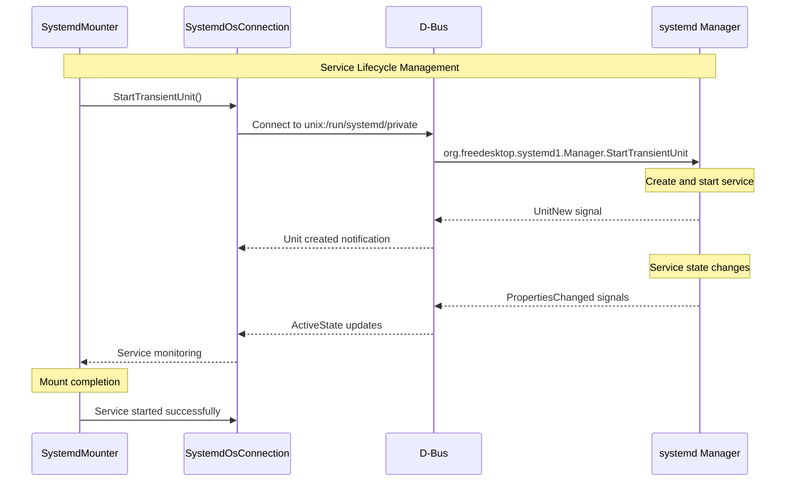
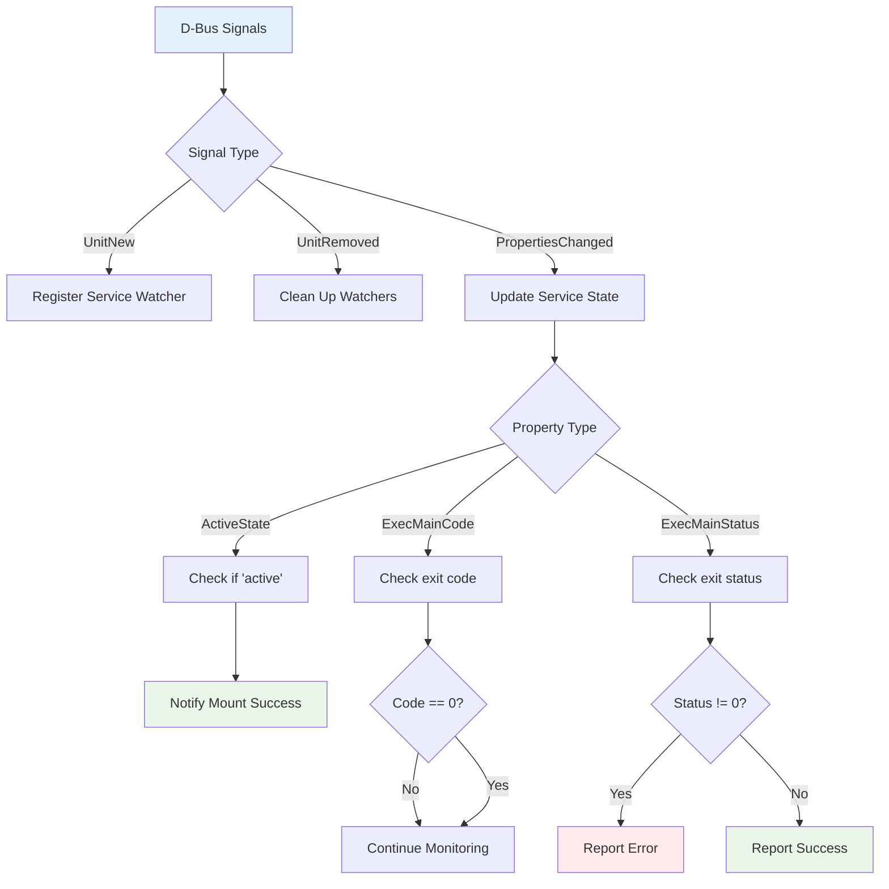
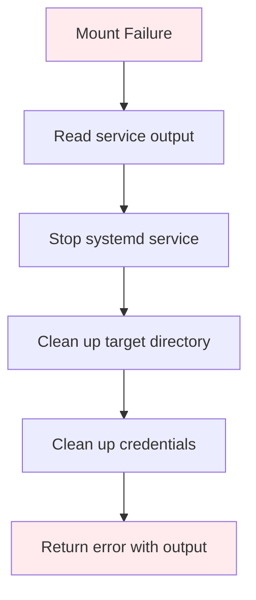
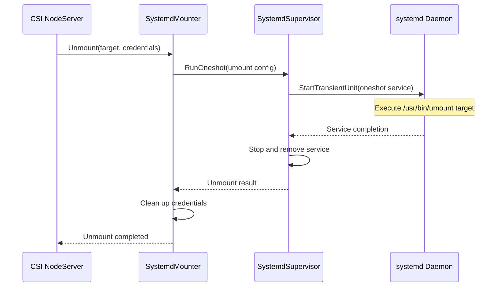
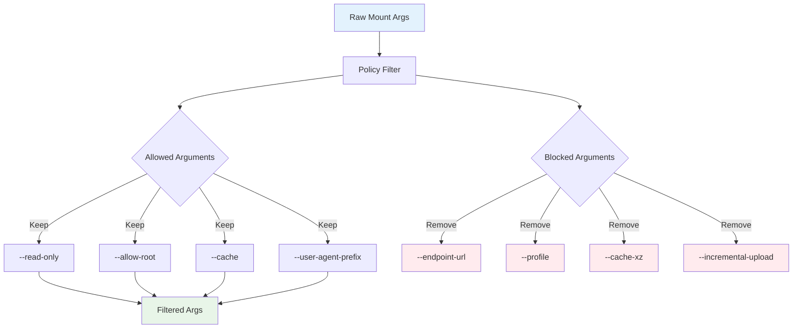

# Systemd Mounter Architecture

## Overview

The Systemd Mounter is one of two mounting strategies available in the Scality S3 CSI Driver (the other being Pod Mounter). It provides a lightweight, systemd-based approach to mounting S3 buckets as FUSE filesystems using the `mount-s3` binary from AWS Mountpoint for Amazon S3.

The Systemd Mounter leverages the host system's systemd daemon to manage mount-s3 processes as transient systemd units. This approach provides several advantages:

- **Process Management**: Systemd handles process lifecycle, restart policies, and cleanup
- **Resource Isolation**: Each mount runs as a separate systemd unit with configurable resource limits
- **Logging Integration**: Output is captured through pseudoterminals and integrated with systemd logging
- **Service Dependencies**: Proper ordering and dependency management through systemd

## Architecture Components



### Core Components

| Component | Purpose | Location |
|-----------|---------|----------|
| **SystemdMounter** | Main interface implementing the Mounter contract | `pkg/driver/node/mounter/systemd_mounter.go` |
| **SystemdSupervisor** | Manages systemd service lifecycle and monitoring | `pkg/system/systemd.go` |
| **SystemdOsConnection** | Low-level D-Bus communication with systemd | `pkg/system/systemd.go` |
| **Pts** | Pseudoterminal management for output capture | `pkg/system/pts.go` |
| **ServiceRunner** | Interface for running systemd services | `pkg/driver/node/mounter/mounter.go` |

## Static Provisioning Workflow

The Systemd Mounter only supports static provisioning, where S3 buckets are pre-created and manually configured as PersistentVolumes.



## Mount Process Deep Dive

### 1. Pre-Mount Validation



### 2. Credential Management

The SystemdMounter handles AWS credentials through multiple sources:

- **Environment Variables**: `AWS_ACCESS_KEY_ID`, `AWS_SECRET_ACCESS_KEY`, etc.
- **Instance Profile**: EC2 instance roles
- **Shared Credentials File**: AWS credentials file
- **Kubernetes Secrets**: Secret-based authentication



### 3. Systemd Service Creation



## Systemd Integration Details

### D-Bus Communication

The SystemdMounter communicates with systemd through D-Bus, specifically using the systemd Manager interface:



### Signal Monitoring



## Error Handling and Cleanup

### Mount Failure Recovery



### Unmount Process



## Configuration and Environment

### Mount Arguments Policy

The SystemdMounter enforces security policies by filtering certain mount arguments:



### Environment Variables

| Variable | Purpose | Default |
|----------|---------|---------|
| `MOUNT_S3_PATH` | Path to mount-s3 binary | `/usr/bin/mount-s3` |
| `HOST_PLUGIN_DIR` | Host plugin directory | `/var/lib/kubelet/plugins/s3.csi.scality.com/` |
| `PTMX_PATH` | Pseudoterminal master path | `/dev/ptmx` |
| `AWS_*` | AWS credential variables | Various |

## Deployment Considerations

### Prerequisites

- systemd available on host system
- D-Bus socket accessible at `/run/systemd/private`
- `mount-s3` binary installed on host
- Appropriate permissions for D-Bus communication

### Resource Management

Each mount creates a separate systemd service unit, allowing for:

- Individual process monitoring
- Resource limits per mount
- Independent lifecycle management
- Proper cleanup on node shutdown

## Enabling Mermaid Support

The project already has Mermaid support configured in `mkdocs.yml`:

```yaml
plugins:
  - mermaid2

markdown_extensions:
  - pymdownx.superfences:
      custom_fences:
        - name: mermaid
          class: mermaid
          format: pymdownx.superfences.fence_div_format
```

No additional configuration is required to view the diagrams in this documentation.

## Related Components

- **Pod Mounter**: Alternative mounting strategy using Kubernetes pods
- **CSI Node Server**: Main CSI interface implementation
- **Credential Provider**: AWS credential management
- **Mount-s3**: AWS Mountpoint for Amazon S3 binary

## Troubleshooting

Common issues and their resolution:

| Issue | Cause | Solution |
|-------|-------|----------|
| Mount fails with D-Bus error | systemd not accessible | Check D-Bus socket permissions |
| Service creation fails | Invalid mount arguments | Review mount options and policies |
| Credentials not found | Credential provider misconfigured | Verify AWS credential setup |
| Mount hangs | Network connectivity issues | Check S3 endpoint accessibility |

For detailed troubleshooting, see the [Troubleshooting Guide](../troubleshooting.md).