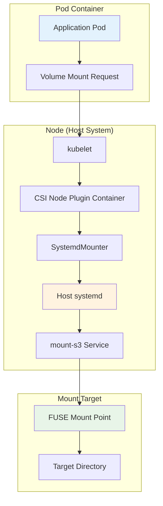
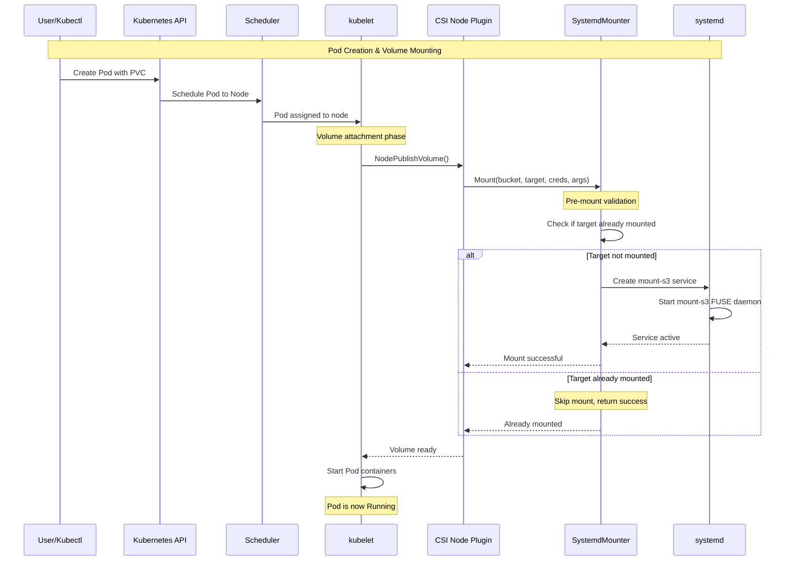
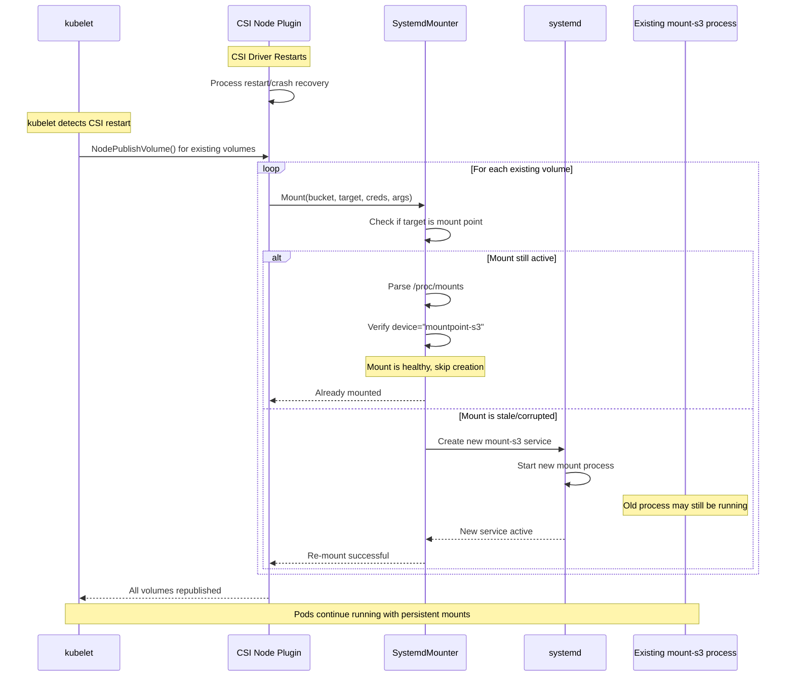
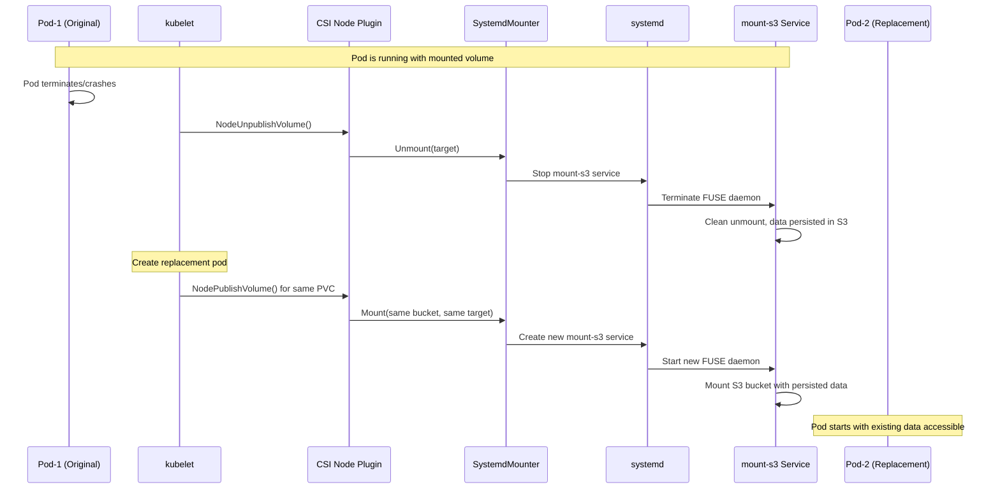
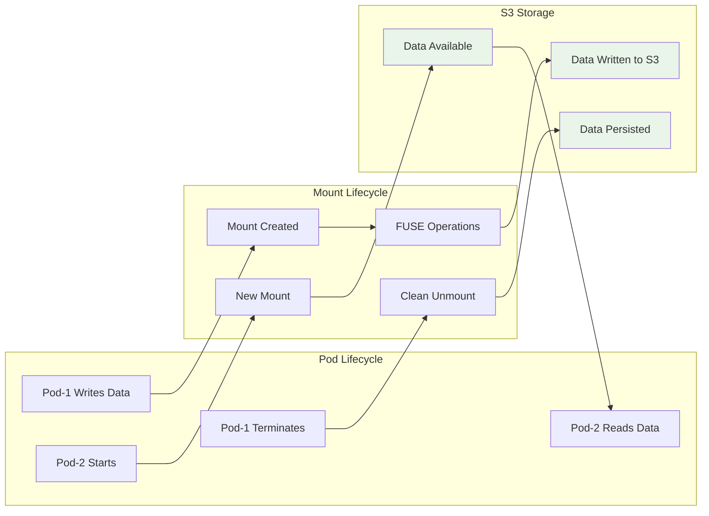
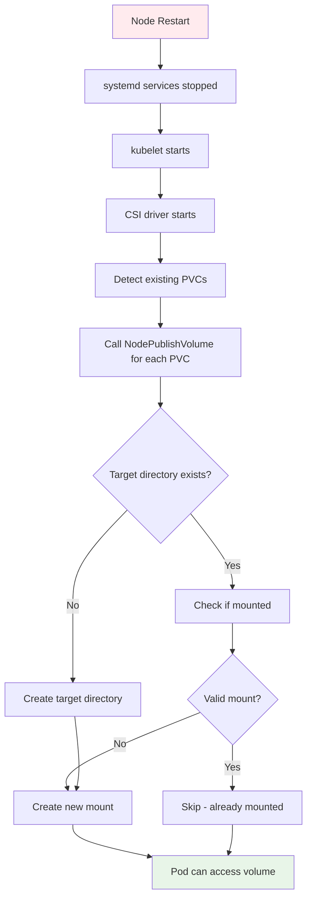
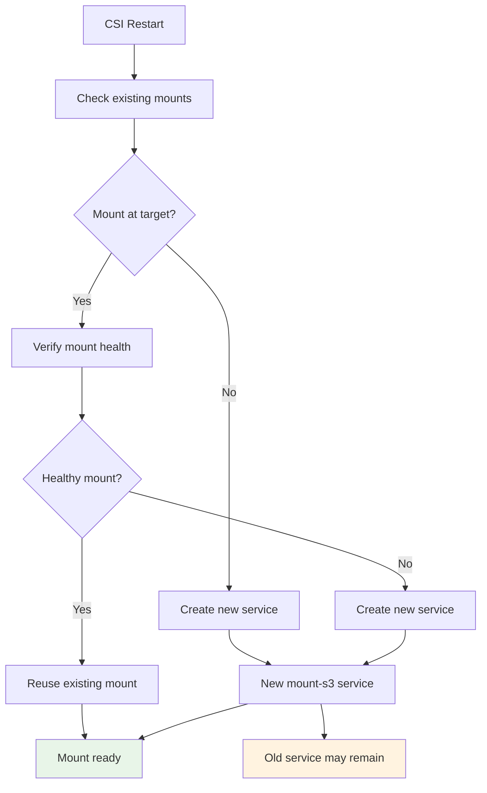
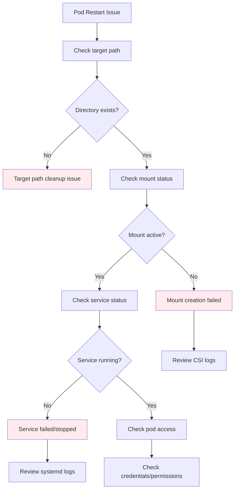

# Systemd Mounter Operations Guide

## Overview

This guide explains the operational behavior of the Systemd Mounter from an end-user perspective, covering pod lifecycle, mount persistence, and recovery scenarios. Understanding these operations helps troubleshoot issues and predict system behavior during various restart scenarios.

## How Pods Access Host Systemd Mounter

### Pod-to-Host Communication Flow



### Key Communication Mechanisms

1. **CSI Interface**: Pod requests volumes through Kubernetes CSI (Container Storage Interface)
2. **Host Privileges**: CSI Node Plugin runs as privileged container with host access
3. **systemd Integration**: Plugin communicates with host systemd via D-Bus socket
4. **Mount Propagation**: Host mounts are visible in container through mount propagation

### Access Path Details

| Component | Access Method | Privileges Required |
|-----------|---------------|-------------------|
| **Application Pod** | Standard Kubernetes volume mount | User-level |
| **CSI Node Plugin** | Privileged container with host namespace access | Privileged, host PID/IPC |
| **Host systemd** | D-Bus socket at `/run/systemd/private` | Root access via privilege escalation |
| **mount-s3 Binary** | Direct execution on host filesystem | Root privileges through systemd |

## Pod Startup Workflow

### Initial Pod Creation



### Mount Point Detection Logic

The SystemdMounter performs these checks before creating a new mount:

```mermaid
flowchart TD
    A[Mount Request] --> B[Check target path exists]
    B --> C{Path exists?}
    
    C -->|No| D[Create target directory]
    C -->|Yes| E[Check if mount point]
    
    D --> E
    E --> F{Is mount point?}
    
    F -->|No| G[Proceed with new mount]
    F -->|Yes| H[Parse /proc/mounts]
    
    H --> I{Device = "mountpoint-s3"?}
    I -->|Yes| J[Skip mount - already active]
    I -->|No| K[Not our mount - proceed]
    
    G --> L[Create systemd service]
    K --> L
    J --> M[Return success]
    L --> N[Start mount-s3 daemon]
    N --> M
    
    style J fill:#e8f5e8
    style M fill:#e8f5e8
    style L fill:#fff3e0
```

## CSI Driver Restart Scenarios

### CSI Driver Restart with `requiresRepublish: true`

The CSI driver is configured with `requiresRepublish: true`, which means kubelet will call `NodePublishVolume` again for all existing volumes when the CSI driver restarts.



### Mount Persistence During CSI Restart

| Scenario | Behavior | Outcome |
|----------|----------|---------|
| **Active systemd mount** | Mount persists independently of CSI | ✅ No disruption |
| **Corrupted mount** | CSI detects and recreates mount | ✅ Automatic recovery |
| **Orphaned systemd service** | New service created, old may remain | ⚠️ Potential resource leak |
| **Credential refresh** | Credentials updated during republish | ✅ Seamless credential rotation |

## Pod Restart Scenarios

### Pod Restart with Persistent Volume



### Data Persistence Guarantees



## System Recovery Scenarios

### Node Restart Recovery



### Orphaned Service Cleanup

When CSI restarts, orphaned systemd services may remain:



### Service Naming and Isolation

Each mount creates a unique systemd service:

```bash
# Service naming pattern
mount-s3-{VERSION}-{UUID}.service

# Example services
mount-s3-v1.12.0-a1b2c3d4-e5f6-7890-abcd-ef1234567890.service
mount-s3-v1.12.0-b2c3d4e5-f6g7-8901-bcde-f21234567890.service
```

## Operational Monitoring

### Health Check Commands

```bash
# Check systemd mount services
systemctl list-units 'mount-s3-*'

# Verify mount points
mount | grep mountpoint-s3

# Check CSI driver logs
kubectl logs -n kube-system -l app=scality-s3-csi-node

# Monitor mount activity
journalctl -f -u 'mount-s3-*'
```

### Common Operational Patterns

| Operation | Expected Behavior | Verification |
|-----------|------------------|--------------|
| **Pod Start** | New systemd service created | `systemctl list-units mount-s3-*` |
| **Pod Restart** | Old service stopped, new service created | Check service timestamps |
| **CSI Restart** | Existing mounts detected and reused | No new services for existing mounts |
| **Node Restart** | All mounts recreated during startup | All PVCs remounted successfully |

## Troubleshooting Mount Persistence

### Mount State Verification



### Recovery Actions

| Issue | Diagnosis | Resolution |
|-------|-----------|------------|
| **Stale mount** | Mount point exists but service stopped | Manual unmount: `umount <target>` |
| **Orphaned service** | Service running but no mount point | Stop service: `systemctl stop mount-s3-*` |
| **Permission denied** | Credentials expired/invalid | Update credentials, restart pod |
| **Mount collision** | Multiple services for same target | Clean up duplicate services |

## Best Practices

### For Cluster Administrators

1. **Monitor systemd services** regularly for orphaned mount services
2. **Set up alerts** for failed mount-s3 services
3. **Implement log retention** for systemd journal entries
4. **Plan for credential rotation** with zero-downtime updates

### For Application Developers

1. **Design for mount availability** - handle temporary mount unavailability
2. **Implement proper error handling** for I/O operations
3. **Use readiness probes** to verify volume accessibility
4. **Plan for data consistency** during pod restarts

### For Operations Teams

1. **Monitor CSI driver health** and restart behavior
2. **Track mount service lifecycle** and cleanup
3. **Implement automated recovery** for common failure scenarios
4. **Maintain runbook procedures** for manual recovery

## Summary

The Systemd Mounter provides robust mount persistence through:

- **Independent mount lifecycle** from CSI driver process
- **Automatic mount detection** and reuse during restarts
- **Graceful handling** of pod and CSI driver restarts
- **Persistent data access** across application lifecycle changes

Understanding these operational patterns helps ensure reliable S3 storage integration in production Kubernetes environments.