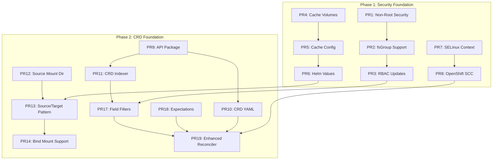

# SELinux and v2.0 Development Plan (Revised)

## Executive Summary

This document provides a comprehensive implementation plan for adding production-ready SELinux support to the Scality CSI Driver v2.0.
Based on analysis of the AWS upstream v2.0.0 implementation, this plan focuses on the **non-root execution model**,
**MountpointS3PodAttachment CRD pattern**, and **pod-contained cache architecture** to enable SELinux-enforcing
environments (like OpenShift) without requiring privileged containers.

## Critical Architecture Requirements

### Analysis Findings

After thorough analysis of AWS upstream v2.0.0 release, the key enablers for SELinux support are:

1. **Non-Root Execution** - All Mountpoint processes run as non-root users
2. **Pod Isolation** - Dedicated, unprivileged Kubernetes pods for each mount
3. **Pod-Contained Caching** - Cache volumes within pods, not on host filesystem
4. **MountpointS3PodAttachment CRD** - Production-grade pod sharing coordination
5. **Source/Target Mount Pattern** - Bind mounts for proper isolation
6. **Security Context Support** - fsGroup and VOLUME_MOUNT_GROUP compatibility

### SELinux Compatibility Architecture

```text
SELinux-Compatible Architecture (v2.0)
=====================================

Workload Pod 1 (non-root) ──┐
Workload Pod 2 (non-root) ──┼── CRD: MountpointS3PodAttachment
Workload Pod 3 (non-root) ──┘     │
                                   ▼
                    Controller (Reconciler + Field Matching)
                                   │
                                   ▼
              Mountpoint Pod (non-root, mount-s3 namespace)
                           │
                    ┌──────┴──────┐
                    ▼             ▼
              Source Mount    Cache Volume
              (bind mount)    (emptyDir/ephemeral)
                    │
         ┌──────────┼──────────┐
         ▼          ▼          ▼
   Bind Mount  Bind Mount  Bind Mount
   Target 1    Target 2    Target 3
```

**Key Difference from v1.x**: No privileged containers, no host filesystem dependencies, proper SELinux isolation.

## Implementation Phases

### Phase 0: Upgrade Testing Infrastructure (Prerequisite)

**Duration**: 2 weeks
**PRs**: See `upgrade-testing-implementation-plan.md`
**Goal**: Ensure backward compatibility during v1.2.0 to v2.0 upgrade

### Phase 1: Security Foundation (Weeks 1-2)

**Duration**: 2 weeks
**PRs**: 8 foundational PRs
**Goal**: Non-root execution and pod-contained cache architecture

### Phase 2: CRD Foundation (Weeks 3-4)

**Duration**: 2 weeks
**PRs**: 12 foundational PRs
**Goal**: Implement MountpointS3PodAttachment CRD and source/target mount pattern

### Phase 3: Pod Sharing & Advanced Logic (Weeks 5-6)

**Duration**: 2 weeks
**PRs**: 15 implementation PRs
**Goal**: Production-grade pod sharing with sophisticated matching criteria

### Phase 4: RBAC & Integration (Week 7)

**Duration**: 1 week
**PRs**: 8 security PRs
**Goal**: Comprehensive RBAC and SELinux context handling

### Phase 5: Controller Test Updates (Week 8)

**Duration**: 1 week
**PRs**: 8 test PRs
**Goal**: Update controller tests for CRD architecture and pod sharing

### Phase 6: Testing & Validation (Week 9)

**Duration**: 1 week
**PRs**: 12 test PRs
**Goal**: Comprehensive testing of SELinux, OpenShift, and pod sharing scenarios

### Phase 7: Documentation & Release Prep (Week 10)

**Duration**: 1 week
**PRs**: 10 documentation PRs
**Goal**: Complete documentation and release preparation

## Detailed PR Breakdown

**Total PRs: 73**
**Timeline: 10 weeks**
**Parallelizable: ~60% of PRs**

---

## Phase 1: Security Foundation (Weeks 1-2) - 8 PRs

### Non-Root Execution (Sequential: PRs 1-3)

#### PR 1: Update Pod Security Contexts for Non-Root

**Size: 80 lines** | **Review: 7 min** | **Dependencies: None**

```yaml
# Update charts/scality-mountpoint-s3-csi-driver/templates/node.yaml
# Add non-root security context to all containers

securityContext:
  runAsNonRoot: true
  runAsUser: 65534  # nobody user
  runAsGroup: 65534 # nobody group
  allowPrivilegeEscalation: false
  capabilities:
    drop:
      - ALL
  readOnlyRootFilesystem: true
  seccompProfile:
    type: RuntimeDefault

# Update pod security context
podSecurityContext:
  runAsNonRoot: true
  runAsUser: 65534
  runAsGroup: 65534
  fsGroup: 65534
  seccompProfile:
    type: RuntimeDefault
```

```yaml
# Update Mountpoint pod template in controller
# pkg/podmounter/mppod/creator.go template

spec:
  securityContext:
    runAsNonRoot: true
    runAsUser: 65534
    runAsGroup: 65534
    fsGroup: {{ .FSGroup }}  # From workload pod
    seccompProfile:
      type: RuntimeDefault
  containers:
  - name: mountpoint-s3
    securityContext:
      runAsNonRoot: true
      runAsUser: 65534
      runAsGroup: 65534
      allowPrivilegeEscalation: false
      capabilities:
        drop:
          - ALL
      readOnlyRootFilesystem: true
```

#### PR 2: Add fsGroup and VOLUME_MOUNT_GROUP Support

**Size: 90 lines** | **Review: 8 min** | **Dependencies: PR1**

```go
// pkg/driver/node/credentialprovider/credential_provider.go
// Add fsGroup handling

type CredentialContext struct {
    WorkloadPodID      string
    VolumeID           string
    FSGroup            *int64  // NEW: fsGroup from pod security context
    VolumeMode         string
    ServiceAccountName string
    Namespace          string
}

// Extract fsGroup from workload pod
func extractFSGroup(pod *corev1.Pod) *int64 {
    if pod.Spec.SecurityContext != nil && pod.Spec.SecurityContext.FSGroup != nil {
        return pod.Spec.SecurityContext.FSGroup
    }
    return nil
}
```

```go
// pkg/podmounter/mppod/creator.go
// Update Mountpoint pod creation with fsGroup

func (mpc *MountpointPodCreator) CreatePod(ctx context.Context, credentialCtx credentialprovider.CredentialContext,
    bucketName string, args mountpoint.Args) (*corev1.Pod, error) {

    // Set pod fsGroup to match workload pod
    var fsGroup *int64
    if credentialCtx.FSGroup != nil {
        fsGroup = credentialCtx.FSGroup
    } else {
        // Default fsGroup
        defaultFS := int64(65534)
        fsGroup = &defaultFS
    }

    pod := &corev1.Pod{
        Spec: corev1.PodSpec{
            SecurityContext: &corev1.PodSecurityContext{
                FSGroup: fsGroup,
                RunAsNonRoot: &[]bool{true}[0],
                RunAsUser: &[]int64{65534}[0],
                RunAsGroup: &[]int64{65534}[0],
            },
            // ... rest of pod spec
        },
    }

    // Add VOLUME_MOUNT_GROUP environment variable
    pod.Spec.Containers[0].Env = append(pod.Spec.Containers[0].Env, corev1.EnvVar{
        Name:  "VOLUME_MOUNT_GROUP",
        Value: fmt.Sprintf("%d", *fsGroup),
    })

    return pod, nil
}
```

#### PR 3: Update RBAC for Non-Privileged Operation

**Size: 60 lines** | **Review: 6 min** | **Dependencies: PR1**

```yaml
# Update charts/scality-mountpoint-s3-csi-driver/templates/rbac.yaml
# Remove privileged requirements, add volume management permissions

apiVersion: rbac.authorization.k8s.io/v1
kind: ClusterRole
metadata:
  name: scality-s3-csi-driver-role
rules:
# Existing CSI permissions...

# Add permissions for non-privileged volume operations
- apiGroups: [""]
  resources: ["persistentvolumes", "persistentvolumeclaims"]
  verbs: ["get", "list", "watch"]
- apiGroups: [""]
  resources: ["nodes"]
  verbs: ["get", "list", "watch"]

# Mountpoint pod management in mount-s3 namespace
- apiGroups: [""]
  resources: ["pods"]
  verbs: ["get", "list", "watch", "create", "update", "patch", "delete"]
  resourceNames: ["mount-s3-*"]  # Restrict to our pods

# Volume mount permissions without privilege escalation
- apiGroups: [""]
  resources: ["pods/exec"]
  verbs: ["create"]
  resourceNames: ["mount-s3-*"]
```

### Cache Architecture (Parallel: PRs 4-6)

#### PR 4: Implement Pod-Contained Cache Volumes

**Size: 100 lines** | **Review: 8 min** | **Dependencies: None**

```go
// pkg/podmounter/mppod/creator.go
// Add cache volume support to Mountpoint pods

func (mpc *MountpointPodCreator) addCacheVolume(pod *corev1.Pod, cacheConfig CacheConfig) {
    var volume corev1.Volume
    var volumeMount corev1.VolumeMount

    switch cacheConfig.Type {
    case "emptyDir":
        volume = corev1.Volume{
            Name: "cache-volume",
            VolumeSource: corev1.VolumeSource{
                EmptyDir: &corev1.EmptyDirVolumeSource{
                    SizeLimit: cacheConfig.SizeLimit,
                    Medium:    cacheConfig.Medium, // "" for disk, "Memory" for tmpfs
                },
            },
        }
    case "ephemeral":
        volume = corev1.Volume{
            Name: "cache-volume",
            VolumeSource: corev1.VolumeSource{
                Ephemeral: &corev1.EphemeralVolumeSource{
                    VolumeClaimTemplate: &corev1.PersistentVolumeClaimTemplate{
                        Spec: corev1.PersistentVolumeClaimSpec{
                            AccessModes: []corev1.PersistentVolumeAccessMode{
                                corev1.ReadWriteOnce,
                            },
                            Resources: corev1.ResourceRequirements{
                                Requests: corev1.ResourceList{
                                    corev1.ResourceStorage: *cacheConfig.SizeLimit,
                                },
                            },
                            StorageClassName: cacheConfig.StorageClassName,
                        },
                    },
                },
            },
        }
    }

    volumeMount = corev1.VolumeMount{
        Name:      "cache-volume",
        MountPath: "/tmp/mountpoint-cache",
        ReadOnly:  false,
    }

    pod.Spec.Volumes = append(pod.Spec.Volumes, volume)
    pod.Spec.Containers[0].VolumeMounts = append(pod.Spec.Containers[0].VolumeMounts, volumeMount)

    // Add cache directory to mountpoint args
    pod.Spec.Containers[0].Env = append(pod.Spec.Containers[0].Env, corev1.EnvVar{
        Name:  "MOUNTPOINT_CACHE_DIR",
        Value: "/tmp/mountpoint-cache",
    })
}

type CacheConfig struct {
    Type             string            // "emptyDir" or "ephemeral"
    SizeLimit        *resource.Quantity // Required size limit
    Medium           corev1.StorageMedium // For emptyDir: "" or "Memory"
    StorageClassName *string           // For ephemeral volumes
}
```

#### PR 5: Add Cache Configuration to Volume Attributes

**Size: 70 lines** | **Review: 6 min** | **Dependencies: PR4**

```go
// pkg/driver/node/volumecontext/volume_context.go
// Add cache configuration parsing

type VolumeContext struct {
    // Existing fields...

    // Cache configuration
    CacheType             string `json:"cache,omitempty"`
    CacheEmptyDirSizeLimit string `json:"cacheEmptyDirSizeLimit,omitempty"`
    CacheEphemeralStorageClass string `json:"cacheEphemeralStorageClass,omitempty"`
}

func (vc *VolumeContext) ValidateAndSetDefaults() error {
    // Existing validation...

    // Validate cache configuration
    if vc.CacheType != "" {
        switch vc.CacheType {
        case "emptyDir", "ephemeral":
            // Valid cache types
        default:
            return fmt.Errorf("invalid cache type %q, must be 'emptyDir' or 'ephemeral'", vc.CacheType)
        }

        // Require size limit for cache
        if vc.CacheEmptyDirSizeLimit == "" {
            return fmt.Errorf("cacheEmptyDirSizeLimit is required when cache is enabled")
        }

        // Validate size limit format
        if _, err := resource.ParseQuantity(vc.CacheEmptyDirSizeLimit); err != nil {
            return fmt.Errorf("invalid cacheEmptyDirSizeLimit format: %w", err)
        }
    }

    return nil
}

func (vc *VolumeContext) GetCacheConfig() *podmounter.CacheConfig {
    if vc.CacheType == "" {
        return nil
    }

    sizeLimit := resource.MustParse(vc.CacheEmptyDirSizeLimit)

    config := &podmounter.CacheConfig{
        Type:      vc.CacheType,
        SizeLimit: &sizeLimit,
    }

    if vc.CacheType == "ephemeral" && vc.CacheEphemeralStorageClass != "" {
        config.StorageClassName = &vc.CacheEphemeralStorageClass
    }

    return config
}
```

#### PR 6: Update Helm Values for Cache Configuration

**Size: 50 lines** | **Review: 5 min** | **Dependencies: PR5**

```yaml
# Update charts/scality-mountpoint-s3-csi-driver/values.yaml
# Add cache configuration options

mountpointPod:
  # Cache configuration
  cache:
    # Enable cache by default with emptyDir
    enabled: true
    type: "emptyDir"  # "emptyDir" or "ephemeral"
    sizeLimit: "1Gi"  # Required size limit
    medium: ""        # "" for disk, "Memory" for tmpfs (emptyDir only)
    storageClass: ""  # Storage class for ephemeral volumes

  # Resource limits for Mountpoint pods
  resources:
    limits:
      memory: "512Mi"
      cpu: "200m"
    requests:
      memory: "256Mi"
      cpu: "100m"
```

```yaml
# Update storage class template example
# charts/scality-mountpoint-s3-csi-driver/examples/storageclass.yaml

apiVersion: storage.k8s.io/v1
kind: StorageClass
metadata:
  name: scality-s3-cached
provisioner: s3.csi.scality.com
parameters:
  bucketName: my-bucket

  # Cache configuration (optional)
  cache: "emptyDir"
  cacheEmptyDirSizeLimit: "2Gi"

  # For ephemeral cache
  # cache: "ephemeral"
  # cacheEmptyDirSizeLimit: "5Gi"
  # cacheEphemeralStorageClass: "fast-ssd"
```

### SELinux Context Configuration (Parallel: PRs 7-8)

#### PR 7: Add SELinux Context Support

**Size: 60 lines** | **Review: 6 min** | **Dependencies: PR1**

```yaml
# Update charts/scality-mountpoint-s3-csi-driver/values.yaml
# Add SELinux configuration

node:
  # SELinux configuration for OpenShift compatibility
  seLinuxOptions:
    user: system_u
    type: container_t
    role: system_r
    level: s0

controller:
  seLinuxOptions:
    user: system_u
    type: container_t
    role: system_r
    level: s0

mountpointPod:
  seLinuxOptions:
    user: system_u
    type: container_t
    role: system_r
    level: s0
```

```yaml
# Update charts/scality-mountpoint-s3-csi-driver/templates/node.yaml
# Add SELinux options conditionally

{{- if .Values.node.seLinuxOptions }}
securityContext:
  seLinuxOptions:
    user: {{ .Values.node.seLinuxOptions.user }}
    type: {{ .Values.node.seLinuxOptions.type }}
    role: {{ .Values.node.seLinuxOptions.role }}
    level: {{ .Values.node.seLinuxOptions.level }}
{{- end }}
```

#### PR 8: OpenShift Security Context Constraints (SCC)

**Size: 80 lines** | **Review: 7 min** | **Dependencies: PR7**

```yaml
# Add charts/scality-mountpoint-s3-csi-driver/templates/openshift-scc.yaml
# OpenShift-specific security context constraints

{{- if .Values.openshift.enabled }}
apiVersion: security.openshift.io/v1
kind: SecurityContextConstraints
metadata:
  name: scality-s3-csi-driver-scc
  annotations:
    kubernetes.io/description: "SCC for Scality S3 CSI Driver pods"
allowHostDirVolumePlugin: false
allowHostIPC: false
allowHostNetwork: false
allowHostPID: false
allowHostPorts: false
allowPrivilegeEscalation: false
allowPrivilegedContainer: false
allowedCapabilities: []
defaultAddCapabilities: []
requiredDropCapabilities:
- ALL
fsGroup:
  type: MustRunAs
  ranges:
  - min: 1
    max: 65535
runAsUser:
  type: MustRunAsNonRoot
seLinuxContext:
  type: MustRunAs
  seLinuxOptions:
    user: system_u
    role: system_r
    type: container_t
supplementalGroups:
  type: MustRunAs
  ranges:
  - min: 1
    max: 65535
volumes:
- configMap
- downwardAPI
- emptyDir
- ephemeral
- projected
- secret
users:
- system:serviceaccount:{{ .Release.Namespace }}:scality-s3-csi-driver-sa
---
{{- end }}
```

```yaml
# Update values.yaml with OpenShift support
openshift:
  enabled: false  # Set to true for OpenShift deployments
  createSCC: true # Create SecurityContextConstraints
```

---

## Phase 2: CRD Foundation (Weeks 3-4) - 12 PRs

### CRD Core Implementation (Sequential: PRs 9-11)

#### PR 9: Create API Package Structure

**Size: 80 lines** | **Review: 7 min** | **Dependencies: None**

```go
// pkg/api/v2/groupversion_info.go
package v2

import (
    "k8s.io/apimachinery/pkg/runtime/schema"
    "sigs.k8s.io/controller-runtime/pkg/scheme"
)

const (
    Group   = "s3.csi.scality.com"
    Version = "v2"
)

var (
    // SchemeGroupVersion is group version used to register these objects
    SchemeGroupVersion = schema.GroupVersion{Group: Group, Version: Version}

    // SchemeBuilder is used to add go types to the GroupVersionKind scheme
    SchemeBuilder = &scheme.Builder{GroupVersion: SchemeGroupVersion}

    // AddToScheme adds the types in this group-version to the given scheme.
    AddToScheme = SchemeBuilder.AddToScheme
)
```

```go
// pkg/api/v2/mountpoints3podattachment_types.go
package v2

import (
    metav1 "k8s.io/apimachinery/pkg/apis/meta/v1"
)

// +kubebuilder:object:root=true
// +kubebuilder:subresource:status
// +kubebuilder:resource:scope=Cluster,shortName=s3pa
// +kubebuilder:selectablefield:JSONPath=`.spec.nodeName`
// +kubebuilder:selectablefield:JSONPath=`.spec.persistentVolumeName`
// +kubebuilder:selectablefield:JSONPath=`.spec.volumeID`
// +kubebuilder:selectablefield:JSONPath=`.spec.mountOptions`
// +kubebuilder:selectablefield:JSONPath=`.spec.authenticationSource`
// +kubebuilder:selectablefield:JSONPath=`.spec.workloadFSGroup`
type MountpointS3PodAttachment struct {
    metav1.TypeMeta   `json:",inline"`
    metav1.ObjectMeta `json:"metadata,omitempty"`
    Spec   MountpointS3PodAttachmentSpec   `json:"spec,omitempty"`
    Status MountpointS3PodAttachmentStatus `json:"status,omitempty"`
}

type MountpointS3PodAttachmentSpec struct {
    NodeName                         string `json:"nodeName"`
    PersistentVolumeName             string `json:"persistentVolumeName"`
    VolumeID                         string `json:"volumeID"`
    MountOptions                     string `json:"mountOptions"`
    AuthenticationSource             string `json:"authenticationSource"`
    WorkloadFSGroup                  string `json:"workloadFSGroup"`
    WorkloadServiceAccountName       string `json:"workloadServiceAccountName,omitempty"`
    WorkloadNamespace                string `json:"workloadNamespace,omitempty"`
    WorkloadServiceAccountIAMRoleARN string `json:"workloadServiceAccountIAMRoleARN,omitempty"`

    // Maps each Mountpoint S3 pod name to its workload attachments
    MountpointS3PodAttachments map[string][]WorkloadAttachment `json:"mountpointS3PodAttachments"`
}

type WorkloadAttachment struct {
    WorkloadPodUID string      `json:"workloadPodUID"`
    AttachmentTime metav1.Time `json:"attachmentTime"`
}

type MountpointS3PodAttachmentStatus struct {
    Ready bool `json:"ready,omitempty"`
}

// +kubebuilder:object:root=true
type MountpointS3PodAttachmentList struct {
    metav1.TypeMeta `json:",inline"`
    metav1.ListMeta `json:"metadata,omitempty"`
    Items           []MountpointS3PodAttachment `json:"items"`
}

func init() {
    SchemeBuilder.Register(&MountpointS3PodAttachment{}, &MountpointS3PodAttachmentList{})
}
```

#### PR 10: Generate CRD YAML Template

**Size: 60 lines** | **Review: 5 min** | **Dependencies: PR9**

```yaml
# charts/scality-mountpoint-s3-csi-driver/templates/scalitys3podattachments-crd.yaml
{{- if or (eq .Values.mountingStrategy "podmounter") (eq .Values.mountingStrategy "auto") }}
apiVersion: apiextensions.k8s.io/v1
kind: CustomResourceDefinition
metadata:
  name: mountpoints3podattachments.s3.csi.scality.com
  annotations:
    helm.sh/resource-policy: keep
spec:
  group: s3.csi.scality.com
  versions:
  - name: v2
    served: true
    storage: true
    schema:
      openAPIV3Schema:
        type: object
        properties:
          spec:
            type: object
            required:
              - nodeName
              - persistentVolumeName
              - volumeID
            properties:
              nodeName:
                type: string
              persistentVolumeName:
                type: string
              volumeID:
                type: string
              mountOptions:
                type: string
              authenticationSource:
                type: string
              workloadFSGroup:
                type: string
              mountpointS3PodAttachments:
                type: object
                additionalProperties:
                  type: array
                  items:
                    type: object
                    properties:
                      workloadPodUID:
                        type: string
                      attachmentTime:
                        type: string
                        format: date-time
          status:
            type: object
            properties:
              ready:
                type: boolean
  scope: Cluster
  names:
    plural: mountpoints3podattachments
    singular: mountpoints3podattachment
    kind: MountpointS3PodAttachment
    shortNames:
    - s3pa
{{- end }}
```

#### PR 11: Add CRD Field Indexer

**Size: 100 lines** | **Review: 8 min** | **Dependencies: PR9**

```go
// pkg/api/v2/mountpoints3podattachment_indexer.go
package v2

import (
    "context"
    "sigs.k8s.io/controller-runtime/pkg/client"
    "sigs.k8s.io/controller-runtime/pkg/manager"
)

const (
    FieldNodeName                         = "spec.nodeName"
    FieldPersistentVolumeName             = "spec.persistentVolumeName"
    FieldVolumeID                         = "spec.volumeID"
    FieldMountOptions                     = "spec.mountOptions"
    FieldAuthenticationSource             = "spec.authenticationSource"
    FieldWorkloadFSGroup                  = "spec.workloadFSGroup"
    FieldWorkloadServiceAccountName       = "spec.workloadServiceAccountName"
    FieldWorkloadNamespace                = "spec.workloadNamespace"
    FieldWorkloadServiceAccountIAMRoleARN = "spec.workloadServiceAccountIAMRoleARN"
)

func SetupIndexers(ctx context.Context, mgr manager.Manager) error {
    // Index by node name for efficient node-specific queries
    if err := mgr.GetFieldIndexer().IndexField(ctx, &MountpointS3PodAttachment{}, FieldNodeName, func(rawObj client.Object) []string {
        s3pa := rawObj.(*MountpointS3PodAttachment)
        return []string{s3pa.Spec.NodeName}
    }); err != nil {
        return err
    }

    // Index by persistent volume name
    if err := mgr.GetFieldIndexer().IndexField(ctx, &MountpointS3PodAttachment{}, FieldPersistentVolumeName, func(rawObj client.Object) []string {
        s3pa := rawObj.(*MountpointS3PodAttachment)
        return []string{s3pa.Spec.PersistentVolumeName}
    }); err != nil {
        return err
    }

    // Index by volume ID for efficient volume-specific queries
    if err := mgr.GetFieldIndexer().IndexField(ctx, &MountpointS3PodAttachment{}, FieldVolumeID, func(rawObj client.Object) []string {
        s3pa := rawObj.(*MountpointS3PodAttachment)
        return []string{s3pa.Spec.VolumeID}
    }); err != nil {
        return err
    }

    // Additional indexes for pod sharing criteria
    indexes := map[string]func(*MountpointS3PodAttachment) string{
        FieldMountOptions:                     func(s3pa *MountpointS3PodAttachment) string { return s3pa.Spec.MountOptions },
        FieldAuthenticationSource:             func(s3pa *MountpointS3PodAttachment) string { return s3pa.Spec.AuthenticationSource },
        FieldWorkloadFSGroup:                  func(s3pa *MountpointS3PodAttachment) string { return s3pa.Spec.WorkloadFSGroup },
        FieldWorkloadServiceAccountName:       func(s3pa *MountpointS3PodAttachment) string { return s3pa.Spec.WorkloadServiceAccountName },
        FieldWorkloadNamespace:                func(s3pa *MountpointS3PodAttachment) string { return s3pa.Spec.WorkloadNamespace },
        FieldWorkloadServiceAccountIAMRoleARN: func(s3pa *MountpointS3PodAttachment) string { return s3pa.Spec.WorkloadServiceAccountIAMRoleARN },
    }

    for field, extractFunc := range indexes {
        if err := mgr.GetFieldIndexer().IndexField(ctx, &MountpointS3PodAttachment{}, field, func(rawObj client.Object) []string {
            s3pa := rawObj.(*MountpointS3PodAttachment)
            return []string{extractFunc(s3pa)}
        }); err != nil {
            return err
        }
    }

    return nil
}
```

### Source/Target Mount Implementation (Parallel: PRs 12-16)

#### PR 12: Add Source Mount Directory Functions

**Size: 40 lines** | **Review: 5 min** | **Dependencies: None**

```go
// pkg/driver/node/mounter/source_mount.go
package mounter

import (
    "path/filepath"
    "os"
)

const (
    // SourceMountDirName is the directory name for source mounts
    SourceMountDirName = "mnt"

    // PluginDir is the plugin directory under kubelet
    PluginDir = "plugins"

    // DriverName for Scality CSI
    DriverName = "s3.csi.scality.com"
)

// SourceMountDir returns the base directory for all source mounts
func SourceMountDir(kubeletPath string) string {
    return filepath.Join(kubeletPath, PluginDir, DriverName, SourceMountDirName)
}

// SourceMountPath returns the specific source mount path for a Mountpoint pod
func SourceMountPath(kubeletPath, podName string) string {
    return filepath.Join(SourceMountDir(kubeletPath), podName)
}

// EnsureSourceMountDir creates the source mount directory if it doesn't exist
func EnsureSourceMountDir(kubeletPath string) error {
    dir := SourceMountDir(kubeletPath)
    return os.MkdirAll(dir, 0750)
}

// CleanupSourceMount removes a specific source mount directory
func CleanupSourceMount(kubeletPath, podName string) error {
    path := SourceMountPath(kubeletPath, podName)
    return os.RemoveAll(path)
}
```

---

## Phase 5: Controller Test Updates (Week 8) - 8 PRs

The current controller tests use envtest and Ginkgo, testing basic pod scheduling. They need comprehensive updates for the new CRD architecture and pod sharing logic.

### CRD Test Infrastructure (Sequential: PRs 58-60)

#### PR 58: Update Test Suite for CRD Support

**Size: 80 lines** | **Review: 7 min** | **Dependencies: PR 10**

```go
// Update tests/controller/suite_test.go
// Add CRD scheme registration and field indexers

import (
    // Add CRD imports
    crdv2 "github.com/scality/mountpoint-s3-csi-driver/pkg/api/v2"
)

var _ = BeforeSuite(func() {
    logf.SetLogger(zap.New(zap.WriteTo(GinkgoWriter), zap.UseDevMode(true)))

    ctx, cancel = context.WithCancel(context.TODO())

    By("Bootstrapping test environment")
    testEnv = &envtest.Environment{
        CRDDirectoryPaths: []string{
            filepath.Join("..", "..", "charts", "scality-mountpoint-s3-csi-driver", "templates"),
        },
        ErrorIfCRDPathMissing: true,
    }

    var err error
    cfg, err = testEnv.Start()
    Expect(err).NotTo(HaveOccurred())
    Expect(cfg).NotTo(BeNil())

    // Register CRD scheme
    err = crdv2.AddToScheme(scheme.Scheme)
    Expect(err).NotTo(HaveOccurred())

    k8sClient, err = client.New(cfg, client.Options{Scheme: scheme.Scheme})
    Expect(err).NotTo(HaveOccurred())
    Expect(k8sClient).NotTo(BeNil())

    k8sManager, err := ctrl.NewManager(cfg, ctrl.Options{Scheme: scheme.Scheme})
    Expect(err).ToNot(HaveOccurred())

    // Setup CRD field indexers
    err = crdv2.SetupIndexers(ctx, k8sManager)
    Expect(err).ToNot(HaveOccurred())

    // Updated reconciler with CRD support
    err = csicontroller.NewReconciler(k8sManager.GetClient(), mppod.Config{
        Namespace:         mountpointNamespace,
        MountpointVersion: mountpointVersion,
        PriorityClassName: mountpointPriorityClassName,
        Container: mppod.ContainerConfig{
            Command:         mountpointContainerCommand,
            Image:           mountpointImage,
            ImagePullPolicy: mountpointImagePullPolicy,
        },
        CSIDriverVersion: version.GetVersion().DriverVersion,
    }).SetupWithManager(k8sManager)
    Expect(err).ToNot(HaveOccurred())

    go func() {
        defer GinkgoRecover()
        err = k8sManager.Start(ctx)
        Expect(err).ToNot(HaveOccurred(), "failed to run manager")
    }()

    createMountpointNamespace()
    createMountpointPriorityClass()
})
```

#### PR 59: Add CRD Test Helpers

**Size: 120 lines** | **Review: 10 min** | **Dependencies: PR 58**

```go
// tests/controller/crd_helpers_test.go
package controller_test

import (
    . "github.com/onsi/gomega"
    metav1 "k8s.io/apimachinery/pkg/apis/meta/v1"
    "k8s.io/apimachinery/pkg/types"
    "sigs.k8s.io/controller-runtime/pkg/client"

    crdv2 "github.com/scality/mountpoint-s3-csi-driver/pkg/api/v2"
)

// createS3PodAttachment creates a test MountpointS3PodAttachment CRD
func createS3PodAttachment(opts ...s3paOption) *s3paWrapper {
    s3pa := &crdv2.MountpointS3PodAttachment{
        ObjectMeta: metav1.ObjectMeta{
            Name: randomName("s3pa"),
            Labels: map[string]string{
                "app.kubernetes.io/name": "scality-mountpoint-s3-csi-driver",
            },
        },
        Spec: crdv2.MountpointS3PodAttachmentSpec{
            NodeName:                         "test-node",
            PersistentVolumeName:             "test-pv",
            VolumeID:                         "test-volume-id",
            MountOptions:                     "",
            AuthenticationSource:             "driver",
            WorkloadFSGroup:                  "1000",
            WorkloadServiceAccountName:       "default",
            WorkloadNamespace:                "default",
            WorkloadServiceAccountIAMRoleARN: "",
            MountpointS3PodAttachments:       make(map[string][]crdv2.WorkloadAttachment),
        },
    }

    for _, opt := range opts {
        opt(s3pa)
    }

    return &s3paWrapper{s3pa: s3pa}
}

type s3paOption func(*crdv2.MountpointS3PodAttachment)

func withNodeName(nodeName string) s3paOption {
    return func(s3pa *crdv2.MountpointS3PodAttachment) {
        s3pa.Spec.NodeName = nodeName
    }
}

func withPVName(pvName string) s3paOption {
    return func(s3pa *crdv2.MountpointS3PodAttachment) {
        s3pa.Spec.PersistentVolumeName = pvName
    }
}

func withVolumeID(volumeID string) s3paOption {
    return func(s3pa *crdv2.MountpointS3PodAttachment) {
        s3pa.Spec.VolumeID = volumeID
    }
}

func withMountOptions(mountOptions string) s3paOption {
    return func(s3pa *crdv2.MountpointS3PodAttachment) {
        s3pa.Spec.MountOptions = mountOptions
    }
}

func withFSGroup(fsGroup string) s3paOption {
    return func(s3pa *crdv2.MountpointS3PodAttachment) {
        s3pa.Spec.WorkloadFSGroup = fsGroup
    }
}

func withMountpointPodAttachment(podName string, attachments ...crdv2.WorkloadAttachment) s3paOption {
    return func(s3pa *crdv2.MountpointS3PodAttachment) {
        s3pa.Spec.MountpointS3PodAttachments[podName] = attachments
    }
}

type s3paWrapper struct {
    s3pa *crdv2.MountpointS3PodAttachment
}

func (w *s3paWrapper) create() *s3paWrapper {
    By(fmt.Sprintf("Creating S3PodAttachment %q", w.s3pa.Name))
    Expect(k8sClient.Create(ctx, w.s3pa)).To(Succeed())
    return w
}

func (w *s3paWrapper) get() *crdv2.MountpointS3PodAttachment {
    current := &crdv2.MountpointS3PodAttachment{}
    key := types.NamespacedName{Name: w.s3pa.Name}
    Expect(k8sClient.Get(ctx, key, current)).To(Succeed())
    return current
}

func (w *s3paWrapper) delete() {
    By(fmt.Sprintf("Deleting S3PodAttachment %q", w.s3pa.Name))
    Expect(k8sClient.Delete(ctx, w.s3pa)).To(Succeed())
}

func (w *s3paWrapper) shouldExist() *s3paWrapper {
    Eventually(func() error {
        return k8sClient.Get(ctx, types.NamespacedName{Name: w.s3pa.Name}, &crdv2.MountpointS3PodAttachment{})
    }, defaultWaitTimeout, defaultWaitRetryPeriod).Should(Succeed())
    return w
}

func (w *s3paWrapper) shouldNotExist() {
    Eventually(func() bool {
        err := k8sClient.Get(ctx, types.NamespacedName{Name: w.s3pa.Name}, &crdv2.MountpointS3PodAttachment{})
        return apierrors.IsNotFound(err)
    }, defaultWaitTimeout, defaultWaitRetryPeriod).Should(BeTrue())
}

// Helper to create workload attachment
func createWorkloadAttachment(podUID string) crdv2.WorkloadAttachment {
    return crdv2.WorkloadAttachment{
        WorkloadPodUID: podUID,
        AttachmentTime: metav1.Now(),
    }
}
```

#### PR 60: Add Pod Sharing Test Cases

**Size: 150 lines** | **Review: 12 min** | **Dependencies: PR 59**

```go
// tests/controller/pod_sharing_test.go
package controller_test

import (
    . "github.com/onsi/ginkgo/v2"
    . "github.com/onsi/gomega"
    "k8s.io/utils/ptr"

    crdv2 "github.com/scality/mountpoint-s3-csi-driver/pkg/api/v2"
)

var _ = Describe("Pod Sharing", func() {
    Context("When workloads have matching sharing criteria", func() {
        It("should reuse existing Mountpoint pod", func() {
            // Create first volume and pod
            vol1 := createVolume()
            vol1.bind()

            pod1 := createPod(
                withPVC(vol1.pvc),
                withFSGroup(1000),
                withServiceAccount("test-sa"),
            )
            pod1.schedule("test-node")

            // Verify first Mountpoint pod is created
            waitAndVerifyMountpointPodFor(pod1, vol1)

            // Create second pod with same criteria
            pod2 := createPod(
                withPVC(vol1.pvc),
                withFSGroup(1000),
                withServiceAccount("test-sa"),
            )
            pod2.schedule("test-node")

            // Should reuse the same Mountpoint pod via CRD sharing
            Eventually(func() int {
                s3paList := &crdv2.MountpointS3PodAttachmentList{}
                Expect(k8sClient.List(ctx, s3paList)).To(Succeed())

                if len(s3paList.Items) != 1 {
                    return 0
                }

                s3pa := s3paList.Items[0]
                totalAttachments := 0
                for _, attachments := range s3pa.Spec.MountpointS3PodAttachments {
                    totalAttachments += len(attachments)
                }
                return totalAttachments
            }, defaultWaitTimeout, defaultWaitRetryPeriod).Should(Equal(2))

            // Verify only one Mountpoint pod exists
            mountpointPods := listMountpointPods()
            Expect(mountpointPods.Items).To(HaveLen(1))
        })

        It("should create separate Mountpoint pods for different FSGroups", func() {
            vol := createVolume()
            vol.bind()

            pod1 := createPod(
                withPVC(vol.pvc),
                withFSGroup(1000),
            )
            pod1.schedule("test-node")

            pod2 := createPod(
                withPVC(vol.pvc),
                withFSGroup(2000), // Different FSGroup
            )
            pod2.schedule("test-node")

            // Should create two separate S3PodAttachments
            Eventually(func() int {
                s3paList := &crdv2.MountpointS3PodAttachmentList{}
                Expect(k8sClient.List(ctx, s3paList)).To(Succeed())
                return len(s3paList.Items)
            }, defaultWaitTimeout, defaultWaitRetryPeriod).Should(Equal(2))

            // Should create two separate Mountpoint pods
            Eventually(func() int {
                mountpointPods := listMountpointPods()
                return len(mountpointPods.Items)
            }, defaultWaitTimeout, defaultWaitRetryPeriod).Should(Equal(2))
        })

        It("should create separate Mountpoint pods for different mount options", func() {
            vol1 := createVolume(withMountOptions("--read-only"))
            vol1.bind()
            vol2 := createVolume(withMountOptions("--cache-size 1Gi"))
            vol2.bind()

            pod1 := createPod(withPVC(vol1.pvc))
            pod1.schedule("test-node")

            pod2 := createPod(withPVC(vol2.pvc))
            pod2.schedule("test-node")

            // Should create two separate S3PodAttachments due to different mount options
            Eventually(func() int {
                s3paList := &crdv2.MountpointS3PodAttachmentList{}
                Expect(k8sClient.List(ctx, s3paList)).To(Succeed())
                return len(s3paList.Items)
            }, defaultWaitTimeout, defaultWaitRetryPeriod).Should(Equal(2))
        })
    })

    Context("When workload pods are deleted", func() {
        It("should remove workload attachment from S3PodAttachment", func() {
            vol := createVolume()
            vol.bind()

            pod := createPod(withPVC(vol.pvc))
            pod.schedule("test-node")

            waitAndVerifyMountpointPodFor(pod, vol)

            // Delete the workload pod
            pod.delete()

            // S3PodAttachment should eventually have no attachments
            Eventually(func() int {
                s3paList := &crdv2.MountpointS3PodAttachmentList{}
                Expect(k8sClient.List(ctx, s3paList)).To(Succeed())

                if len(s3paList.Items) == 0 {
                    return 0
                }

                s3pa := s3paList.Items[0]
                totalAttachments := 0
                for _, attachments := range s3pa.Spec.MountpointS3PodAttachments {
                    totalAttachments += len(attachments)
                }
                return totalAttachments
            }, defaultWaitTimeout, defaultWaitRetryPeriod).Should(Equal(0))
        })

        It("should delete S3PodAttachment when no workloads remain", func() {
            vol := createVolume()
            vol.bind()

            pod := createPod(withPVC(vol.pvc))
            pod.schedule("test-node")

            waitAndVerifyMountpointPodFor(pod, vol)

            // Delete the workload pod
            pod.delete()

            // S3PodAttachment should eventually be deleted
            Eventually(func() int {
                s3paList := &crdv2.MountpointS3PodAttachmentList{}
                Expect(k8sClient.List(ctx, s3paList)).To(Succeed())
                return len(s3paList.Items)
            }, defaultWaitTimeout, defaultWaitRetryPeriod).Should(Equal(0))

            // Mountpoint pod should be deleted
            Eventually(func() int {
                mountpointPods := listMountpointPods()
                return len(mountpointPods.Items)
            }, defaultWaitTimeout, defaultWaitRetryPeriod).Should(Equal(0))
        })
    })
})

// Helper function to list Mountpoint pods
func listMountpointPods() *corev1.PodList {
    podList := &corev1.PodList{}
    Expect(k8sClient.List(ctx, podList, client.InNamespace(mountpointNamespace))).To(Succeed())
    return podList
}
```

### Enhanced Test Cases (Parallel: PRs 61-65)

#### PR 61: Add Non-Root Security Context Tests

**Size: 80 lines** | **Review: 7 min** | **Dependencies: PR 1**

```go
// tests/controller/security_context_test.go
package controller_test

import (
    . "github.com/onsi/ginkgo/v2"
    . "github.com/onsi/gomega"
    corev1 "k8s.io/api/core/v1"
    "k8s.io/utils/ptr"
)

var _ = Describe("Security Context", func() {
    Context("When creating Mountpoint pods", func() {
        It("should run as non-root user", func() {
            vol := createVolume()
            vol.bind()

            pod := createPod(withPVC(vol.pvc))
            pod.schedule("test-node")

            var mountpointPod *corev1.Pod
            Eventually(func() bool {
                mountpointPods := listMountpointPods()
                if len(mountpointPods.Items) == 0 {
                    return false
                }
                mountpointPod = &mountpointPods.Items[0]
                return true
            }, defaultWaitTimeout, defaultWaitRetryPeriod).Should(BeTrue())

            // Verify pod security context
            Expect(mountpointPod.Spec.SecurityContext).NotTo(BeNil())
            Expect(mountpointPod.Spec.SecurityContext.RunAsNonRoot).To(Equal(ptr.To(true)))
            Expect(mountpointPod.Spec.SecurityContext.RunAsUser).To(Equal(ptr.To(int64(65534))))
            Expect(mountpointPod.Spec.SecurityContext.RunAsGroup).To(Equal(ptr.To(int64(65534))))

            // Verify container security context
            container := mountpointPod.Spec.Containers[0]
            Expect(container.SecurityContext).NotTo(BeNil())
            Expect(container.SecurityContext.RunAsNonRoot).To(Equal(ptr.To(true)))
            Expect(container.SecurityContext.AllowPrivilegeEscalation).To(Equal(ptr.To(false)))
            Expect(container.SecurityContext.Capabilities).NotTo(BeNil())
            Expect(container.SecurityContext.Capabilities.Drop).To(ContainElement("ALL"))
        })

        It("should inherit fsGroup from workload pod", func() {
            vol := createVolume()
            vol.bind()

            pod := createPod(
                withPVC(vol.pvc),
                withFSGroup(2000),
            )
            pod.schedule("test-node")

            var mountpointPod *corev1.Pod
            Eventually(func() bool {
                mountpointPods := listMountpointPods()
                if len(mountpointPods.Items) == 0 {
                    return false
                }
                mountpointPod = &mountpointPods.Items[0]
                return true
            }, defaultWaitTimeout, defaultWaitRetryPeriod).Should(BeTrue())

            // Verify fsGroup inheritance
            Expect(mountpointPod.Spec.SecurityContext.FSGroup).To(Equal(ptr.To(int64(2000))))

            // Verify VOLUME_MOUNT_GROUP environment variable
            container := mountpointPod.Spec.Containers[0]
            var volumeMountGroupEnv *corev1.EnvVar
            for _, env := range container.Env {
                if env.Name == "VOLUME_MOUNT_GROUP" {
                    volumeMountGroupEnv = &env
                    break
                }
            }
            Expect(volumeMountGroupEnv).NotTo(BeNil())
            Expect(volumeMountGroupEnv.Value).To(Equal("2000"))
        })
    })
})
```

#### PR 62: Add Cache Volume Tests

**Size: 90 lines** | **Review: 8 min** | **Dependencies: PR 4**

```go
// tests/controller/cache_volume_test.go
package controller_test

import (
    . "github.com/onsi/ginkgo/v2"
    . "github.com/onsi/gomega"
    corev1 "k8s.io/api/core/v1"
    "k8s.io/apimachinery/pkg/api/resource"
)

var _ = Describe("Cache Volumes", func() {
    Context("When cache is configured in storage class", func() {
        It("should create emptyDir cache volume", func() {
            vol := createVolume(withParameters(map[string]string{
                "bucketName":              "test-bucket",
                "cache":                   "emptyDir",
                "cacheEmptyDirSizeLimit":  "1Gi",
            }))
            vol.bind()

            pod := createPod(withPVC(vol.pvc))
            pod.schedule("test-node")

            var mountpointPod *corev1.Pod
            Eventually(func() bool {
                mountpointPods := listMountpointPods()
                if len(mountpointPods.Items) == 0 {
                    return false
                }
                mountpointPod = &mountpointPods.Items[0]
                return true
            }, defaultWaitTimeout, defaultWaitRetryPeriod).Should(BeTrue())

            // Verify cache volume exists
            var cacheVolume *corev1.Volume
            for _, vol := range mountpointPod.Spec.Volumes {
                if vol.Name == "cache-volume" {
                    cacheVolume = &vol
                    break
                }
            }
            Expect(cacheVolume).NotTo(BeNil())
            Expect(cacheVolume.EmptyDir).NotTo(BeNil())

            sizeLimit := resource.MustParse("1Gi")
            Expect(cacheVolume.EmptyDir.SizeLimit).To(Equal(&sizeLimit))

            // Verify cache volume mount
            container := mountpointPod.Spec.Containers[0]
            var cacheVolumeMount *corev1.VolumeMount
            for _, mount := range container.VolumeMounts {
                if mount.Name == "cache-volume" {
                    cacheVolumeMount = &mount
                    break
                }
            }
            Expect(cacheVolumeMount).NotTo(BeNil())
            Expect(cacheVolumeMount.MountPath).To(Equal("/tmp/mountpoint-cache"))

            // Verify cache environment variable
            var cacheEnv *corev1.EnvVar
            for _, env := range container.Env {
                if env.Name == "MOUNTPOINT_CACHE_DIR" {
                    cacheEnv = &env
                    break
                }
            }
            Expect(cacheEnv).NotTo(BeNil())
            Expect(cacheEnv.Value).To(Equal("/tmp/mountpoint-cache"))
        })

        It("should create ephemeral cache volume", func() {
            vol := createVolume(withParameters(map[string]string{
                "bucketName":                    "test-bucket",
                "cache":                         "ephemeral",
                "cacheEmptyDirSizeLimit":        "5Gi",
                "cacheEphemeralStorageClass":    "fast-ssd",
            }))
            vol.bind()

            pod := createPod(withPVC(vol.pvc))
            pod.schedule("test-node")

            var mountpointPod *corev1.Pod
            Eventually(func() bool {
                mountpointPods := listMountpointPods()
                if len(mountpointPods.Items) == 0 {
                    return false
                }
                mountpointPod = &mountpointPods.Items[0]
                return true
            }, defaultWaitTimeout, defaultWaitRetryPeriod).Should(BeTrue())

            // Verify ephemeral cache volume exists
            var cacheVolume *corev1.Volume
            for _, vol := range mountpointPod.Spec.Volumes {
                if vol.Name == "cache-volume" {
                    cacheVolume = &vol
                    break
                }
            }
            Expect(cacheVolume).NotTo(BeNil())
            Expect(cacheVolume.Ephemeral).NotTo(BeNil())

            pvcTemplate := cacheVolume.Ephemeral.VolumeClaimTemplate
            sizeLimit := resource.MustParse("5Gi")
            Expect(pvcTemplate.Spec.Resources.Requests[corev1.ResourceStorage]).To(Equal(sizeLimit))
            Expect(pvcTemplate.Spec.StorageClassName).To(Equal(ptr.To("fast-ssd")))
        })
    })
})
```

#### PR 63: Add Field Filter and Indexing Tests

**Size: 100 lines** | **Review: 8 min** | **Dependencies: PR 11**

```go
// tests/controller/field_filter_test.go
package controller_test

import (
    . "github.com/onsi/ginkgo/v2"
    . "github.com/onsi/gomega"
    "sigs.k8s.io/controller-runtime/pkg/client"

    crdv2 "github.com/scality/mountpoint-s3-csi-driver/pkg/api/v2"
)

var _ = Describe("Field Filters and Indexing", func() {
    Context("When querying S3PodAttachments by field", func() {
        BeforeEach(func() {
            // Create test S3PodAttachments with different field values
            s3pa1 := createS3PodAttachment(
                withNodeName("node-1"),
                withPVName("pv-1"),
                withVolumeID("vol-1"),
                withFSGroup("1000"),
            ).create()

            s3pa2 := createS3PodAttachment(
                withNodeName("node-2"),
                withPVName("pv-2"),
                withVolumeID("vol-2"),
                withFSGroup("2000"),
            ).create()

            s3pa3 := createS3PodAttachment(
                withNodeName("node-1"), // Same node as s3pa1
                withPVName("pv-3"),
                withVolumeID("vol-3"),
                withFSGroup("1000"), // Same fsGroup as s3pa1
            ).create()
        })

        It("should filter by node name", func() {
            s3paList := &crdv2.MountpointS3PodAttachmentList{}
            err := k8sClient.List(ctx, s3paList, client.MatchingFields{
                crdv2.FieldNodeName: "node-1",
            })
            Expect(err).NotTo(HaveOccurred())
            Expect(s3paList.Items).To(HaveLen(2))

            for _, s3pa := range s3paList.Items {
                Expect(s3pa.Spec.NodeName).To(Equal("node-1"))
            }
        })

        It("should filter by persistent volume name", func() {
            s3paList := &crdv2.MountpointS3PodAttachmentList{}
            err := k8sClient.List(ctx, s3paList, client.MatchingFields{
                crdv2.FieldPersistentVolumeName: "pv-2",
            })
            Expect(err).NotTo(HaveOccurred())
            Expect(s3paList.Items).To(HaveLen(1))
            Expect(s3paList.Items[0].Spec.PersistentVolumeName).To(Equal("pv-2"))
        })

        It("should filter by volume ID", func() {
            s3paList := &crdv2.MountpointS3PodAttachmentList{}
            err := k8sClient.List(ctx, s3paList, client.MatchingFields{
                crdv2.FieldVolumeID: "vol-3",
            })
            Expect(err).NotTo(HaveOccurred())
            Expect(s3paList.Items).To(HaveLen(1))
            Expect(s3paList.Items[0].Spec.VolumeID).To(Equal("vol-3"))
        })

        It("should filter by workload FSGroup", func() {
            s3paList := &crdv2.MountpointS3PodAttachmentList{}
            err := k8sClient.List(ctx, s3paList, client.MatchingFields{
                crdv2.FieldWorkloadFSGroup: "1000",
            })
            Expect(err).NotTo(HaveOccurred())
            Expect(s3paList.Items).To(HaveLen(2))

            for _, s3pa := range s3paList.Items {
                Expect(s3pa.Spec.WorkloadFSGroup).To(Equal("1000"))
            }
        })

        It("should filter by multiple fields", func() {
            s3paList := &crdv2.MountpointS3PodAttachmentList{}
            err := k8sClient.List(ctx, s3paList, client.MatchingFields{
                crdv2.FieldNodeName:        "node-1",
                crdv2.FieldWorkloadFSGroup: "1000",
            })
            Expect(err).NotTo(HaveOccurred())
            Expect(s3paList.Items).To(HaveLen(2))

            for _, s3pa := range s3paList.Items {
                Expect(s3pa.Spec.NodeName).To(Equal("node-1"))
                Expect(s3pa.Spec.WorkloadFSGroup).To(Equal("1000"))
            }
        })
    })
})
```

#### PR 64: Add CRD Lifecycle Tests

**Size: 110 lines** | **Review: 9 min** | **Dependencies: PR 59**

```go
// tests/controller/crd_lifecycle_test.go
package controller_test

import (
    . "github.com/onsi/ginkgo/v2"
    . "github.com/onsi/gomega"
    metav1 "k8s.io/apimachinery/pkg/apis/meta/v1"

    crdv2 "github.com/scality/mountpoint-s3-csi-driver/pkg/api/v2"
)

var _ = Describe("CRD Lifecycle", func() {
    Context("When managing S3PodAttachment resources", func() {
        It("should create, update, and delete S3PodAttachment", func() {
            // Create S3PodAttachment
            s3pa := createS3PodAttachment(
                withNodeName("test-node"),
                withPVName("test-pv"),
                withVolumeID("test-volume"),
            ).create()

            s3pa.shouldExist()

            // Verify initial state
            current := s3pa.get()
            Expect(current.Spec.NodeName).To(Equal("test-node"))
            Expect(current.Spec.PersistentVolumeName).To(Equal("test-pv"))
            Expect(current.Spec.VolumeID).To(Equal("test-volume"))
            Expect(current.Spec.MountpointS3PodAttachments).To(BeEmpty())

            // Add workload attachment
            attachment := createWorkloadAttachment("pod-uid-1")
            current.Spec.MountpointS3PodAttachments["mp-pod-1"] = []crdv2.WorkloadAttachment{attachment}
            Expect(k8sClient.Update(ctx, current)).To(Succeed())

            // Verify update
            Eventually(func() int {
                updated := s3pa.get()
                return len(updated.Spec.MountpointS3PodAttachments["mp-pod-1"])
            }, defaultWaitTimeout, defaultWaitRetryPeriod).Should(Equal(1))

            // Add second workload attachment to same Mountpoint pod
            updated := s3pa.get()
            attachment2 := createWorkloadAttachment("pod-uid-2")
            updated.Spec.MountpointS3PodAttachments["mp-pod-1"] = append(
                updated.Spec.MountpointS3PodAttachments["mp-pod-1"],
                attachment2,
            )
            Expect(k8sClient.Update(ctx, updated)).To(Succeed())

            // Verify second attachment
            Eventually(func() int {
                current := s3pa.get()
                return len(current.Spec.MountpointS3PodAttachments["mp-pod-1"])
            }, defaultWaitTimeout, defaultWaitRetryPeriod).Should(Equal(2))

            // Remove first workload attachment
            current = s3pa.get()
            current.Spec.MountpointS3PodAttachments["mp-pod-1"] = []crdv2.WorkloadAttachment{attachment2}
            Expect(k8sClient.Update(ctx, current)).To(Succeed())

            // Verify attachment removal
            Eventually(func() int {
                current := s3pa.get()
                return len(current.Spec.MountpointS3PodAttachments["mp-pod-1"])
            }, defaultWaitTimeout, defaultWaitRetryPeriod).Should(Equal(1))

            // Remove all attachments (should remove Mountpoint pod entry)
            current = s3pa.get()
            delete(current.Spec.MountpointS3PodAttachments, "mp-pod-1")
            Expect(k8sClient.Update(ctx, current)).To(Succeed())

            // Verify Mountpoint pod entry removal
            Eventually(func() int {
                current := s3pa.get()
                return len(current.Spec.MountpointS3PodAttachments)
            }, defaultWaitTimeout, defaultWaitRetryPeriod).Should(Equal(0))

            // Delete S3PodAttachment
            s3pa.delete()
            s3pa.shouldNotExist()
        })

        It("should handle concurrent updates", func() {
            s3pa := createS3PodAttachment().create()

            // Simulate concurrent updates by multiple controllers
            attachment1 := createWorkloadAttachment("pod-uid-1")
            attachment2 := createWorkloadAttachment("pod-uid-2")

            // First update adds attachment1
            current1 := s3pa.get()
            current1.Spec.MountpointS3PodAttachments["mp-pod-1"] = []crdv2.WorkloadAttachment{attachment1}

            // Second update adds attachment2 (simulating concurrent update)
            current2 := s3pa.get()
            current2.Spec.MountpointS3PodAttachments["mp-pod-2"] = []crdv2.WorkloadAttachment{attachment2}

            // Both updates should eventually succeed (with retries)
            Expect(k8sClient.Update(ctx, current1)).To(Succeed())

            // The second update might need a retry due to resource version conflict
            Eventually(func() error {
                current2 = s3pa.get() // Refresh resource version
                current2.Spec.MountpointS3PodAttachments["mp-pod-2"] = []crdv2.WorkloadAttachment{attachment2}
                return k8sClient.Update(ctx, current2)
            }, defaultWaitTimeout, defaultWaitRetryPeriod).Should(Succeed())

            // Verify both attachments exist
            final := s3pa.get()
            Expect(final.Spec.MountpointS3PodAttachments).To(HaveLen(2))
            Expect(final.Spec.MountpointS3PodAttachments["mp-pod-1"]).To(HaveLen(1))
            Expect(final.Spec.MountpointS3PodAttachments["mp-pod-2"]).To(HaveLen(1))
        })
    })
})
```

#### PR 65: Add Performance and Stress Tests

**Size: 120 lines** | **Review: 10 min** | **Dependencies: PR 64**

```go
// tests/controller/performance_test.go
package controller_test

import (
    "fmt"
    "sync"
    "time"

    . "github.com/onsi/ginkgo/v2"
    . "github.com/onsi/gomega"
    corev1 "k8s.io/api/core/v1"
    metav1 "k8s.io/apimachinery/pkg/apis/meta/v1"

    crdv2 "github.com/scality/mountpoint-s3-csi-driver/pkg/api/v2"
)

var _ = Describe("Performance and Stress Tests", func() {
    Context("When handling multiple concurrent workloads", func() {
        It("should handle 20 concurrent pod creations efficiently", func() {
            vol := createVolume()
            vol.bind()

            const numPods = 20
            var wg sync.WaitGroup
            podNames := make([]string, numPods)

            start := time.Now()

            // Create pods concurrently
            for i := 0; i < numPods; i++ {
                wg.Add(1)
                go func(index int) {
                    defer wg.Done()
                    defer GinkgoRecover()

                    pod := createPod(
                        withName(fmt.Sprintf("test-pod-%d", index)),
                        withPVC(vol.pvc),
                        withFSGroup(1000), // Same fsGroup - should share Mountpoint pods
                    )
                    pod.schedule("test-node")
                    podNames[index] = pod.pod.Name
                }(i)
            }

            wg.Wait()
            creationDuration := time.Since(start)

            // All pods should be scheduled quickly
            Expect(creationDuration).To(BeNumerically("<", 30*time.Second))

            // Should create only one S3PodAttachment (due to pod sharing)
            Eventually(func() int {
                s3paList := &crdv2.MountpointS3PodAttachmentList{}
                Expect(k8sClient.List(ctx, s3paList)).To(Succeed())
                return len(s3paList.Items)
            }, defaultWaitTimeout*4, defaultWaitRetryPeriod).Should(Equal(1))

            // Should have all 20 workload attachments in the single S3PodAttachment
            Eventually(func() int {
                s3paList := &crdv2.MountpointS3PodAttachmentList{}
                Expect(k8sClient.List(ctx, s3paList)).To(Succeed())

                if len(s3paList.Items) != 1 {
                    return 0
                }

                s3pa := s3paList.Items[0]
                totalAttachments := 0
                for _, attachments := range s3pa.Spec.MountpointS3PodAttachments {
                    totalAttachments += len(attachments)
                }
                return totalAttachments
            }, defaultWaitTimeout*4, defaultWaitRetryPeriod).Should(Equal(numPods))

            // Should create only one Mountpoint pod (due to sharing)
            Eventually(func() int {
                mountpointPods := listMountpointPods()
                return len(mountpointPods.Items)
            }, defaultWaitTimeout*2, defaultWaitRetryPeriod).Should(Equal(1))

            By(fmt.Sprintf("Created %d pods in %v, sharing 1 Mountpoint pod", numPods, creationDuration))
        })

        It("should handle rapid pod creation and deletion cycles", func() {
            vol := createVolume()
            vol.bind()

            const cycles = 10
            const podsPerCycle = 5

            for cycle := 0; cycle < cycles; cycle++ {
                By(fmt.Sprintf("Running cycle %d/%d", cycle+1, cycles))

                pods := make([]*podWrapper, podsPerCycle)

                // Create pods
                for i := 0; i < podsPerCycle; i++ {
                    pod := createPod(
                        withName(fmt.Sprintf("cycle-%d-pod-%d", cycle, i)),
                        withPVC(vol.pvc),
                        withFSGroup(1000),
                    )
                    pod.schedule("test-node")
                    pods[i] = pod
                }

                // Wait for S3PodAttachment to be created
                Eventually(func() int {
                    s3paList := &crdv2.MountpointS3PodAttachmentList{}
                    Expect(k8sClient.List(ctx, s3paList)).To(Succeed())
                    return len(s3paList.Items)
                }, defaultWaitTimeout, defaultWaitRetryPeriod).Should(Equal(1))

                // Delete pods
                for _, pod := range pods {
                    pod.delete()
                }

                // Wait for cleanup
                Eventually(func() int {
                    s3paList := &crdv2.MountpointS3PodAttachmentList{}
                    Expect(k8sClient.List(ctx, s3paList)).To(Succeed())
                    return len(s3paList.Items)
                }, defaultWaitTimeout, defaultWaitRetryPeriod).Should(Equal(0))

                Eventually(func() int {
                    mountpointPods := listMountpointPods()
                    return len(mountpointPods.Items)
                }, defaultWaitTimeout, defaultWaitRetryPeriod).Should(Equal(0))
            }
        })

        It("should efficiently query large numbers of S3PodAttachments", func() {
            const numS3PAs = 100

            // Create many S3PodAttachments across different nodes
            for i := 0; i < numS3PAs; i++ {
                nodeIndex := i % 10 // 10 different nodes
                s3pa := createS3PodAttachment(
                    withNodeName(fmt.Sprintf("node-%d", nodeIndex)),
                    withPVName(fmt.Sprintf("pv-%d", i)),
                    withVolumeID(fmt.Sprintf("vol-%d", i)),
                ).create()
            }

            // Verify all created
            Eventually(func() int {
                s3paList := &crdv2.MountpointS3PodAttachmentList{}
                Expect(k8sClient.List(ctx, s3paList)).To(Succeed())
                return len(s3paList.Items)
            }, defaultWaitTimeout*2, defaultWaitRetryPeriod).Should(Equal(numS3PAs))

            // Test efficient querying by node
            start := time.Now()
            for nodeIndex := 0; nodeIndex < 10; nodeIndex++ {
                s3paList := &crdv2.MountpointS3PodAttachmentList{}
                err := k8sClient.List(ctx, s3paList, client.MatchingFields{
                    crdv2.FieldNodeName: fmt.Sprintf("node-%d", nodeIndex),
                })
                Expect(err).NotTo(HaveOccurred())
                Expect(s3paList.Items).To(HaveLen(10)) // 100 S3PAs / 10 nodes = 10 per node
            }
            queryDuration := time.Since(start)

            // Queries should be fast due to indexing
            Expect(queryDuration).To(BeNumerically("<", 5*time.Second))

            By(fmt.Sprintf("Queried %d S3PodAttachments across 10 nodes in %v", numS3PAs, queryDuration))
        })
    })
})

// Helper function to create pod with specific name
func withName(name string) podOption {
    return func(pod *corev1.Pod) {
        pod.Name = name
        pod.GenerateName = ""
    }
}
```

---

## Parallelization Strategy

### Weeks 1-2: Security Foundation (8 PRs)

**Sequential Track**: PRs 1-3 (Non-root execution)
**Parallel Track A**: PRs 4-6 (Cache architecture)
**Parallel Track B**: PRs 7-8 (SELinux contexts)

### Weeks 3-4: CRD Foundation (12 PRs)

**Sequential Track**: PRs 9-11 (CRD core)
**Parallel Track A**: PRs 12-16 (Source/Target mounts)
**Parallel Track B**: PRs 17-20 (Controller foundation)

### Weeks 5-6: Pod Sharing Logic (15 PRs)

**Sequential Track**: PRs 21-28 (Core sharing logic)
**Parallel Track**: PRs 29-35 (Integration and wiring)

### Dependency Map



## Success Criteria

### Technical Requirements

1. ✅ **Non-Root Execution**: All processes run as non-root (UID 65534)
2. ✅ **SELinux Compatible**: Works on SELinux-enforcing hosts without privileged containers
3. ✅ **OpenShift Ready**: Full ROSA/OpenShift compatibility with SCC
4. ✅ **Pod-Contained Cache**: Cache stored in pod volumes, not host filesystem
5. ✅ **Pod Sharing**: Efficient resource utilization through CRD-coordinated sharing
6. ✅ **fsGroup Support**: Proper volume permissions with workload pod fsGroup
7. ✅ **Source/Target Isolation**: Bind mount pattern for proper security isolation
8. ✅ **Backward Compatible**: Existing systemd mounts continue working during migration

### Performance Requirements

1. ✅ **Mount Latency**: <20% overhead compared to v1.x systemd mounter
2. ✅ **Resource Usage**: Mountpoint pods within configured limits
3. ✅ **Cache Performance**: Pod-contained cache performs comparably to host cache
4. ✅ **Pod Sharing Efficiency**: Multiple workloads efficiently share pods

### Migration Requirements

1. ✅ **Zero Downtime**: Existing mounts continue working during upgrade
2. ✅ **Gradual Migration**: Support mixed-mode operation (systemd + pod mounter)
3. ✅ **Configuration Compatibility**: Minimal changes required in existing deployments
4. ✅ **Rollback Support**: Can rollback to v1.x if needed

## Breaking Changes and Migration Guide

### Breaking Changes in v2.0

1. **Cache Architecture**
   - **v1.x**: Cache stored on host filesystem at `/tmp/mountpoint-cache`
   - **v2.0**: Cache stored in pod volumes (emptyDir/ephemeral)
   - **Impact**: No cache sharing between different volumes
   - **Mitigation**: Use pod sharing to share cache within same volume

2. **Security Context Requirements**
   - **v1.x**: Some containers run as root
   - **v2.0**: All containers run as non-root (UID 65534)
   - **Impact**: Must configure fsGroup in workload pods
   - **Mitigation**: Automatic fsGroup inheritance from workload pods

3. **Log Access**
   - **v1.x**: Logs written to host filesystem
   - **v2.0**: Logs accessible via `kubectl logs`
   - **Impact**: Host-level log access no longer available
   - **Mitigation**: Use Kubernetes logging mechanisms

### Configuration Migration

#### Update Storage Classes

```yaml
# v1.x Storage Class
apiVersion: storage.k8s.io/v1
kind: StorageClass
metadata:
  name: scality-s3
provisioner: s3.csi.scality.com
parameters:
  bucketName: my-bucket

---

# v2.0 Storage Class with cache
apiVersion: storage.k8s.io/v1
kind: StorageClass
metadata:
  name: scality-s3-v2
provisioner: s3.csi.scality.com
parameters:
  bucketName: my-bucket
  # Add cache configuration
  cache: "emptyDir"
  cacheEmptyDirSizeLimit: "1Gi"
```

#### Update Workload Pod Specs

```yaml
# Ensure fsGroup is set for proper permissions
spec:
  securityContext:
    fsGroup: 1000  # This will be inherited by Mountpoint pods
  containers:
  - name: app
    # ... container spec
```

### Testing Recommendations

1. **Test in Staging**: Thoroughly test v2.0 in staging environment
2. **Validate SELinux**: Test on SELinux-enforcing nodes
3. **Check fsGroup**: Ensure workload pods have proper fsGroup configuration
4. **Cache Performance**: Benchmark cache performance with pod volumes
5. **OpenShift Testing**: Validate on OpenShift/ROSA clusters

## Timeline Summary

- **Week 1-2**: Security Foundation (non-root, cache, SELinux) - 8 PRs
- **Week 3-4**: CRD Foundation (CRD, source/target mounts) - 12 PRs  
- **Week 5-6**: Pod Sharing Logic (sharing criteria, lifecycle) - 15 PRs
- **Week 7**: RBAC & Integration (permissions, wiring) - 8 PRs
- **Week 8**: Controller Test Updates (CRD tests, pod sharing tests) - 8 PRs
- **Week 9**: Testing & Validation (SELinux, OpenShift tests) - 12 PRs
- **Week 10**: Documentation & Release (docs, migration guides) - 10 PRs

Total: 73 PRs over 10 weeks with ~60% parallelization opportunity

This plan provides a comprehensive path to v2.0 with production-ready SELinux support, focusing on the critical
non-root execution model and pod-contained architecture that enables compatibility with OpenShift and other hardened
Kubernetes environments.
