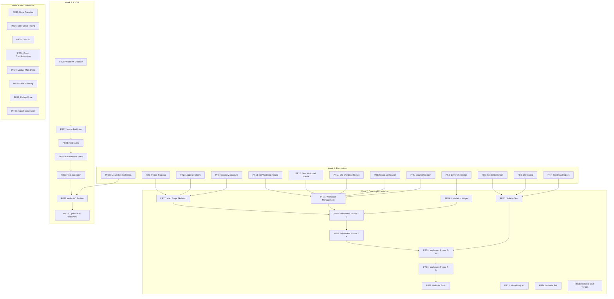

# Upgrade Testing Implementation Plan

## Overview

This document provides a complete, self-contained implementation plan for adding upgrade testing to the Scality CSI Driver.
The goal is to ensure backward compatibility when upgrading from v1.2.0 (systemd mounter) to v2.x (with Pod Mounter support).

## Context

### Current State

- **v1.2.0**: Uses systemd mounter, requires privileged containers
- **v2.0.0** (planned): Adds Pod Mounter support for SELinux compatibility
- **Challenge**: Ensure existing mounts continue working after upgrade

### Requirements

- Zero downtime during upgrade
- Existing systemd mounts must continue working
- Test credential refresh (2+ hour test duration)
- Support mixed mode operation (systemd + Pod Mounter)
- Run on every PR affecting mount code

## Implementation Timeline

**Total Duration**: 4 weeks
**Total PRs**: 40
**Average PR Size**: 40 lines
**Average Review Time**: 5-7 minutes

## PR Dependency Graph



## Parallelization Opportunities

### Can be done in parallel

- **Week 1**: PRs 1-13 can all be done simultaneously by different developers
- **Week 2**: PRs 22-25 (Makefile) can be parallel to PRs 14-21 (Core)
- **Week 3**: PRs 33-37 (Docs) can be parallel to PRs 26-32 (CI/CD)
- **Any time**: Documentation PRs can be done independently

### Must be sequential

- PRs 17-21 must be done in order (build up main script)
- PRs 26-31 must be done in order (build up workflow)

## Detailed PR Implementations

### PR 1: Create upgrade test directory structure

**Size: 20 lines** | **Review: 5 min** | **Can parallelize: Yes**

```bash
# Create directory structure
mkdir -p tests/e2e/upgrade/{lib,fixtures,scenarios}

# tests/e2e/upgrade/README.md
cat > tests/e2e/upgrade/README.md << 'EOF'
# Upgrade Testing

This directory contains upgrade compatibility tests for the Scality CSI Driver.

## Structure
- `lib/` - Helper functions and utilities
- `fixtures/` - Kubernetes YAML fixtures for test workloads
- `scenarios/` - Different upgrade test scenarios
- `run-upgrade-test.sh` - Main test runner

## Usage
See docs/development/upgrade-testing.md for details.
EOF

# Create .gitkeep files
touch tests/e2e/upgrade/{lib,fixtures,scenarios}/.gitkeep
```

### PR 2: Add basic logging helpers

**Size: 40 lines** | **Review: 5 min** | **Can parallelize: Yes**

```bash
# tests/e2e/upgrade/lib/logging.sh
cat > tests/e2e/upgrade/lib/logging.sh << 'EOF'
#!/bin/bash

# Color codes for output
RED='\033[0;31m'
GREEN='\033[0;32m'
YELLOW='\033[1;33m'
NC='\033[0m' # No Color

log_phase() {
    echo ""
    echo "========================================"
    echo "PHASE: $1"
    echo "========================================"
}

log_info() {
    echo -e "[INFO] $1"
}

log_error() {
    echo -e "${RED}[ERROR] $1${NC}" >&2
}

log_success() {
    echo -e "${GREEN}[SUCCESS] $1${NC}"
}

log_warning() {
    echo -e "${YELLOW}[WARNING] $1${NC}"
}

log_title() {
    echo ""
    echo "########################################"
    echo "# $1"
    echo "########################################"
    echo ""
}
EOF
chmod +x tests/e2e/upgrade/lib/logging.sh
```

### PR 3: Add phase tracking helpers

**Size: 35 lines** | **Review: 5 min** | **Can parallelize: Yes**

```bash
# tests/e2e/upgrade/lib/phase-tracker.sh
cat > tests/e2e/upgrade/lib/phase-tracker.sh << 'EOF'
#!/bin/bash

# Track test phases for reporting
PHASE_RESULTS=()

record_phase() {
    local phase=$1
    local status=$2
    local timestamp=$(date '+%Y-%m-%d %H:%M:%S')

    PHASE_RESULTS+=("${timestamp}|${phase}|${status}")

    if [[ "$status" == "FAILED" ]]; then
        log_error "Phase failed: ${phase}"
        print_test_summary
        exit 1
    fi
    log_success "Phase completed: ${phase}"
}

print_test_summary() {
    echo ""
    echo "================================"
    echo "Upgrade Test Summary"
    echo "================================"
    echo "Timestamp|Phase|Status"
    echo "---------|-----|------"
    for result in "${PHASE_RESULTS[@]}"; do
        echo "$result"
    done
    echo "================================"
}
EOF
chmod +x tests/e2e/upgrade/lib/phase-tracker.sh
```

### PR 4: Add driver verification helper

**Size: 30 lines** | **Review: 5 min** | **Can parallelize: Yes**

```bash
# tests/e2e/upgrade/lib/verify-driver.sh
cat > tests/e2e/upgrade/lib/verify-driver.sh << 'EOF'
#!/bin/bash

verify_driver_ready() {
    local namespace=$1
    local timeout=${2:-300}

    log_info "Verifying CSI driver is ready in namespace: ${namespace}"

    # Check DaemonSet is ready
    if ! kubectl rollout status daemonset/s3-csi-node -n "${namespace}" --timeout="${timeout}s"; then
        log_error "CSI node DaemonSet not ready"
        return 1
    fi

    # Check if controller is deployed and ready
    if kubectl get deployment/s3-csi-controller -n "${namespace}" 2>/dev/null; then
        if ! kubectl rollout status deployment/s3-csi-controller -n "${namespace}" --timeout="${timeout}s"; then
            log_error "CSI controller Deployment not ready"
            return 1
        fi
    fi

    # Verify CSI driver is registered
    if ! kubectl get csidrivers s3.csi.scality.com; then
        log_error "CSI driver not registered"
        return 1
    fi

    log_success "CSI driver is ready"
}
EOF
chmod +x tests/e2e/upgrade/lib/verify-driver.sh
```

### PR 5: Add mount detection helper

**Size: 45 lines** | **Review: 5 min** | **Can parallelize: Yes**

```bash
# tests/e2e/upgrade/lib/detect-mount.sh
cat > tests/e2e/upgrade/lib/detect-mount.sh << 'EOF'
#!/bin/bash

detect_mount_strategy() {
    local pod=$1
    local namespace=${2:-default}

    # Get the node where pod is running
    local node=$(kubectl get pod -n "${namespace}" "${pod}" -o jsonpath='{.spec.nodeName}' 2>/dev/null)

    if [[ -z "$node" ]]; then
        echo "unknown"
        return 1
    fi

    # Check for systemd mount by looking at mount points on the node
    # We use kubectl debug to check the node
    local mount_info=$(kubectl debug node/"${node}" -it --image=busybox -- \
        sh -c "mount | grep mount-s3" 2>/dev/null || true)

    if [[ -n "$mount_info" ]]; then
        echo "systemd"
        return 0
    fi

    # Check for Pod Mounter by looking for mountpoint pods
    local pod_uid=$(kubectl get pod -n "${namespace}" "${pod}" -o jsonpath='{.metadata.uid}' 2>/dev/null)

    if [[ -n "$pod_uid" ]]; then
        # Check if there's a mountpoint pod for this workload
        local mp_pods=$(kubectl get pods -n mount-s3 \
            -l "s3.csi.scality.com/pod-uid=${pod_uid}" \
            -o name 2>/dev/null | grep "mp-" || true)

        if [[ -n "$mp_pods" ]]; then
            echo "podmounter"
            return 0
        fi
    fi

    # Check if mount-s3 namespace exists (indicates Pod Mounter capability)
    if kubectl get namespace mount-s3 2>/dev/null; then
        echo "podmounter-capable"
        return 0
    fi

    echo "unknown"
}
EOF
chmod +x tests/e2e/upgrade/lib/detect-mount.sh
```

### PR 6: Add mount verification helper

**Size: 40 lines** | **Review: 5 min** | **Can parallelize: Yes**

```bash
# tests/e2e/upgrade/lib/verify-mounts.sh
cat > tests/e2e/upgrade/lib/verify-mounts.sh << 'EOF'
#!/bin/bash

verify_mounts_working() {
    local expected_type=$1
    local namespace=${2:-default}

    log_info "Verifying mounts are working (expected: ${expected_type})"

    # Get all test pods
    local pods=$(kubectl get pods -n "${namespace}" -l test=upgrade -o jsonpath='{.items[*].metadata.name}')

    if [[ -z "$pods" ]]; then
        log_error "No test pods found"
        return 1
    fi

    for pod in $pods; do
        log_info "Checking pod: ${pod}"

        # Test basic file operations
        if ! kubectl exec -n "${namespace}" "$pod" -- touch /data/test-file-$(date +%s); then
            log_error "Cannot write to mount in pod ${pod}"
            return 1
        fi

        if ! kubectl exec -n "${namespace}" "$pod" -- ls /data/ > /dev/null 2>&1; then
            log_error "Cannot list mount in pod ${pod}"
            return 1
        fi

        # Verify mount type if specified
        if [[ "$expected_type" != "any" ]]; then
            local actual_type=$(detect_mount_strategy "$pod" "$namespace")
            if [[ "$actual_type" != "$expected_type" ]]; then
                log_warning "Pod $pod has mount type: $actual_type (expected: $expected_type)"
            fi
        fi
    done

    log_success "All mounts are working"
}
EOF
chmod +x tests/e2e/upgrade/lib/verify-mounts.sh
```

### PR 7: Add test data helpers

**Size: 50 lines** | **Review: 5 min** | **Can parallelize: Yes**

```bash
# tests/e2e/upgrade/lib/test-data.sh
cat > tests/e2e/upgrade/lib/test-data.sh << 'EOF'
#!/bin/bash

TEST_FILES_LIST="/tmp/upgrade-test-files.txt"
TEST_CHECKSUMS="/tmp/upgrade-test-checksums.txt"

write_test_data() {
    local namespace=${1:-default}
    local pod=${2:-test-pod-1}

    log_info "Writing test data"

    > "${TEST_FILES_LIST}"

    # Write test files with timestamps
    for i in {1..10}; do
        local filename="test-data-${i}-$(date +%s).txt"
        local content="Test data ${i} written at $(date)"

        kubectl exec -n "${namespace}" "${pod}" -- \
            sh -c "echo '${content}' > /data/${filename}"

        echo "${filename}" >> "${TEST_FILES_LIST}"
    done

    log_success "Test data written"
}

calculate_checksums() {
    local namespace=${1:-default}
    local pod=${2:-test-pod-1}

    log_info "Calculating checksums"

    > "${TEST_CHECKSUMS}"

    while read filename; do
        local checksum=$(kubectl exec -n "${namespace}" "${pod}" -- \
            sh -c "md5sum /data/${filename}" | awk '{print $1}')
        echo "${filename}:${checksum}" >> "${TEST_CHECKSUMS}"
    done < "${TEST_FILES_LIST}"

    log_success "Checksums calculated"
}

verify_data_integrity() {
    local namespace=${1:-default}
    local pod=${2:-test-pod-1}

    log_info "Verifying data integrity"

    while IFS=: read filename checksum; do
        local actual=$(kubectl exec -n "${namespace}" "${pod}" -- \
            sh -c "md5sum /data/${filename}" 2>/dev/null | awk '{print $1}')

        if [[ "$checksum" != "$actual" ]]; then
            log_error "Checksum mismatch for ${filename}"
            return 1
        fi
    done < "${TEST_CHECKSUMS}"

    log_success "Data integrity verified"
}
EOF
chmod +x tests/e2e/upgrade/lib/test-data.sh
```

### PR 8: Add I/O testing helpers

**Size: 45 lines** | **Review: 5 min** | **Can parallelize: Yes**

```bash
# tests/e2e/upgrade/lib/io-testing.sh
cat > tests/e2e/upgrade/lib/io-testing.sh << 'EOF'
#!/bin/bash

IO_LOG_FILE="/data/continuous-io.log"

start_continuous_io() {
    local namespace=${1:-default}
    local pod=${2:-test-pod-1}

    log_info "Starting continuous I/O workload"

    # Run continuous I/O in background
    (
        while true; do
            kubectl exec -n "${namespace}" "${pod}" -- \
                sh -c "echo 'IO at $(date)' >> ${IO_LOG_FILE}" 2>/dev/null
            kubectl exec -n "${namespace}" "${pod}" -- \
                sh -c "tail -n 100 ${IO_LOG_FILE} > /dev/null" 2>/dev/null
            sleep 1
        done
    ) &

    local io_pid=$!
    echo $io_pid

    sleep 2
    log_success "Continuous I/O started (PID: ${io_pid})"
}

verify_io_active() {
    local pid=$1

    if ! kill -0 $pid 2>/dev/null; then
        log_error "I/O process not running (PID: ${pid})"
        return 1
    fi
    log_info "I/O process is active"
}

verify_io_continuity() {
    local pid=$1
    local namespace=${2:-default}
    local pod=${3:-test-pod-1}

    verify_io_active $pid

    # Check for recent writes (within last 10 seconds)
    local last_line=$(kubectl exec -n "${namespace}" "${pod}" -- \
        tail -n 1 ${IO_LOG_FILE} 2>/dev/null)

    if [[ -z "$last_line" ]]; then
        log_error "No I/O log found"
        return 1
    fi

    log_info "I/O continuity verified: ${last_line}"
}
EOF
chmod +x tests/e2e/upgrade/lib/io-testing.sh
```

### PR 9: Add credential refresh check

**Size: 25 lines** | **Review: 5 min** | **Can parallelize: Yes**

```bash
# tests/e2e/upgrade/lib/credential-check.sh
cat > tests/e2e/upgrade/lib/credential-check.sh << 'EOF'
#!/bin/bash

verify_credential_refresh() {
    local namespace=${1:-default}
    local pod=${2:-test-pod-1}

    log_info "Verifying credential refresh"

    # Test that pods can still access S3 after credential refresh period
    local test_file="cred-refresh-test-$(date +%s).txt"

    if ! kubectl exec -n "${namespace}" "${pod}" -- \
        touch "/data/${test_file}" 2>/dev/null; then
        log_error "Cannot write after credential refresh period"
        return 1
    fi

    if ! kubectl exec -n "${namespace}" "${pod}" -- \
        ls "/data/${test_file}" 2>/dev/null; then
        log_error "Cannot read after credential refresh period"
        return 1
    fi

    log_success "Credential refresh verified"
}
EOF
chmod +x tests/e2e/upgrade/lib/credential-check.sh
```

### PR 10: Add mount info collection script

**Size: 50 lines** | **Review: 5 min** | **Can parallelize: Yes**

```bash
# tests/e2e/upgrade/lib/collect-mount-info.sh
cat > tests/e2e/upgrade/lib/collect-mount-info.sh << 'EOF'
#!/bin/bash

collect_mount_info() {
    echo "=== Mount Information Collection ==="
    echo "Time: $(date)"
    echo ""

    echo "=== CSI Driver Pods ==="
    kubectl get pods -n scality-s3-csi -o wide 2>/dev/null || \
        kubectl get pods -n kube-system -l app.kubernetes.io/name=scality-mountpoint-s3-csi-driver -o wide

    echo ""
    echo "=== Systemd Mounts on Nodes ==="
    for node in $(kubectl get nodes -o jsonpath='{.items[*].metadata.name}'); do
        echo "Node: $node"
        kubectl debug node/$node -it --image=busybox -- \
            sh -c "mount | grep mount-s3" 2>/dev/null || echo "  No systemd mounts"
    done

    echo ""
    echo "=== Pod Mounter Namespace ==="
    if kubectl get namespace mount-s3 2>/dev/null; then
        echo "Pod Mounter namespace exists"
        kubectl get pods -n mount-s3 -o wide 2>/dev/null || echo "  No mountpoint pods"
    else
        echo "Pod Mounter namespace not found"
    fi

    echo ""
    echo "=== Test Workloads ==="
    kubectl get pods -l test=upgrade -o wide

    echo ""
    echo "=== Mount Points in Test Pods ==="
    for pod in $(kubectl get pods -l test=upgrade -o jsonpath='{.items[*].metadata.name}'); do
        echo "Pod: $pod"
        kubectl exec $pod -- mount | grep "/data" 2>/dev/null || echo "  Mount point not found"
        kubectl exec $pod -- ls -la /data 2>/dev/null | head -5 || echo "  Cannot list /data"
    done

    echo ""
    echo "=== CSI Driver Version ==="
    kubectl get pods -n scality-s3-csi -l app=s3-csi-node -o jsonpath='{.items[0].spec.containers[0].image}' 2>/dev/null || \
        kubectl get pods -n kube-system -l app.kubernetes.io/name=scality-mountpoint-s3-csi-driver -o jsonpath='{.items[0].spec.containers[0].image}'
}

# If script is run directly
if [[ "${BASH_SOURCE[0]}" == "${0}" ]]; then
    collect_mount_info
fi
EOF
chmod +x tests/e2e/upgrade/lib/collect-mount-info.sh
```

### PR 11: Add old workload fixture

**Size: 40 lines** | **Review: 5 min** | **Can parallelize: Yes**

```yaml
# tests/e2e/upgrade/fixtures/old-workload.yaml
apiVersion: v1
kind: PersistentVolume
metadata:
  name: upgrade-test-pv-1
spec:
  capacity:
    storage: 5Gi
  accessModes:
    - ReadWriteMany
  persistentVolumeClaimPolicy: Retain
  csi:
    driver: s3.csi.scality.com
    volumeHandle: upgrade-test-bucket-1
    volumeAttributes:
      bucketName: upgrade-test-bucket-1
---
apiVersion: v1
kind: PersistentVolumeClaim
metadata:
  name: upgrade-test-pvc-1
spec:
  accessModes:
    - ReadWriteMany
  resources:
    requests:
      storage: 5Gi
  volumeName: upgrade-test-pv-1
---
apiVersion: v1
kind: Pod
metadata:
  name: test-pod-1
  labels:
    test: upgrade
    phase: pre-upgrade
spec:
  containers:
  - name: test
    image: busybox:1.36
    command: ["/bin/sh", "-c", "sleep infinity"]
    volumeMounts:
    - name: s3-volume
      mountPath: /data
  volumes:
  - name: s3-volume
    persistentVolumeClaim:
      claimName: upgrade-test-pvc-1
```

### PR 12: Add new workload fixture

**Size: 40 lines** | **Review: 5 min** | **Can parallelize: Yes**

```yaml
# tests/e2e/upgrade/fixtures/new-workload.yaml
apiVersion: v1
kind: PersistentVolume
metadata:
  name: upgrade-test-pv-2
spec:
  capacity:
    storage: 5Gi
  accessModes:
    - ReadWriteMany
  persistentVolumeClaimPolicy: Retain
  csi:
    driver: s3.csi.scality.com
    volumeHandle: upgrade-test-bucket-2
    volumeAttributes:
      bucketName: upgrade-test-bucket-2
---
apiVersion: v1
kind: PersistentVolumeClaim
metadata:
  name: upgrade-test-pvc-2
spec:
  accessModes:
    - ReadWriteMany
  resources:
    requests:
      storage: 5Gi
  volumeName: upgrade-test-pv-2
---
apiVersion: v1
kind: Pod
metadata:
  name: test-pod-2
  labels:
    test: upgrade
    phase: post-upgrade
spec:
  containers:
  - name: test
    image: busybox:1.36
    command: ["/bin/sh", "-c", "sleep infinity"]
    volumeMounts:
    - name: s3-volume
      mountPath: /data
  volumes:
  - name: s3-volume
    persistentVolumeClaim:
      claimName: upgrade-test-pvc-2
```

### PR 13: Add I/O workload fixture

**Size: 30 lines** | **Review: 5 min** | **Can parallelize: Yes**

```yaml
# tests/e2e/upgrade/fixtures/io-workload.yaml
apiVersion: v1
kind: Pod
metadata:
  name: io-generator
  labels:
    test: upgrade
    purpose: continuous-io
spec:
  containers:
  - name: io
    image: busybox:1.36
    command:
    - /bin/sh
    - -c
    - |
      while true; do
        echo "$(date): Writing test data" >> /data/io-test.log
        head -c 1024 /dev/urandom | base64 > /data/random-$(date +%s).txt
        ls -la /data/ > /dev/null
        sleep 1
      done
    volumeMounts:
    - name: s3-volume
      mountPath: /data
  volumes:
  - name: s3-volume
    persistentVolumeClaim:
      claimName: upgrade-test-pvc-1
```

### PR 14: Add installation helper

**Size: 50 lines** | **Review: 7 min** | **Dependencies: PR4**

```bash
# tests/e2e/upgrade/lib/install-driver.sh
cat > tests/e2e/upgrade/lib/install-driver.sh << 'EOF'
#!/bin/bash

install_old_version() {
    local version=$1
    local namespace=$2
    local s3_endpoint=${3:-http://s3.scality.com:8000}

    log_info "Installing CSI Driver version ${version}"

    # Add Helm repo if not exists
    helm repo add scality https://scality.github.io/mountpoint-s3-csi-driver 2>/dev/null || true
    helm repo update

    # Install specific version
    helm install scality-mountpoint-s3-csi-driver \
        scality/scality-mountpoint-s3-csi-driver \
        --version "${version}" \
        --namespace "${namespace}" \
        --create-namespace \
        --set s3.endpointUrl="${s3_endpoint}" \
        --set s3CredentialSecret.accessKeyId="${ACCOUNT1_ACCESS_KEY}" \
        --set s3CredentialSecret.secretAccessKey="${ACCOUNT1_SECRET_KEY}" \
        --wait --timeout 5m

    log_success "CSI Driver ${version} installed"
}

upgrade_driver() {
    local to_version=$1
    local to_image=$2
    local namespace=$3

    log_info "Upgrading CSI Driver to ${to_version}"

    local upgrade_args="--reuse-values"

    if [[ -n "${to_image}" ]]; then
        # Extract repository and tag from image
        local repo=$(echo "${to_image}" | cut -d: -f1)
        local tag=$(echo "${to_image}" | cut -d: -f2)
        upgrade_args="${upgrade_args} --set image.repository=${repo} --set image.tag=${tag}"
    fi

    if [[ "${to_version}" == "local" ]]; then
        # Upgrade to local chart
        helm upgrade scality-mountpoint-s3-csi-driver \
            ./charts/scality-mountpoint-s3-csi-driver \
            --namespace "${namespace}" \
            ${upgrade_args} \
            --wait --timeout 10m
    else
        # Upgrade to specific version
        helm upgrade scality-mountpoint-s3-csi-driver \
            scality/scality-mountpoint-s3-csi-driver \
            --version "${to_version}" \
            --namespace "${namespace}" \
            ${upgrade_args} \
            --wait --timeout 10m
    fi

    log_success "CSI Driver upgraded to ${to_version}"
}
EOF
chmod +x tests/e2e/upgrade/lib/install-driver.sh
```

### PR 15: Add workload management

**Size: 40 lines** | **Review: 5 min** | **Dependencies: PR5, PR6**

```bash
# tests/e2e/upgrade/lib/workload-management.sh
cat > tests/e2e/upgrade/lib/workload-management.sh << 'EOF'
#!/bin/bash

create_test_workloads() {
    local namespace=${1:-default}

    log_info "Creating test workloads"

    # Apply old workload fixture
    kubectl apply -f tests/e2e/upgrade/fixtures/old-workload.yaml

    # Wait for pod to be ready
    if ! kubectl wait --for=condition=Ready pod/test-pod-1 \
        --namespace "${namespace}" --timeout=300s; then
        log_error "Test pod 1 not ready"
        return 1
    fi

    log_success "Test workloads created"
}

create_new_workload() {
    local namespace=${1:-default}

    log_info "Creating new workload (post-upgrade)"

    # Apply new workload fixture
    kubectl apply -f tests/e2e/upgrade/fixtures/new-workload.yaml

    # Wait for pod to be ready
    if ! kubectl wait --for=condition=Ready pod/test-pod-2 \
        --namespace "${namespace}" --timeout=300s; then
        log_error "Test pod 2 not ready"
        return 1
    fi

    log_success "New workload created"
}

cleanup_workloads() {
    log_info "Cleaning up test workloads"

    kubectl delete -f tests/e2e/upgrade/fixtures/ --ignore-not-found=true

    log_success "Workloads cleaned up"
}
EOF
chmod +x tests/e2e/upgrade/lib/workload-management.sh
```

### PR 16: Add stability test function

**Size: 60 lines** | **Review: 7 min** | **Dependencies: PR7, PR8, PR9**

```bash
# tests/e2e/upgrade/lib/stability-test.sh
cat > tests/e2e/upgrade/lib/stability-test.sh << 'EOF'
#!/bin/bash

run_stability_test() {
    local duration_minutes=$1
    local io_pid=$2
    local namespace=${3:-default}

    log_info "Running stability test for ${duration_minutes} minutes"

    local end_time=$(($(date +%s) + duration_minutes * 60))
    local check_interval=60  # Check every minute
    local checks_performed=0

    while [[ $(date +%s) -lt $end_time ]]; do
        checks_performed=$((checks_performed + 1))

        log_info "Health check ${checks_performed} at $(date)"

        # Perform periodic health checks
        periodic_health_check "${namespace}" "${io_pid}"

        # Check for credential refresh at specific intervals
        # After 70 minutes and 130 minutes (credential refresh happens every hour)
        if [[ $checks_performed -eq 70 ]] || [[ $checks_performed -eq 130 ]]; then
            log_info "Checking credential refresh..."
            verify_credential_refresh "${namespace}"
        fi

        sleep $check_interval
    done

    log_success "Stability test completed"
}

periodic_health_check() {
    local namespace=$1
    local io_pid=$2

    # Check mounts are still working
    if ! verify_mounts_working "any" "${namespace}"; then
        log_error "Mount verification failed during stability test"
        return 1
    fi

    # Check data integrity
    if ! verify_data_integrity "${namespace}"; then
        log_error "Data integrity check failed during stability test"
        return 1
    fi

    # Check I/O continuity if provided
    if [[ -n "${io_pid}" ]]; then
        if ! verify_io_continuity "${io_pid}" "${namespace}"; then
            log_error "I/O continuity check failed during stability test"
            return 1
        fi
    fi

    log_info "Health check passed"
}
EOF
chmod +x tests/e2e/upgrade/lib/stability-test.sh
```

### PR 17: Create main test script (skeleton)

**Size: 80 lines** | **Review: 7 min** | **Dependencies: PR1-3**

```bash
# tests/e2e/upgrade/run-upgrade-test.sh
cat > tests/e2e/upgrade/run-upgrade-test.sh << 'EOF'
#!/bin/bash
set -euo pipefail

SCRIPT_DIR="$(cd "$(dirname "${BASH_SOURCE[0]}")" && pwd)"

# Source all helper libraries
source "${SCRIPT_DIR}/lib/logging.sh"
source "${SCRIPT_DIR}/lib/phase-tracker.sh"
source "${SCRIPT_DIR}/lib/verify-driver.sh"
source "${SCRIPT_DIR}/lib/detect-mount.sh"
source "${SCRIPT_DIR}/lib/verify-mounts.sh"
source "${SCRIPT_DIR}/lib/test-data.sh"
source "${SCRIPT_DIR}/lib/io-testing.sh"
source "${SCRIPT_DIR}/lib/credential-check.sh"
source "${SCRIPT_DIR}/lib/install-driver.sh"
source "${SCRIPT_DIR}/lib/workload-management.sh"
source "${SCRIPT_DIR}/lib/stability-test.sh"

# Default values
FROM_VERSION="${FROM_VERSION:-v1.2.0}"
TO_VERSION="${TO_VERSION:-local}"
TO_IMAGE=""
TEST_DURATION_MINUTES="${TEST_DURATION_MINUTES:-30}"
NAMESPACE="scality-s3-csi"
S3_ENDPOINT_URL="${S3_ENDPOINT_URL:-http://s3.scality.com:8000}"

# Parse command line arguments
while [[ $# -gt 0 ]]; do
    case $1 in
        --from-version)
            FROM_VERSION="$2"
            shift 2
            ;;
        --to-version)
            TO_VERSION="$2"
            shift 2
            ;;
        --to-image)
            TO_IMAGE="$2"
            shift 2
            ;;
        --test-duration)
            TEST_DURATION_MINUTES="$2"
            shift 2
            ;;
        --namespace)
            NAMESPACE="$2"
            shift 2
            ;;
        --s3-endpoint)
            S3_ENDPOINT_URL="$2"
            shift 2
            ;;
        --help)
            echo "Usage: $0 [OPTIONS]"
            echo "Options:"
            echo "  --from-version VERSION    Version to upgrade from (default: v1.2.0)"
            echo "  --to-version VERSION      Version to upgrade to (default: local)"
            echo "  --to-image IMAGE          Docker image for upgrade"
            echo "  --test-duration MINUTES   Test duration in minutes (default: 30)"
            echo "  --namespace NAMESPACE     Kubernetes namespace (default: scality-s3-csi)"
            echo "  --s3-endpoint URL         S3 endpoint URL"
            exit 0
            ;;
        *)
            echo "Unknown option: $1"
            exit 1
            ;;
    esac
done

# Main test execution
main() {
    log_title "Upgrade Test: ${FROM_VERSION} → ${TO_VERSION}"
    log_info "Test duration: ${TEST_DURATION_MINUTES} minutes"
    log_info "S3 endpoint: ${S3_ENDPOINT_URL}"
    log_info "Namespace: ${NAMESPACE}"

    # Test implementation will be added in subsequent PRs
    log_warning "Test skeleton - implementation coming in next PRs"
}

# Run main function
main "$@"
EOF
chmod +x tests/e2e/upgrade/run-upgrade-test.sh
```

### PR 18: Implement Phase 1-2 (install & workload)

**Size: 40 lines** | **Review: 5 min** | **Dependencies: PR14, PR15, PR17**

```bash
# Add to tests/e2e/upgrade/run-upgrade-test.sh after the main() function declaration
# Replace the log_warning line with actual implementation

    # Phase 1: Install old version
    log_phase "1. Installing CSI Driver ${FROM_VERSION}"
    install_old_version "${FROM_VERSION}" "${NAMESPACE}" "${S3_ENDPOINT_URL}"
    verify_driver_ready "${NAMESPACE}"
    record_phase "install_old_version" "SUCCESS"

    # Phase 2: Create test workloads
    log_phase "2. Creating test workloads"
    create_test_workloads
    verify_mounts_working "systemd"
    record_phase "create_workloads" "SUCCESS"
```

### PR 19: Implement Phase 3-4 (data & I/O)

**Size: 35 lines** | **Review: 5 min** | **Dependencies: PR18**

```bash
# Add to tests/e2e/upgrade/run-upgrade-test.sh after Phase 2

    # Phase 3: Write test data
    log_phase "3. Writing test data"
    write_test_data
    calculate_checksums
    record_phase "write_test_data" "SUCCESS"

    # Phase 4: Start continuous I/O
    log_phase "4. Starting continuous I/O"
    IO_PID=$(start_continuous_io)
    sleep 5  # Let I/O start
    verify_io_active $IO_PID
    record_phase "start_io" "SUCCESS"
```

### PR 20: Implement Phase 5-6 (upgrade & verify)

**Size: 40 lines** | **Review: 5 min** | **Dependencies: PR16, PR19**

```bash
# Add to tests/e2e/upgrade/run-upgrade-test.sh after Phase 4

    # Phase 5: Perform upgrade
    log_phase "5. Upgrading to ${TO_VERSION}"
    upgrade_driver "${TO_VERSION}" "${TO_IMAGE}" "${NAMESPACE}"
    verify_driver_ready "${NAMESPACE}"
    record_phase "upgrade_driver" "SUCCESS"

    # Phase 6: Verify existing mounts
    log_phase "6. Verifying existing mounts post-upgrade"
    verify_mounts_working "systemd"  # Old mounts should still use systemd
    verify_data_integrity
    verify_io_continuity $IO_PID
    record_phase "verify_existing_mounts" "SUCCESS"
```

### PR 21: Implement Phase 7-9 (new workload & cleanup)

**Size: 35 lines** | **Review: 5 min** | **Dependencies: PR20**

```bash
# Add to tests/e2e/upgrade/run-upgrade-test.sh after Phase 6

    # Phase 7: Create new workload
    log_phase "7. Creating new workload"
    create_new_workload
    NEW_MOUNT_STRATEGY=$(detect_mount_strategy "test-pod-2")
    log_info "New workload using: ${NEW_MOUNT_STRATEGY}"
    record_phase "create_new_workload" "SUCCESS"

    # Phase 8: Run stability test
    log_phase "8. Running stability test (${TEST_DURATION_MINUTES} minutes)"
    run_stability_test "${TEST_DURATION_MINUTES}" "${IO_PID}"
    record_phase "stability_test" "SUCCESS"

    # Phase 9: Cleanup
    log_phase "9. Cleanup"
    kill $IO_PID 2>/dev/null || true
    cleanup_workloads
    record_phase "cleanup" "SUCCESS"

    # Print summary
    print_test_summary
    log_success "Upgrade test completed successfully!"
```

### PR 22: Add basic upgrade test target to Makefile

**Size: 20 lines** | **Review: 5 min** | **Dependencies: PR21**

```makefile
# Add to Makefile

# Upgrade test configuration
UPGRADE_FROM_VERSION ?= v1.2.0
UPGRADE_TO_VERSION ?= local
UPGRADE_TEST_DURATION ?= 30

.PHONY: upgrade-test
upgrade-test: ## Run upgrade compatibility test
    @echo "Testing upgrade: $(UPGRADE_FROM_VERSION) → $(UPGRADE_TO_VERSION)"
    @echo "Duration: $(UPGRADE_TEST_DURATION) minutes"
    @source tests/e2e/scripts/load-credentials.sh && \
    ./tests/e2e/upgrade/run-upgrade-test.sh \
        --from-version $(UPGRADE_FROM_VERSION) \
        --to-version $(UPGRADE_TO_VERSION) \
        --test-duration $(UPGRADE_TEST_DURATION) \
        --s3-endpoint $(S3_ENDPOINT_URL)
```

### PR 23: Add quick test target

**Size: 10 lines** | **Review: 5 min** | **Can parallelize: Yes with PR22**

```makefile
# Add to Makefile

.PHONY: upgrade-test-quick
upgrade-test-quick: ## Quick upgrade test (15 minutes)
    @echo "Running quick upgrade test (15 minutes)"
    @$(MAKE) upgrade-test UPGRADE_TEST_DURATION=15
```

### PR 24: Add full test target

**Size: 10 lines** | **Review: 5 min** | **Can parallelize: Yes with PR22**

```makefile
# Add to Makefile

.PHONY: upgrade-test-full
upgrade-test-full: ## Full upgrade test (150 minutes with credential refresh)
    @echo "Running full upgrade test (150 minutes)"
    @$(MAKE) upgrade-test UPGRADE_TEST_DURATION=150
```

### PR 25: Add multi-version test target

**Size: 15 lines** | **Review: 5 min** | **Can parallelize: Yes with PR22**

```makefile
# Add to Makefile

.PHONY: upgrade-test-all-versions
upgrade-test-all-versions: ## Test upgrades from multiple versions
    @echo "Testing upgrades from all supported versions"
    @for version in v1.2.0 v1.1.0; do \
        echo "Testing upgrade from $$version"; \
        $(MAKE) upgrade-test UPGRADE_FROM_VERSION=$$version || exit 1; \
    done
```

### PR 26: Create upgrade test workflow (skeleton)

**Size: 60 lines** | **Review: 7 min** | **Can parallelize: No**

```yaml
# .github/workflows/upgrade-tests.yaml
name: Upgrade Tests

on:
  push:
    branches:
      - main
  pull_request:
    branches:
      - '**'
    paths:
      - 'pkg/driver/node/mounter/**'
      - 'pkg/podmounter/**'
      - 'charts/**'
      - '.github/workflows/upgrade-tests.yaml'
      - 'tests/e2e/upgrade/**'

env:
  KUBECONFIG: "/home/runner/.kube/config"

jobs:
  # Jobs will be added in subsequent PRs
  placeholder:
    name: Placeholder
    runs-on: ubuntu-latest
    steps:
      - name: Placeholder
        run: echo "Jobs will be added in next PRs"
```

### PR 27: Add image build job

**Size: 30 lines** | **Review: 5 min** | **Dependencies: PR26**

```yaml
# Add to .github/workflows/upgrade-tests.yaml jobs section

  dev-image:
    name: Build Test Image
    permissions:
      contents: read
      packages: write
    uses: scality/workflows/.github/workflows/docker-build.yaml@v2
    with:
      context: .
      name: mountpoint-s3-csi-driver
      namespace: ${{ github.repository_owner }}
      tag: upgrade-test-${{ github.sha }}
```

### PR 28: Add test matrix

**Size: 40 lines** | **Review: 5 min** | **Dependencies: PR27**

```yaml
# Replace placeholder job in .github/workflows/upgrade-tests.yaml

  upgrade-tests:
    name: Upgrade v${{ matrix.from_version }} → PR
    runs-on: ubuntu-22.04-8core
    needs: dev-image
    strategy:
      fail-fast: false
      matrix:
        include:
          - from_version: "1.2.0"
            ring_version: "9.4"
            k8s_version: "1.30"
          - from_version: "1.2.0"
            ring_version: "9.5"
            k8s_version: "1.29"
          - from_version: "1.1.0"
            ring_version: "9.4"
            k8s_version: "1.28"
    env:
      FROM_VERSION: v${{ matrix.from_version }}
      TO_VERSION: upgrade-test-${{ github.sha }}
      TEST_DURATION_MINUTES: 150
```

### PR 29: Add environment setup steps

**Size: 50 lines** | **Review: 7 min** | **Dependencies: PR28**

```yaml
# Add to upgrade-tests job in .github/workflows/upgrade-tests.yaml

    steps:
      - name: Check out repository
        uses: actions/checkout@v4
        with:
          fetch-depth: 0

      - name: Run Common Setup
        uses: ./.github/actions/e2e-setup-common
        with:
          ref: ${{ github.sha }}

      - name: Configure S3 Backend
        run: |
          HOST_IP=$(hostname -I | awk '{print $1}')
          echo "${HOST_IP} s3.scality.com" | sudo tee -a /etc/hosts

          kubectl get configmap coredns -n kube-system -o json | \
          jq --arg ip "${HOST_IP}" \
          '.data.Corefile |= sub("ready"; "ready\n        hosts {\n            " + $ip + " s3.scality.com\n            fallthrough\n        }")' | \
          kubectl apply -f -

          kubectl rollout restart deployment coredns -n kube-system
          kubectl rollout status deployment coredns -n kube-system --timeout=60s
```

### PR 30: Add test execution step

**Size: 30 lines** | **Review: 5 min** | **Dependencies: PR29**

```yaml
# Add to upgrade-tests job steps in .github/workflows/upgrade-tests.yaml

      - name: Run Upgrade Test
        run: |
          source tests/e2e/scripts/load-credentials.sh
          export S3_ENDPOINT_URL=http://s3.scality.com:8000

          ./tests/e2e/upgrade/run-upgrade-test.sh \
            --from-version ${FROM_VERSION} \
            --to-version ${TO_VERSION} \
            --to-image ghcr.io/${{ github.repository }}/mountpoint-s3-csi-driver:${TO_VERSION} \
            --test-duration ${TEST_DURATION_MINUTES}
```

### PR 31: Add artifact collection

**Size: 40 lines** | **Review: 5 min** | **Dependencies: PR10, PR30**

```yaml
# Add to upgrade-tests job steps in .github/workflows/upgrade-tests.yaml

      - name: Collect Logs
        if: always()
        run: |
          mkdir -p artifacts/upgrade-test

          kubectl logs -n scality-s3-csi -l app=s3-csi-node --all-containers > artifacts/upgrade-test/csi-node-logs.txt || true
          kubectl logs -n scality-s3-csi -l app=s3-csi-controller --all-containers > artifacts/upgrade-test/csi-controller-logs.txt || true

          ./tests/e2e/upgrade/lib/collect-mount-info.sh > artifacts/upgrade-test/mount-info.txt || true

          tar -czf artifacts/upgrade-test-${{ matrix.from_version }}-${{ matrix.k8s_version }}.tar.gz -C artifacts upgrade-test/

      - name: Upload Test Artifacts
        if: always()
        uses: actions/upload-artifact@v4
        with:
          name: upgrade-test-${{ matrix.from_version }}-k8s${{ matrix.k8s_version }}
          path: artifacts/*.tar.gz
```

### PR 32: Update e2e-tests.yaml to reference upgrade tests

**Size: 20 lines** | **Review: 5 min** | **Can parallelize: Yes**

```yaml
# Add to .github/workflows/e2e-tests.yaml at the end of jobs section

  # Run upgrade tests for significant changes
  upgrade-tests:
    name: Upgrade Tests
    if: |
      github.event_name == 'pull_request' &&
      (contains(github.event.pull_request.files.*.filename, 'mounter') ||
       contains(github.event.pull_request.files.*.filename, 'charts'))
    uses: ./.github/workflows/upgrade-tests.yaml
```

### PR 33: Create upgrade testing documentation overview

**Size: 50 lines** | **Review: 5 min** | **Can parallelize: Yes**

```markdown
# docs/development/upgrade-testing.md

# Upgrade Testing Guide

## Overview
This guide covers upgrade testing for the Scality CSI Driver, ensuring backward
compatibility when upgrading from v1.2.0 (systemd mounter) to v2.x (Pod Mounter).

## Architecture
- Existing mounts continue using systemd mounter
- New mounts use Pod Mounter (if enabled)
- Zero downtime during upgrade

## Test Scenarios
1. Basic upgrade with existing mounts
2. Long-running (150 min) for credential refresh
3. Mixed mode operation verification
```

### PR 34: Add local testing documentation

**Size: 40 lines** | **Review: 5 min** | **Can parallelize: Yes**

```markdown
# Add to docs/development/upgrade-testing.md

## Local Testing

### Prerequisites
- Kubernetes cluster (kind/minikube)
- S3 endpoint (Minio/LocalStack)
- Built driver images

### Quick Test (15 minutes)
\`\`\`bash
make upgrade-test-quick
\`\`\`

### Full Test (150 minutes)
\`\`\`bash
make upgrade-test-full
\`\`\`
```

### PR 35: Add CI documentation

**Size: 35 lines** | **Review: 5 min** | **Can parallelize: Yes**

```markdown
# Add to docs/development/upgrade-testing.md

## CI Integration

The upgrade tests run automatically on PRs that modify:
- Mounter code
- Helm charts
- Mount-related packages

### Workflow
1. Build test image
2. Run upgrade test matrix
3. Collect artifacts
4. Report results
```

### PR 36: Add troubleshooting guide

**Size: 45 lines** | **Review: 5 min** | **Can parallelize: Yes**

```markdown
# Add to docs/development/upgrade-testing.md

## Troubleshooting

### Common Issues

#### Mounts disappear after upgrade
- Check systemd service status
- Verify mountpoint-s3 binary compatibility
- Review CSI driver logs

#### Credential refresh fails
- Ensure test duration > 120 minutes
- Check IAM role session duration
- Verify credential provider configuration

#### Debug Mode
\`\`\`bash
DEBUG=true make upgrade-test
\`\`\`
```

### PR 37: Update main documentation

**Size: 20 lines** | **Review: 5 min** | **Can parallelize: Yes**

```markdown
# Add to README.md testing section

## Upgrade Testing

Test upgrade compatibility:
\`\`\`bash
# Quick test (15 min)
make upgrade-test-quick

# Full test with credential refresh (150 min)
make upgrade-test-full
\`\`\`

See [docs/development/upgrade-testing.md](docs/development/upgrade-testing.md) for details.
```

### PR 38: Add error handling improvements

**Size: 35 lines** | **Review: 5 min** | **Can parallelize: Yes**

```bash
# Add to tests/e2e/upgrade/lib/error-handler.sh
#!/bin/bash

set_error_trap() {
    trap 'handle_error $? $LINENO' ERR
}

handle_error() {
    local exit_code=$1
    local line_number=$2

    log_error "Error occurred at line ${line_number} with exit code ${exit_code}"

    # Collect debug info
    collect_mount_info
    kubectl get pods -A -o wide > artifacts/pods-on-error.txt
    kubectl describe csidrivers > artifacts/csi-driver-on-error.txt

    # Print phase status
    print_test_summary

    exit ${exit_code}
}
```

### PR 39: Add debug mode support

**Size: 30 lines** | **Review: 5 min** | **Can parallelize: Yes**

```bash
# Add to tests/e2e/upgrade/run-upgrade-test.sh at the top

# Enable debug mode if requested
if [[ "${DEBUG:-false}" == "true" ]]; then
    set -x
    export PS4='+(${BASH_SOURCE}:${LINENO}): ${FUNCNAME[0]:+${FUNCNAME[0]}(): }'
    LOG_LEVEL="debug"
else
    LOG_LEVEL="info"
fi

debug_log() {
    if [[ "${LOG_LEVEL}" == "debug" ]]; then
        echo "[DEBUG] $1" >&2
    fi
}
```

### PR 40: Add test report generation

**Size: 40 lines** | **Review: 5 min** | **Can parallelize: Yes**

```bash
# Add to tests/e2e/upgrade/lib/report-generator.sh
#!/bin/bash

generate_test_report() {
    local output_file="${1:-artifacts/upgrade-test-report.md}"

    cat > "${output_file}" << EOF
# Upgrade Test Report

**Date**: $(date)
**From Version**: ${FROM_VERSION}
**To Version**: ${TO_VERSION}
**Duration**: ${TEST_DURATION_MINUTES} minutes

## Results

$(print_test_summary)

## Mount Strategies
- Pre-upgrade: $(detect_mount_strategy "old-workload")
- Post-upgrade: $(detect_mount_strategy "new-workload")

## Artifacts
- Mount info: artifacts/mount-info-*.txt
- Driver logs: artifacts/csi-driver-logs.tar.gz
EOF

    log_info "Test report generated: ${output_file}"
}
```

## Testing Each PR

Each PR should be tested independently:

1. **Helper function PRs (2-10)**: Test by sourcing and calling functions
2. **Fixture PRs (11-13)**: Test by applying and deleting YAML
3. **Main script PRs (17-21)**: Test incrementally as features are added
4. **Makefile PRs (22-25)**: Test each target independently
5. **Workflow PRs (26-31)**: Test in fork or with act tool
6. **Documentation PRs (33-40)**: Review for accuracy

## Success Metrics

- All existing mounts survive upgrade
- No data loss or corruption
- Continuous I/O uninterrupted
- Credential refresh works (2+ hours)
- Mixed mode operation supported

## Commit Messages

Each PR should have a clear commit message:

```text
feat(upgrade-test): Add [component] for upgrade testing

- What: [Brief description]
- Why: Ensure backward compatibility during v1.2.0 to v2.x upgrades
- Testing: [How it was tested]

Part of upgrade testing implementation
```
