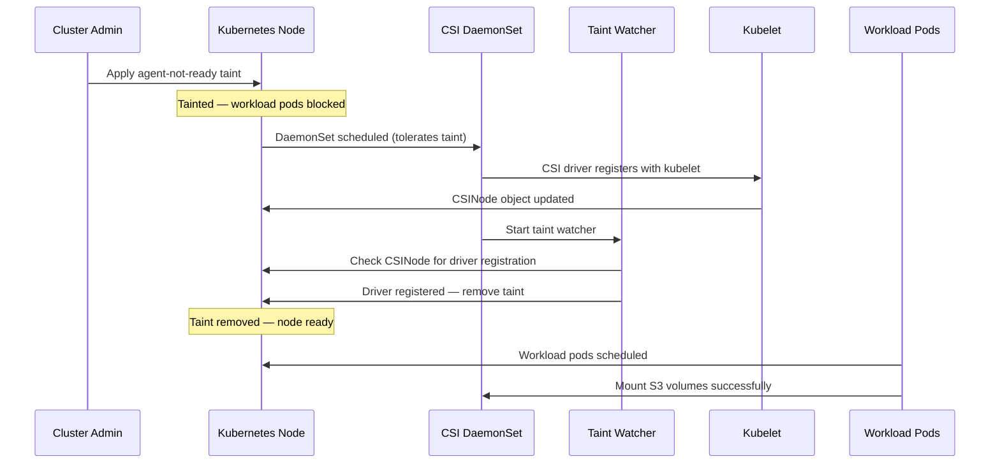

# Node Startup Taint

## Problem

When a Kubernetes node starts or restarts, there is a race condition where workload pods
requiring S3 volumes can be scheduled before the CSI driver registers with kubelet.
This causes pods to fail with the error:

```text
driver name s3.csi.scality.com not found in the list of registered CSI drivers
```

This is common during:

- **Node reboots** (OS updates, kernel patches)
- **Cluster autoscaling** (new nodes joining the cluster)
- **Rolling upgrades** of node pools

## Solution

The CSI driver includes a **taint watcher** that prevents this race condition using
a Kubernetes node taint. The approach works as follows:

1. Cluster admins pre-taint nodes with `s3.csi.scality.com/agent-not-ready:NoExecute`
2. The CSI DaemonSet tolerates this taint and starts normally
3. Once the driver registers with kubelet (verified via the CSINode object),
   the taint watcher automatically removes the taint
4. Workload pods can now be scheduled on the node

### Lifecycle



## Usage

### Taint Nodes

Apply the taint to nodes that should wait for the CSI driver before accepting workloads:

```bash
# Taint a specific node
kubectl taint nodes <node-name> s3.csi.scality.com/agent-not-ready=:NoExecute

# Taint all nodes
kubectl taint nodes --all s3.csi.scality.com/agent-not-ready=:NoExecute
```

For new nodes joining the cluster, configure the taint in your node provisioning
tooling (e.g., Cluster API, kops, or cloud provider node templates) so that nodes
are tainted at creation time.

### DaemonSet Toleration

The CSI DaemonSet automatically tolerates the `agent-not-ready` taint when
`node.defaultTolerations` is enabled (the default). No additional configuration
is needed.

## Configuration

The taint watcher is **automatically active** when the CSI driver runs in node mode.
It watches for the `s3.csi.scality.com/agent-not-ready` taint on the local node and
removes it once driver registration is confirmed.

**Timeout:** The watcher runs for a maximum of 10 minutes. If the driver does not
register within this time, the watcher stops and logs a warning. The taint will
remain on the node and must be removed manually.

**RBAC:** The node service account requires `get`, `patch`, `list`, `watch` on
`nodes` and `get` on `csinodes`. These permissions are included in the default
Helm chart RBAC configuration.

## Verification

### Check if the taint is present

```bash
kubectl describe node <node-name> | grep agent-not-ready
```

If the command returns no output, the taint has been removed (driver is ready).

### Check CSI driver registration

```bash
kubectl get csinodes <node-name> -o jsonpath='{.spec.drivers[*].name}'
```

The output should include `s3.csi.scality.com`.

### Check taint watcher logs

```bash
kubectl logs -n <namespace> -l app=s3-csi-node -c s3-plugin | grep -i taint
```

Expected log messages:

- `Starting taint watcher for node <name>` — watcher started
- `CSI driver registered on node <name>, removing taint` — driver ready, removing taint
- `Successfully removed taint` — taint removed, workloads can schedule

## Troubleshooting

| Symptom | Cause | Solution |
|---------|-------|----------|
| Taint not removed after driver starts | RBAC permissions missing | Verify the node service account has `nodes patch` and `csinodes get` permissions |
| Taint watcher times out | Driver failed to register | Check CSI driver logs and node-driver-registrar logs for errors |
| Workloads still pending after taint removal | Unrelated scheduling issue | Check pod events with `kubectl describe pod <name>` |
