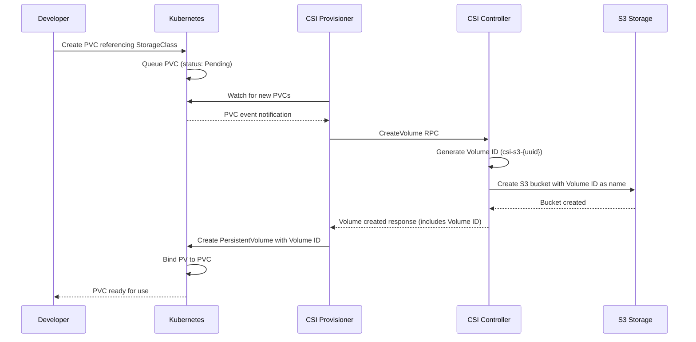

# Dynamic Provisioning

!!! note "Automated Bucket Creation"
    With dynamic provisioning, S3 buckets are created automatically when PersistentVolumeClaims are created, eliminating the need for pre-existing buckets.

Dynamic provisioning enables on-demand creation of S3 buckets and PersistentVolumes through Kubernetes' native storage provisioning system.
When a PersistentVolumeClaim (PVC) references a StorageClass with the Scality S3 CSI provisioner, the system automatically creates both the S3 bucket and corresponding PersistentVolume (PV).

## How Dynamic Provisioning Works

### Workflow Overview



### Core Components

1. **StorageClass**: Defines provisioning parameters and credentials
2. **CSI Provisioner**: Watches for PVCs and triggers volume creation
3. **CSI Controller**: Handles S3 bucket creation and deletion
4. **PersistentVolumeClaim**: Requests storage with specific requirements

### Volume ID System

The CSI driver ensures perfect consistency between Kubernetes resources and S3 storage through a unified volume identification system:

- **Volume ID Generation**: Each volume gets a unique identifier: `csi-s3-{uuid}`
- **Dual Purpose**: This ID serves as both the CSI Volume ID (stored in PersistentVolume) and the S3 bucket name
- **Lifecycle Consistency**: Creation and deletion operations use the same identifier, eliminating any ambiguity about which bucket corresponds to which volume

## Key Requirements

| Requirement | Description | Example |
|-------------|-------------|---------|
| **StorageClass** | Must specify `s3.csi.scality.com` as provisioner | See [StorageClass Reference](storageclass-reference-and-usage-examples.md) |
| **Credentials** | Provisioner and node secrets for S3 operations | See [Credential Management](../../architecture/ring-s3-credentials-management/dynamic-provisioning-credentials-management.md) |

## Basic Configuration

### StorageClass Example

```yaml
apiVersion: storage.k8s.io/v1
kind: StorageClass
metadata:
  name: s3-dynamic
provisioner: s3.csi.scality.com
reclaimPolicy: Delete
volumeBindingMode: Immediate
parameters:
  # Credential configuration
  csi.storage.k8s.io/provisioner-secret-name: s3-provisioner-secret
  csi.storage.k8s.io/provisioner-secret-namespace: kube-system
  csi.storage.k8s.io/node-publish-secret-name: s3-node-secret
  csi.storage.k8s.io/node-publish-secret-namespace: kube-system
mountOptions:
  - allow-delete
  - allow-other
  - region=us-east-1
```

### PersistentVolumeClaim Example

```yaml
apiVersion: v1
kind: PersistentVolumeClaim
metadata:
  name: my-app-storage
spec:
  accessModes:
    - ReadWriteMany
  storageClassName: s3-dynamic
  resources:
    requests:
      storage: 10Gi  # Arbitrary value for S3
```

## Volume Binding Modes

### Immediate Binding (Default)

- PV created immediately when PVC is created
- Bucket created before pod scheduling
- Suitable for most use cases

```yaml title="Immediate binding example"
apiVersion: storage.k8s.io/v1
kind: StorageClass
metadata:
  name: s3-immediate
provisioner: s3.csi.scality.com
reclaimPolicy: Delete
volumeBindingMode: Immediate  # Default behavior
parameters:
  csi.storage.k8s.io/provisioner-secret-name: s3-provisioner-secret
  csi.storage.k8s.io/provisioner-secret-namespace: kube-system
```

### WaitForFirstConsumer

- PV creation delayed until pod is scheduled
- Ensures bucket is created in optimal location
- Recommended if using `${pv.name}` templating in StorageClass parameters

```yaml title="WaitForFirstConsumer binding example"
apiVersion: storage.k8s.io/v1
kind: StorageClass
metadata:
  name: s3-wait-for-consumer
provisioner: s3.csi.scality.com
reclaimPolicy: Delete
volumeBindingMode: WaitForFirstConsumer  # Wait for pod scheduling
parameters:
  # Using ${pv.name} templating requires WaitForFirstConsumer
  csi.storage.k8s.io/provisioner-secret-name: "${pv.name}-secret"
  csi.storage.k8s.io/provisioner-secret-namespace: "${pvc.namespace}"
  csi.storage.k8s.io/node-publish-secret-name: "${pv.name}-secret"
  csi.storage.k8s.io/node-publish-secret-namespace: "${pvc.namespace}"
```

## Lifecycle Management

### Bucket Creation

- **Automatic Naming**: Buckets use `csi-s3-{uuid}` format (e.g., `csi-s3-12345678-abcd-1234-abcd-123456789012`)
- **Volume ID Consistency**: The same identifier is used as both the CSI Volume ID and S3 bucket name
- **Bucket Configuration**: Created with default configuration using S3 API CreateBucket

### Bucket Deletion

Controlled by the `reclaimPolicy`:

- **Delete**: Bucket deleted when PVC is deleted (only if bucket is empty) using S3 API DeleteBucket
- **Retain**: Bucket preserved after PVC deletion

```yaml
reclaimPolicy: Delete  # or Retain
```

!!! warning "S3 Bucket Deletion Behavior"
    When using `reclaimPolicy: Delete`, S3 bucket deletion only occurs if the bucket is completely empty.
    If the bucket contains any objects, the bucket will be retained as a safety mechanism to prevent accidental data loss.
    Kubernetes resources (PVC, PV) will be successfully deleted, but the actual bucket remains in S3 storage.

## Mount Options

Dynamic provisioning supports all [mount options](../mount-options.md) through the StorageClass specification:

## Authentication

Dynamic provisioning supports two authentication modes:

1. **Secret-based Authentication (Recommended)**: Configure **both** `provisioner-secret` and `node-publish-secret` in StorageClass
   - **Provisioner Secret**: Used by CSI controller for bucket creation/deletion
   - **Node-Publish Secret**: Used by nodes for mounting operations
   - Both secrets can point to the same Secret or different Secrets (for least privilege)

2. **Driver-level Authentication**: Omit both secret parameters to use driver-level credentials for all operations

!!! important "Both secrets must be configured together when using secret-based authentication"
    The controller cannot detect if only `node-publish-secret` is configured (CSI specification limitation),
    so configuring only one secret will result in driver-level credentials being used.

See the [Credential Management Guide](../../architecture/ring-s3-credentials-management/dynamic-provisioning-credentials-management.md) for detailed configuration and examples.

## Limitations

- **Single Access Mode**: Only `ReadWriteMany` is supported
- **S3 Bucket Deletion**: Bucket deletion only occurs when completely empty (no objects)

## Next Steps

- Learn about [StorageClass Parameters](storageclass-reference-and-usage-examples.md)
- Set up [Credential Management](../../architecture/ring-s3-credentials-management/dynamic-provisioning-credentials-management.md)
