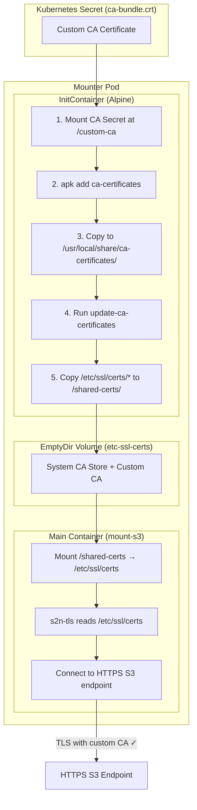
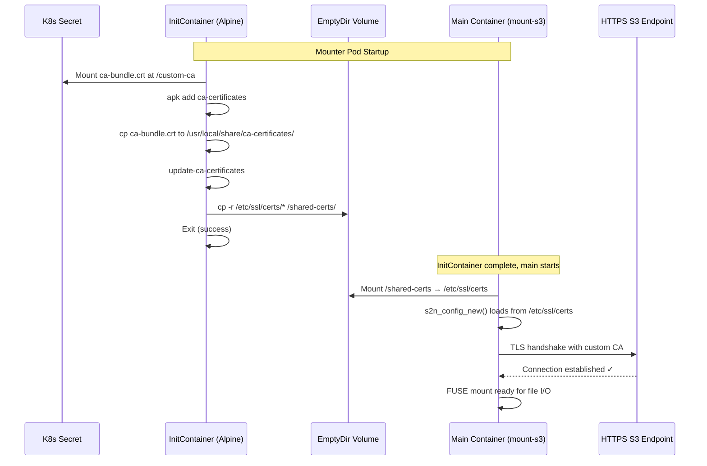

# TLS Configuration for Custom CA Certificates

This guide explains how to configure the Scality CSI Driver for S3 to connect to HTTPS S3 endpoints that use certificates signed by internal or custom Certificate Authorities (CAs).

## Overview

When your S3 endpoint uses HTTPS with certificates signed by an internal CA (rather than a public CA like Let's Encrypt),
the CSI driver needs to be configured to trust that CA certificate.
This is common in enterprise environments where S3 services are secured with internally-signed TLS certificates.

The CSI driver uses a two-pronged approach for custom CA support:

| Component | Method | Description |
|-----------|--------|-------------|
| **Controller** | AWS_CA_BUNDLE | The controller pod mounts the CA certificate and sets the `AWS_CA_BUNDLE` environment variable, which the AWS SDK Go v2 reads automatically |
| **Mounter Pods** | InitContainer | Mounter pods use an Alpine-based initContainer to install the CA certificate into the system trust store (`/etc/ssl/certs/`) before mount-s3 starts |

## How It Works

The following diagram shows how the mounter pod installs custom CA certificates using an initContainer:



### Startup Sequence

The sequence diagram below shows the temporal flow of mounter pod startup with TLS:



## Prerequisites

Before configuring TLS:

1. Obtain your CA certificate in PEM format (usually a `.pem` or `.crt` file)
2. Ensure your S3 endpoint is configured with a certificate signed by this CA
3. Have `kubectl` access to your Kubernetes cluster

## Step 1: Create the CA Certificate Secret

The CA certificate must be stored in a Kubernetes Secret. The secret must exist in **two namespaces**:

- The driver namespace (default: `kube-system`)
- The mounter pod namespace (default: `mount-s3`)

```bash
# Create namespaces if they don't exist
kubectl create namespace kube-system --dry-run=client -o yaml | kubectl apply -f -
kubectl create namespace mount-s3 --dry-run=client -o yaml | kubectl apply -f -

# Create the secret in the driver namespace
kubectl create secret generic custom-ca-cert \
  --from-file=ca-bundle.crt=/path/to/your/ca-bundle.pem \
  --namespace kube-system

# Create the secret in the mounter pod namespace
kubectl create secret generic custom-ca-cert \
  --from-file=ca-bundle.crt=/path/to/your/ca-bundle.pem \
  --namespace mount-s3
```

<!-- markdownlint-disable MD046 -->
!!! important "Secret Key Name"
    The secret must use the key name `ca-bundle.crt`. The CSI driver expects this exact key name.
<!-- markdownlint-enable MD046 -->

### Verifying the Secret

```bash
# Verify the secret was created correctly
kubectl get secret custom-ca-cert -n kube-system -o jsonpath='{.data.ca-bundle\.crt}' | base64 -d | head -5

# Expected output (beginning of a PEM certificate):
# -----BEGIN CERTIFICATE-----
# MIID...
```

## Step 2: Configure the Helm Chart

Update your Helm values to reference the CA certificate secret:

### Using values.yaml

```yaml
# values.yaml
s3:
  endpointUrl: "https://s3.example.com:8443"
  region: "us-east-1"

tls:
  caCertSecret: "custom-ca-cert"
```

### Using --set flags

```bash
helm upgrade --install scality-s3-csi \
  ./charts/scality-mountpoint-s3-csi-driver \
  --namespace kube-system \
  --set s3.endpointUrl=https://s3.example.com:8443 \
  --set tls.caCertSecret=custom-ca-cert
```

## Step 3: Verify the Installation

After installing or upgrading the Helm chart:

### Check Controller Pod

```bash
# Verify the controller pod has the CA certificate mounted
kubectl exec -n kube-system deployment/s3-csi-controller -c s3-csi-controller -- \
  cat /etc/ssl/custom-ca/ca-bundle.crt | head -5

# Verify AWS_CA_BUNDLE is set
kubectl exec -n kube-system deployment/s3-csi-controller -c s3-csi-controller -- \
  env | grep AWS_CA_BUNDLE

# Expected output:
# AWS_CA_BUNDLE=/etc/ssl/custom-ca/ca-bundle.crt
```

### Check Mounter Pods

When a volume is mounted, verify the mounter pod has the CA certificate:

```bash
# List mounter pods
kubectl get pods -n mount-s3

# Check the initContainer completed successfully
kubectl describe pod -n mount-s3 <mounter-pod-name> | grep -A5 "Init Containers"

# Verify the certificate is in the certificate store
kubectl exec -n mount-s3 <mounter-pod-name> -- ls -la /etc/ssl/certs/ | grep custom
```

## Configuration Reference

| Parameter | Description | Default |
|-----------|-------------|---------|
| `tls.caCertSecret` | Name of the Kubernetes Secret containing the CA certificate | `""` (disabled) |
| `tls.initImage.repository` | Image for the CA installation initContainer | `alpine` |
| `tls.initImage.tag` | Tag for the init image | `3.21` |
| `tls.initImage.pullPolicy` | Pull policy for the init image | `IfNotPresent` |
| `tls.initResources.requests.cpu` | CPU request for init container | `10m` |
| `tls.initResources.requests.memory` | Memory request for init container | `16Mi` |
| `tls.initResources.limits.memory` | Memory limit for init container | `64Mi` |

## Troubleshooting

### Certificate Validation Errors

If you see TLS certificate validation errors:

```text
x509: certificate signed by unknown authority
```

1. **Verify the CA certificate is correct:**

   ```bash
   # Check the certificate details
   openssl x509 -in /path/to/ca-bundle.pem -text -noout | head -20
   ```

2. **Ensure the secret exists in both namespaces:**

   ```bash
   kubectl get secret custom-ca-cert -n kube-system
   kubectl get secret custom-ca-cert -n mount-s3
   ```

3. **Check that the secret has the correct key:**

   ```bash
   kubectl get secret custom-ca-cert -n kube-system -o jsonpath='{.data}' | jq -r 'keys[]'
   # Should output: ca-bundle.crt
   ```

### InitContainer Failures

If the mounter pod's initContainer fails:

```bash
# Check initContainer logs
kubectl logs -n mount-s3 <mounter-pod-name> -c install-ca-cert
```

Common issues:

- **Secret not found:** Ensure the secret exists in the `mount-s3` namespace
- **Invalid PEM format:** The certificate must be in PEM format (Base64-encoded with header/footer)

### Controller Pod Issues

If the controller pod cannot connect to S3:

```bash
# Check controller logs
kubectl logs -n kube-system deployment/s3-csi-controller -c s3-csi-controller

# Verify the CA certificate is mounted
kubectl exec -n kube-system deployment/s3-csi-controller -c s3-csi-controller -- \
  ls -la /etc/ssl/custom-ca/
```

## Certificate Rotation

To rotate the CA certificate:

1. **Update the secrets in both namespaces:**

   ```bash
   kubectl create secret generic custom-ca-cert \
     --from-file=ca-bundle.crt=/path/to/new-ca-bundle.pem \
     --namespace kube-system \
     --dry-run=client -o yaml | kubectl apply -f -

   kubectl create secret generic custom-ca-cert \
     --from-file=ca-bundle.crt=/path/to/new-ca-bundle.pem \
     --namespace mount-s3 \
     --dry-run=client -o yaml | kubectl apply -f -
   ```

2. **Restart the controller to pick up the new certificate:**

   ```bash
   kubectl rollout restart deployment/s3-csi-controller -n kube-system
   ```

3. **Existing mounter pods will continue using the old certificate.** New mounter pods (created when new volumes are mounted) will use the updated certificate.

<!-- markdownlint-disable MD046 -->
!!! note "Mounter Pod Certificate Updates"
    Existing mounter pods do not automatically pick up certificate changes. To force a refresh:

    1. Delete the mounter pod (the CSI driver will recreate it)
    2. Or unmount and remount the volume from the application pod
<!-- markdownlint-enable MD046 -->

## Security Considerations

1. **Secret Access:** Ensure RBAC policies restrict access to the CA certificate secret
2. **Certificate Scope:** Only include the CA certificates needed for your S3 endpoint
3. **Certificate Expiry:** Monitor CA certificate expiration dates and plan for rotation
4. **Multiple CAs:** If you need to trust multiple CAs, concatenate them in a single PEM file:

   ```bash
   cat ca1.pem ca2.pem > ca-bundle.pem
   ```

## Example: Complete Installation with TLS

```bash
# 1. Create namespaces
kubectl create namespace kube-system --dry-run=client -o yaml | kubectl apply -f -
kubectl create namespace mount-s3 --dry-run=client -o yaml | kubectl apply -f -

# 2. Create S3 credentials secret
kubectl create secret generic s3-secret \
  --from-literal=access_key_id=YOUR_ACCESS_KEY \
  --from-literal=secret_access_key=YOUR_SECRET_KEY \
  --namespace kube-system

# 3. Create CA certificate secret in both namespaces
kubectl create secret generic custom-ca-cert \
  --from-file=ca-bundle.crt=/path/to/ca-bundle.pem \
  --namespace kube-system

kubectl create secret generic custom-ca-cert \
  --from-file=ca-bundle.crt=/path/to/ca-bundle.pem \
  --namespace mount-s3

# 4. Install the CSI driver with TLS configuration
helm upgrade --install scality-s3-csi \
  ./charts/scality-mountpoint-s3-csi-driver \
  --namespace kube-system \
  --set s3.endpointUrl=https://s3.example.com:8443 \
  --set s3.region=us-east-1 \
  --set tls.caCertSecret=custom-ca-cert \
  --wait

# 5. Verify installation
kubectl get pods -n kube-system -l app.kubernetes.io/name=scality-mountpoint-s3-csi-driver
```
